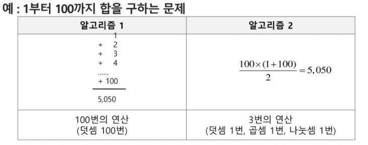
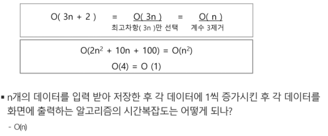

# Algorithm

>  알고리즘이란?
>
> 유한한 단계를 통해 문제를 해결하기 위한 절차나 방법.

컴퓨터 분야에서 알고리즘을 표현하는 방법은 크게 2가지

- 슈더코드(Pseudocode)

- 순서도

주어진 문제를 해결하기 위해서 여러개의 다양한 알고리즘이 가능

 => 어떤 알고리즘을 사용해야 하는가?

##### 알고리즘의 성능 분석 필요

- 많은 문제에서 성능 분석의 기준으로 알고리즘의 작업량을 비교한다.

##### 시간 복잡도 (Time Complexity)

알고리즘의 작업량을 표현할 때, 시간복잡도로 표현한다.

- 실제 걸리는 시간을 측정
- 실행되는 명령문의 개수를 계산

#### 시간복잡도 ~= 빅-오(O) 표기법

시간복잡도 함수중에서 가장 큰 영향력을 주는 n에 대한 항만을 표시

계수는 생략하여 표시

