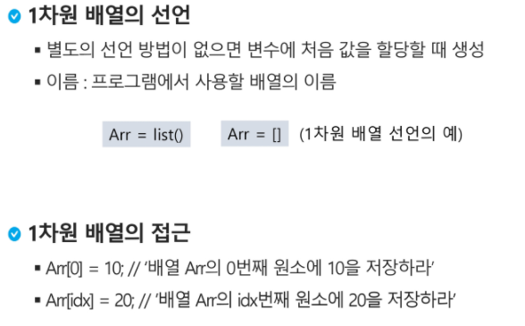
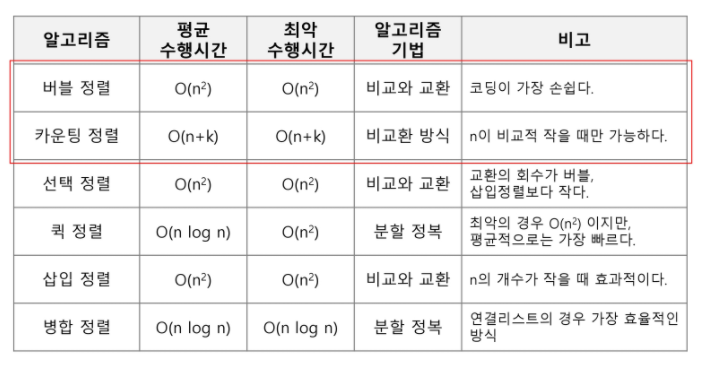

# 배열(Array)

## 배열이란 무엇인가

- 일정한 자료형의 변수들을 하나의 이름으로 열거하여 사용하는 자료구조

### 배열이 왜 필요한가

- 프로그램 내에서 여러 개의 변수가 필요할 때, 일일이 다른 변수명을 이용하여 자료에 접근하는 행동은 매우 비효율적이다
- 배열을 사용하면 하나의 선언을 통해서 둘 이상의 변수를 선언할 수 있다
- 단순히 다수의 변수 선언을 의미하는 것이 아니라 다수의 변수로는 하기 힘든 작업을 배열을 활용해 쉽게 할 수 있다

