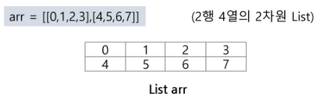
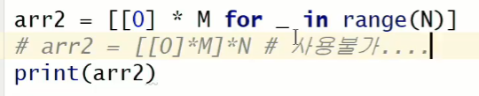
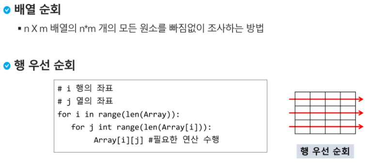
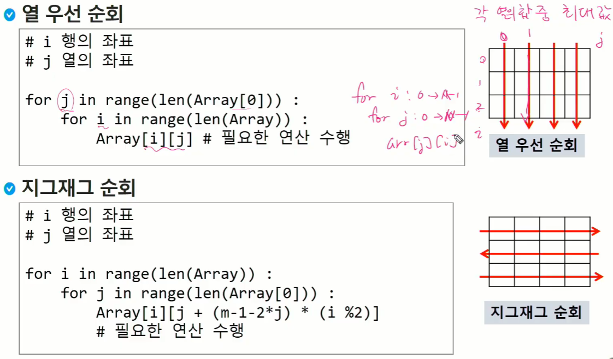
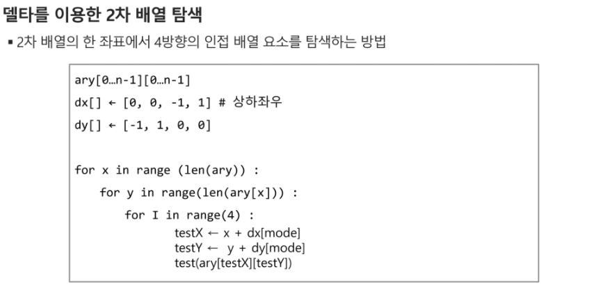
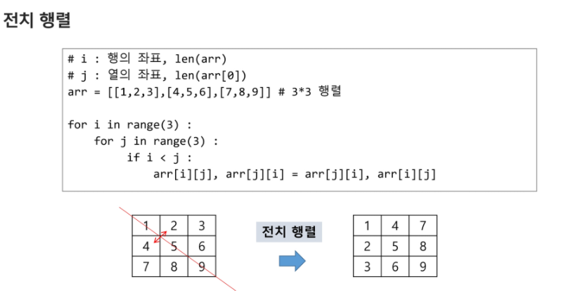

# Array, 2차원 배열

## 2차원 배열

- 1차원 list를 묶어놓은 list

- 2차원 이상의 다차원 list는 차원에 따라 index를 선언

- 2차원 list의 선언: 세로길이(행의 개수), 가로 길이(열의 개수)를 필요로 함

- python에서는 데이터 초기화를 통해 변수선언과 초기화가 가능함

- 일반적인 배열 

  0,0 0,1 0,2 0,3

  1,0 1,1 1,2 1,3

  수학함수로 생각한다면 = >밑으로 갈수록 x값 증가, 오른쪽으로 갈 수록 y값 증가

