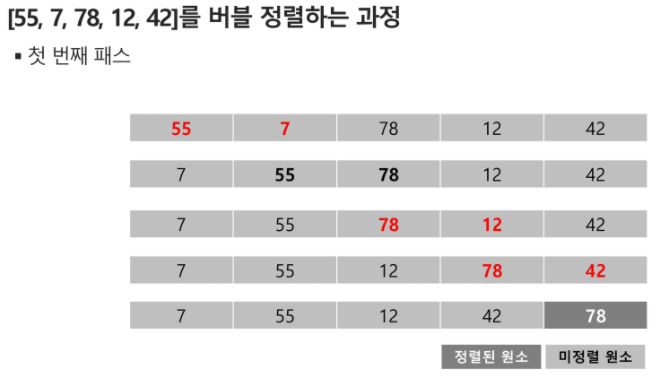
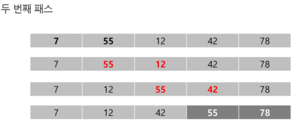
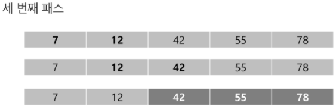
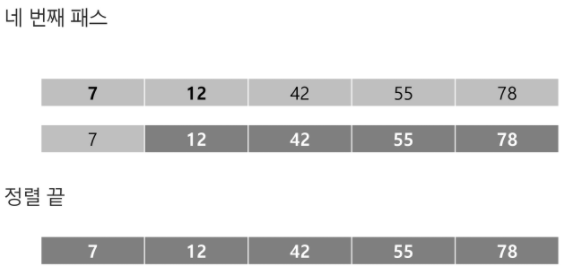
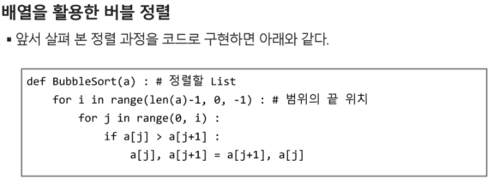

# 버블 정렬(bubble sort)

## 인접한 두개의 원소를 비교하며 자리를 계속 교환하는 방식

### 정렬과정

- 첫번째 원소부터 인접한 원소끼리 계속 자리를 교환하면서 맨 마지막 자리까지 이동한다
- 한 단계가 끝나면 가장 큰 원소가 마지막 자리로 정렬된다
- 교환하며 자리를 이동하는 모습이 물 위로 올라오는 거품 모양과 같가도 하여 버블정렬이라고 한다

시간복잡도

- O(n^2)

