# 카운팅 정렬(Counting Sort)

### 항목들의 순서를 경정하기 위해 집합에 각 항목이 몇 개씩 있는지 세는 작업을 하여, 선형 시간에 정렬하는 효율적인 알고리즘

### 제한사항

- 정수나 정수로 표현할 수 있는 자료에 대해서만 적용 가능 : 각 항목의 발생회수를 기록하기 위해, 정수 항목으로 인덱스 되는 카운트들의 배열을 사용하기 때문이다.
- 카운트들을 위한 충분한 공간을 할당하려면 집합 내의 가장 큰 정수를 알아야 한다

### 시간 복잡도

O(n + k) : n은 리스트 길이, k는 정수의 최대값

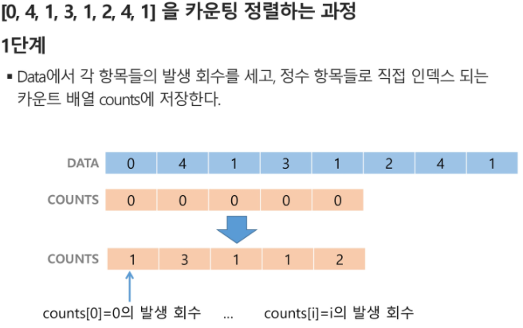

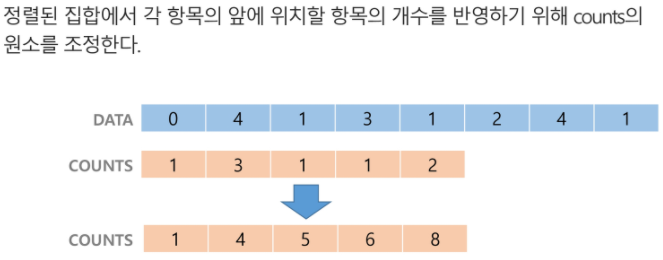

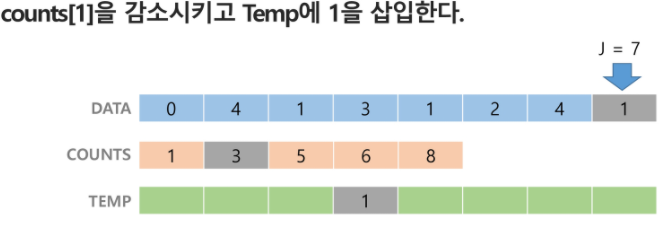

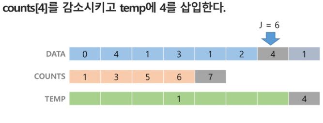

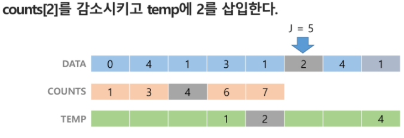

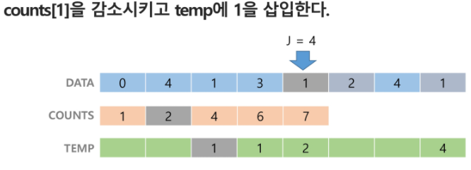

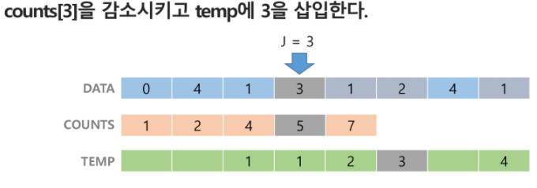

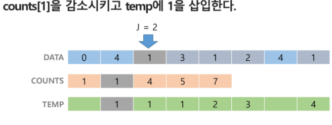

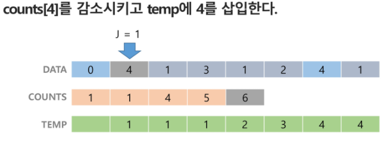

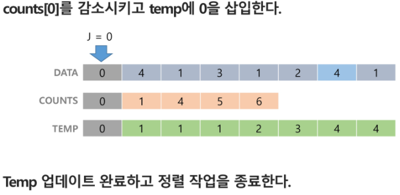

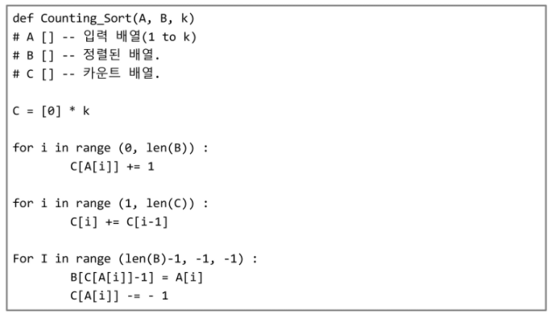

