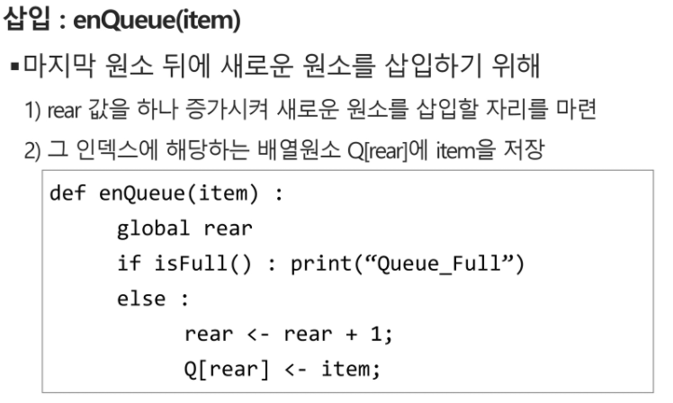
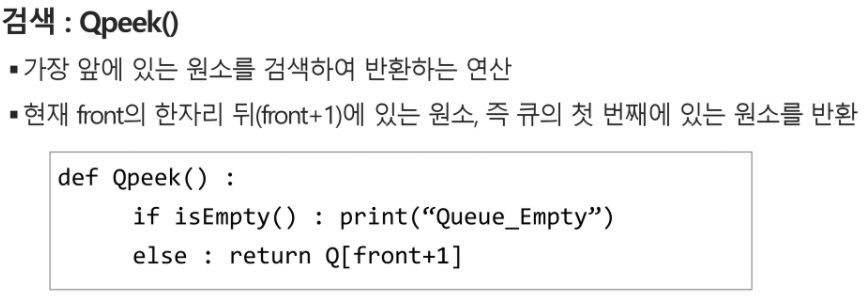

# Queue

## 특성

- 스택과 마찬가지로 삽입과 삭제의 위치가 제한적인 자료구조
  - 큐의 뒤에서는 삽입만 하고, 큐의 앞에서는 삭제만 하는 구조
- 선입선출구조(FIFO: First In First Out)
  - 큐에 삽입한 순서대로 원소가 저장되어, 가장 먼저 삽인된 원소는 가장 먼저 삭제 된다.

## 연산 과정

간단한 대신 느리다

위의 코드에 대한 설명은 추후에 내가 완벽하게 이해를 했을 때 넣도록 하겠다

큐는 너무 이해가 잘되는데 위의 코드는 애매함 (08.25)