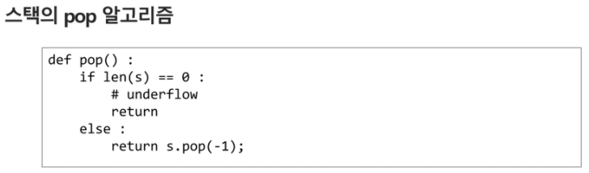

# Stack

## 스택의 특성

- 물건을 쌓아 올리듯 자료를 쌓아 올린 형태의 자료구조
- 스택에 저장된 자료는 선형 구조를 갖는다
  - 선형구조 : 자료간의 관계가 1대1의 관계를 갖는다
  - 비선형구조 : 자료간의 관계가 1대N의 관계를 갖는다 (ex. 트리
    )
- 스택에 자료를 삽입하거나 스택에서 자료를 꺼낼 수 있다
- 마지막에 삽입한 자료를 가장 먼저 꺼낸다. 후입선출(LIFO, Last-In-First-Out)
  - 예) 스택에 1,2,3 순으로 자료를 삽입한 후 꺼내면 역순으로, 3,2,1순으로 꺼낼 수 있다.

## 자료구조와 연산

### 자료구조

- 자료를 선형으로 저장할 저장소
  - c언어에서는 배열을 사용할 수 있다
  - 저장소 자체를 스택이라 부르기도 한다
  - 스택에서 마지막 삽입된 원소의 위치를 top이라 부른다

### 연산

- 삽입 : 저장소에 자료를 저장한다. 보통 push라고 부른다
- 삭제 : 저장소에서 자료를 꺼낸다. 꺼낸 자료는 삽입한 자료의 역순으로 꺼낸다. 보통 pop이라고 부른다
- 스택이 공백인지 아닌지를 확인하는 연산. isEmpty
  - 그 반대 : isNotEmpty. 그렇지만 잘 쓰이지 않고 ! isEmpty를 사용한다
- 스택의 top에 있는 item(원소)을 반환하는 연산 peek

