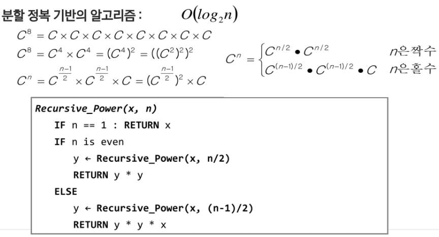
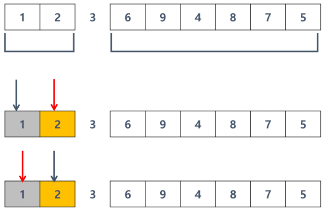

# 분할정복 & 백트랙킹

### 학습목표

문제를 분할해서 해결하는 분할 정복(Divide and Conquer) 기법을 이해하고 대표적인 알고리즘인 퀵 정렬과 병합 정렬에 대해 학습한다.

상태 공간 트리의 모든 노드를 검색하는 백트랙킹에 대해 학습한다.

## 분할 정복 기법

### 거듭 제곱

### 병합 정렬(Merge Sort)

### 퀵 정렬

