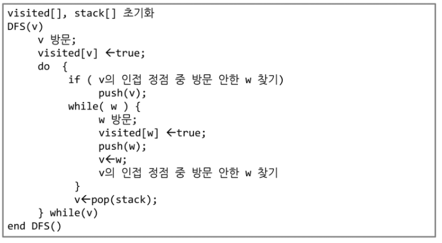
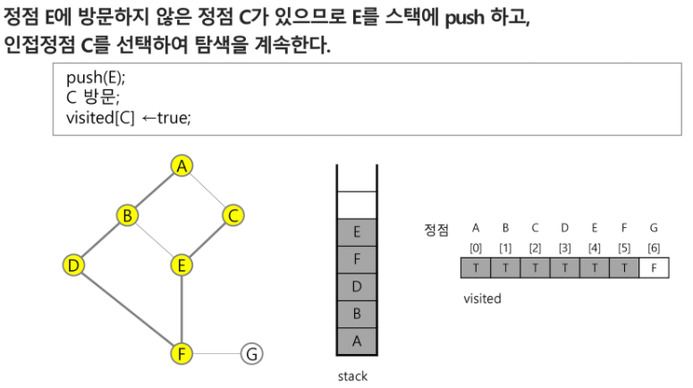
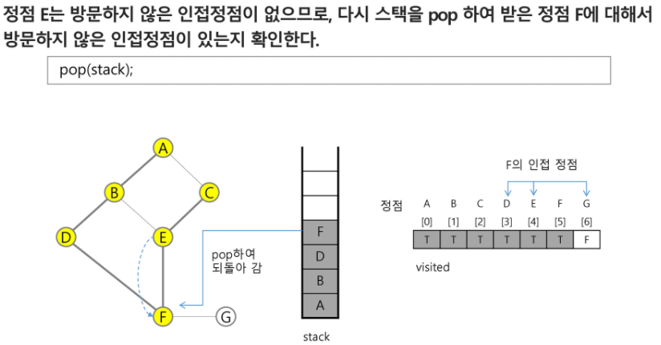
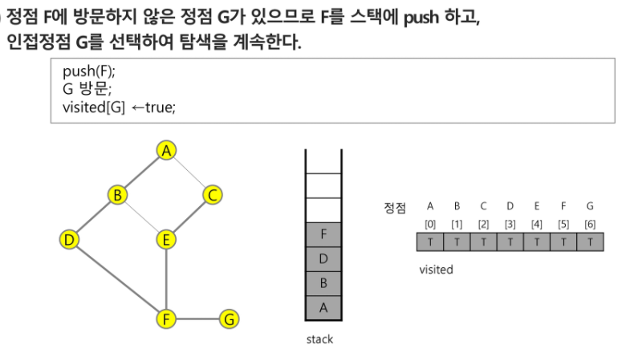
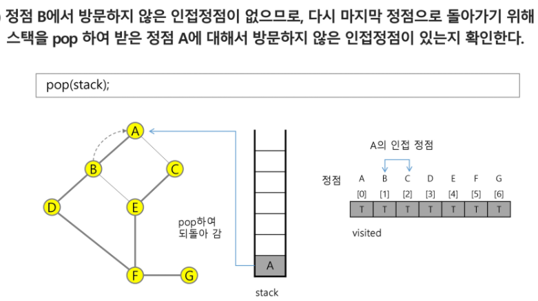
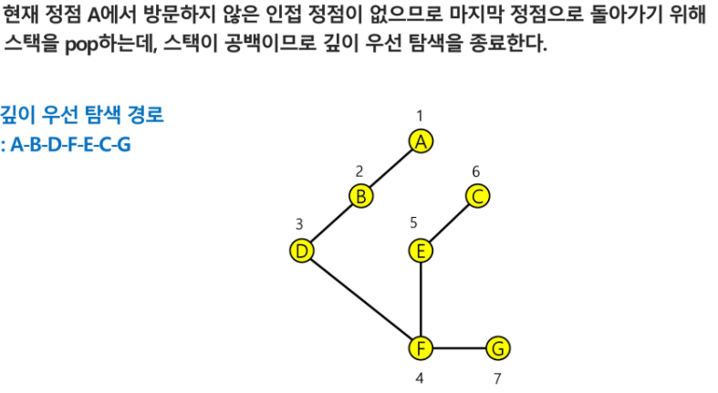
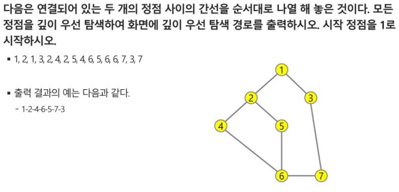

# DFS(깊이우선탐색)















## 예시문제



```python
import sys
sys.stdin = open('input.txt')

# V => 노드, 정점
# E => 엣지, 간선
V, E = list(map(int, input().split()))

graph_list = list(map(int, input().split()))

graph = [[0 for _ in range(V+1)] for _ in range(V+1)]

visited = [0 for _ in range(V+1)]

for i in range(E):
    start = graph_list[i * 2]
    end = graph_list[i * 2 + 1]
    graph[start][end] = graph[end][start] = 1


def dfs(v):
    global graph, visited, V
    #스택에 시작점을 넣고 시작
    stack = [v]

    #스택이 비어있지 않다면 계속해서 DFS 진행
    while len(stack):
        # 가장 마지막에 넣었던 위치를 빼온다
        v = stack.pop()

        # 마지막 위치가 방문하지 않은 곳이라면
        if visited[v] == 0:
            # 방문을 한다
            visited[v] = 1
            print(f'방문한 위치 {v} visited {visited}')

            # 시작점을 기준으로 한줄 반복 (0번 노드는 없으니 1부터 시작)
            for w in range(1, V+1):
                if graph[v][w] == 1 and visited[w] == 0:
                    stack.append(w)
                    print(stack)

dfs(1)
```

