# Tree\_이진트리_순회

- 순회(traversal)란 트리의 각 노드를 중복되지 않게 전부 방문하는 것을 말하는데 트리는 비 선형 구조이기 때문에 선형구조에서와 같이 선후 연결 관계를 알 수 없다.

### 순회 - 트리의 노드들을 체계적으로 방문하는 것

### 3가지의 기본적인 순회 방법

자식은 왼쪽부터 탐색한다

오른쪽부터 탐색하는 경우는 없음 -> 오른쪽부터 순회한다면 여기서 정한 '기본적인' 순회 방법이 아님 

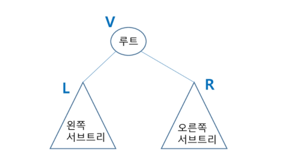

#### 전위 순회(preorder traversal) : VLR

- 부모노드 방문 후, 자식노드를 좌, 우 순서로 방문한다

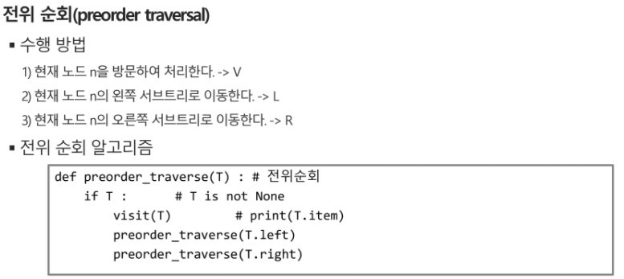

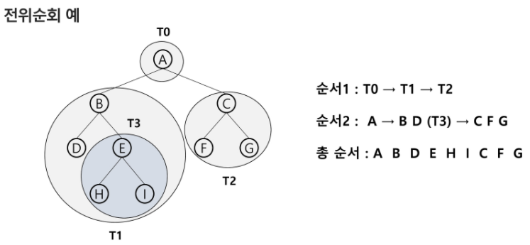

#### 중위 순회(inorder traversal) : LVR

- 왼쪽 자식노드, 부모노드, 오른쪽 자식노드 순으로 방문한다

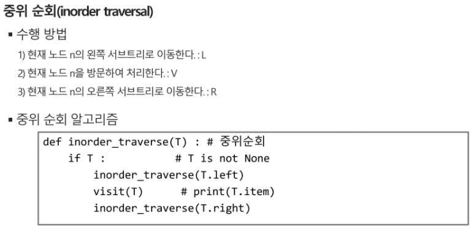

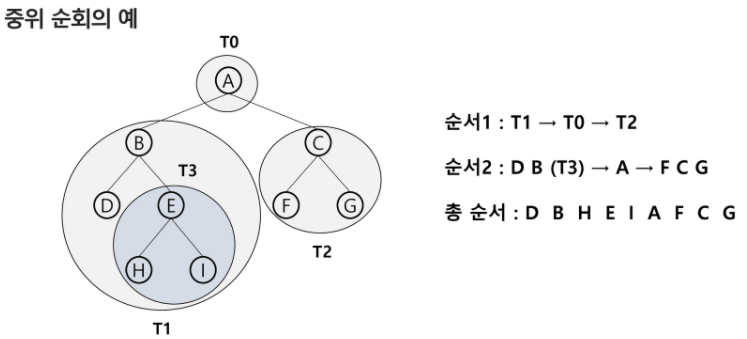

#### 후위 순회(postorder traversal) : LRV

- 자식노드를 좌우 순서로 방문 한 후, 부모노드로 방문한다

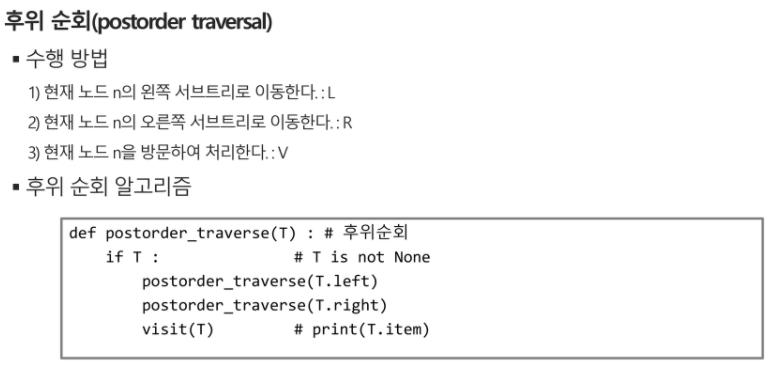

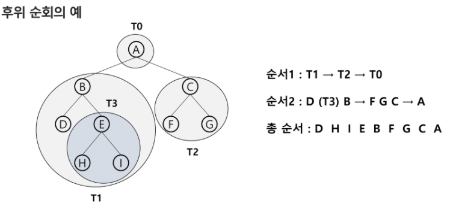

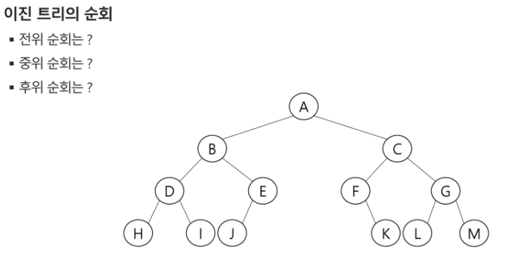

전위

A B D H I E J C F K G L M

중위

후위

## 이진트리의 표현

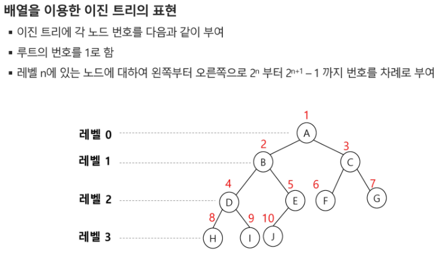

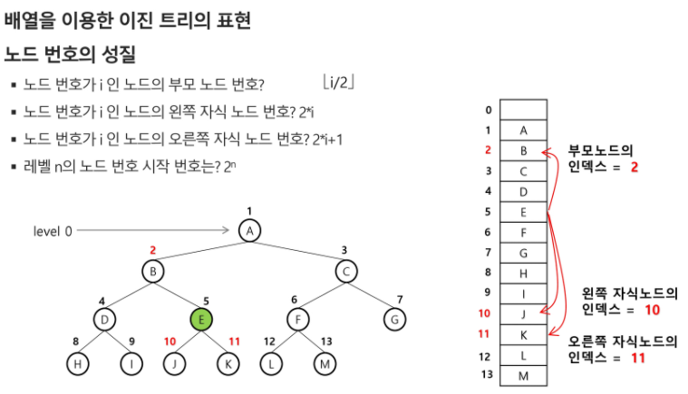

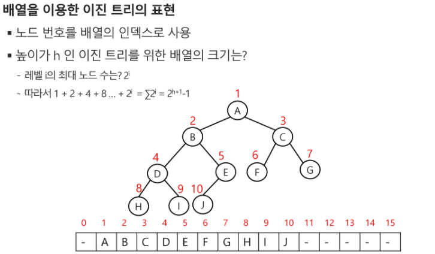

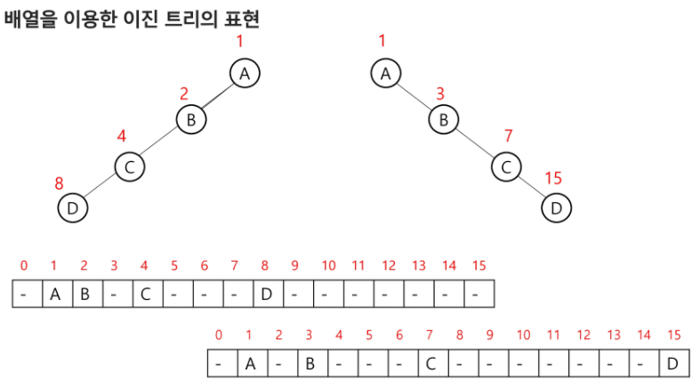

예시) 편향이진트리

포화이진트리의 배열을 따르고 있다

일반적으로는 포화이진트리의 저장 규칙에 맞출 필요는 없다

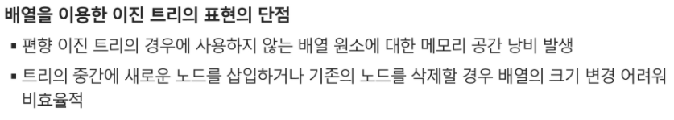

## 예시

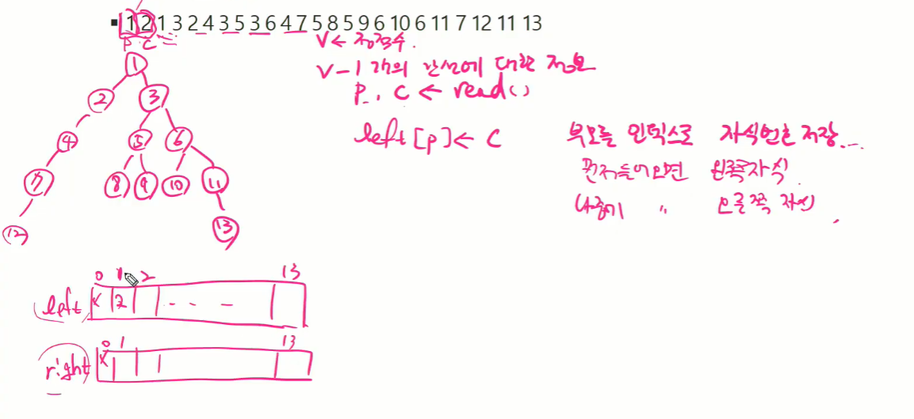

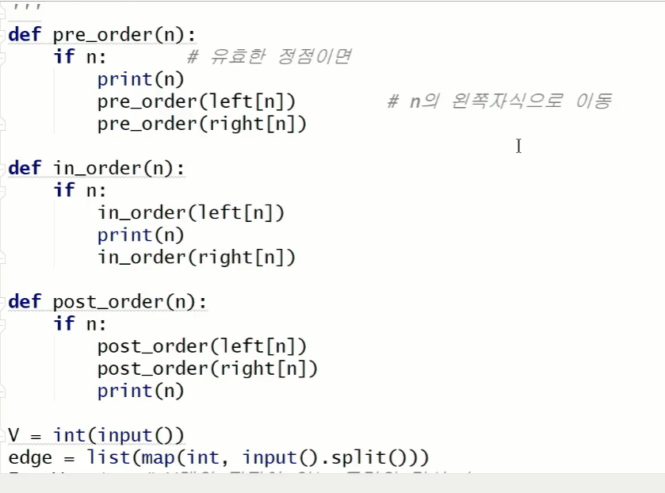

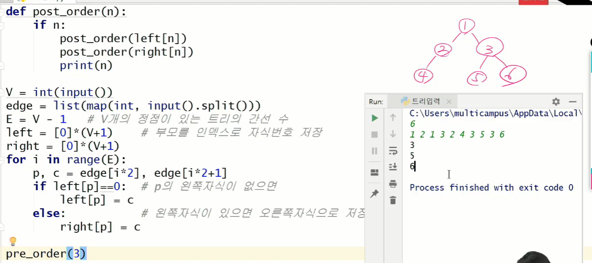

3, 5, 6만 돌았다

루트를 3으로 잡았기 때문에

=> 3을 루트로 하는 서브트리의 정점개수는? => 3

3의 자손의 수 = 2

