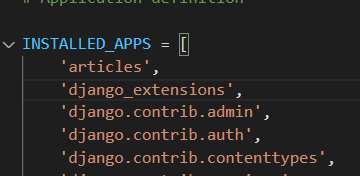
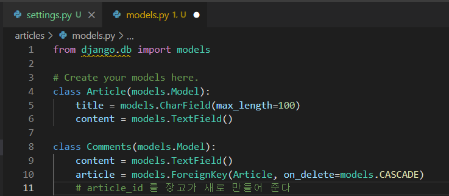
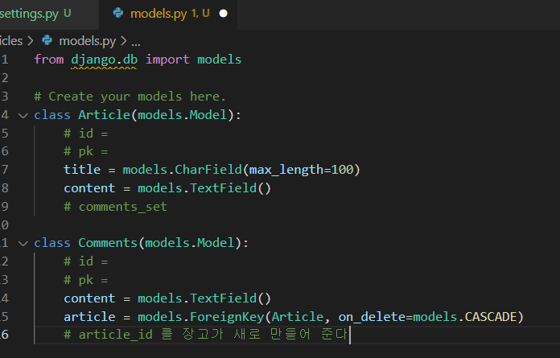
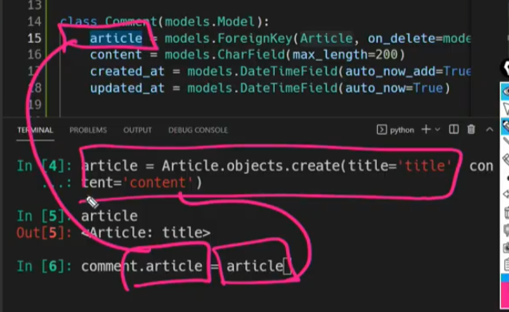
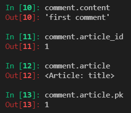
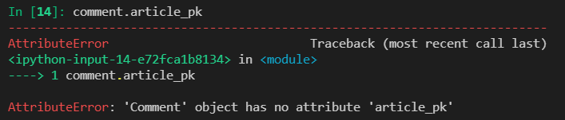

python_shell을 이용한 댓글 연습



```
tmddu@DESKTOP-SGSOLHG MINGW64 ~/git_upload/django/96_RELATION (master)
$ python manage.py shell_plus
# Shell Plus Model Imports
from articles.models import Article, Comments
from django.contrib.admin.models import LogEntry
from django.contrib.auth.models import Group, Permission, User
from django.contrib.contenttypes.models import ContentType
from django.contrib.sessions.models import Session
# Shell Plus Django Imports
from django.core.cache import cache
from django.conf import settings
from django.contrib.auth import get_user_model
from django.db import transaction
from django.db.models import Avg, Case, Count, F, Max, Min, Prefetch, Q, Sum, When
from django.utils import timezone
from django.urls import reverse
from django.db.models import Exists, OuterRef, Subquery
Python 3.9.6 (tags/v3.9.6:db3ff76, Jun 28 2021, 15:26:21) [MSC v.1929 64 bit (AMD64)] on win32
Type "help", "copyright", "credits" or "license" for more information.
(InteractiveConsole)
>>> article = Article()
>>> article
<Article: Article object (None)>
>>> article.title = 'title1'
>>> article.content = 'content1'
>>> article
<Article: Article object (None)>
>>> article.save()
>>> article
<Article: Article object (1)>
>>> comment = Comment()
Traceback (most recent call last):
  File "<console>", line 1, in <module>
NameError: name 'Comment' is not defined
>>> comment = Comments() 
>>> comment.content = 'content1'
>>> comment.article = article
>>> comment.save()
>>> comment
<Comments: Comments object (1)>
>>> comment.content
'content1'
>>> comment.article
<Article: Article object (1)>
>>> comment.article_id
1
>>> comment.article.title
'title1'
>>> comment.article.content
'content1'
>>> comment.article_id.content
Traceback (most recent call last):
  File "<console>", line 1, in <module>
AttributeError: 'int' object has no attribute 'content'
```



```
>>> comment2 = Comments()   
>>> comment2
<Comments: Comments object (None)>
>>> comment2.comtent = 'comment2'
>>> comment2.article_id = article.pk
>>> comment2.save()
>>> comment2
<Comments: Comments object (2)>
```


참조

```
>>> comment.article
<Article: Article object (1)>
```

역참조

```
>>> article.comments_set.all() 
<QuerySet [<Comments: Comments object (1)>, <Comments: Comments object (2)>]>
```



Article : Comment

​		 1 : N 관계


```
>>> comment.article.comments_set.all() 
<QuerySet [<Comments: Comments object (1)>, <Comments: Comments object (2)>]>
# 1번 댓글 => 게시물 => 댓글 전체 참조
>>> Comments.objects.all() 
<QuerySet [<Comments: Comments object (1)>, <Comments: Comments object (2)>]>
# 게시물 => 댓글 전체 참조
```




article라는 객체를 넣어도 알아서 pk값을 반환해준다!





주의 사항



이런건 없음