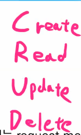
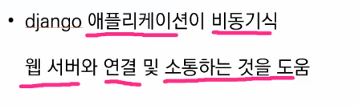

# Django 

## The Web Framework

- Django is a high-level **Python Web Framework** that encourages rapid development and clean, pragmatic design.
- It takes care of much of the hassle of web development, so **you can focus on your app without needing to reinvent the wheel**.

### Web

- world wide web
- 인터넷에 연결된 컴퓨터를 통해 정보를 공유할 수 있는 전 세계적인 정보 공간

## Static web page (정적 웹 페이지)

- 서버에 **미리 저장된 파일**이 사용자에게 **그대로 전달**되는 웹 페이지 
- 서버는 **추가적인 처리 과정 없이 클라이언트에게 응답을 보냄** 
- 모든 상황에서 모든 사용자에게 **동일한 정보**를 표시 
- 일반적으로 HTML, CSS, JavaScript 로 작성됨 
- = flat page

## Dynamic web page (동적 웹 페이지)

- 웹 페이지에 대한 요청을 받은 경우 서버는 **추가적인 처리 과정 이후 클라이언트에게 응답**을 보냄 
- 동적 페이지는 방문자와 **상호작용**하기 때문에 **페이지 내용은 그때그때 다름** 
- 서버 사이드 프로그래밍 언어(python, java, c++ 등)가 사용되며 파일을 처리
- 데이터베이스와의 상호작용이 이루어짐

## Framework

- 프로그래밍에서 특정 운영 체제를 위한 응용 프로그램 표준 구조를 구현하는 클래스와 라이브러리 모임 
- 재사용할 수 있는 수많은 코드를 프레임워크로 통합함으로써 개발자가 새로운 애플리케이션을 위한 표준 코드를 다시 작성하지 않아도 같이 사용할 수 있도록 도움 
- Application Framework 라고도 함

## Web Framework

- **웹 페이지를 개발하는 과정에서 겪는 어려움을 줄이는 것이 주 목적**으로 데이터베이스 연동, 템플릿 형태의 표준, 세션 관리, 코드 재사용 등의 기능을 포함 
- 동적인 웹 페이지나, 웹 애플리케이션, 웹 서비스 개발 보조용으로 만들어지는 Application Framework의 일종

### MTV Pattern

#### model

- 데이터베이스의 기록을 관리
- 데이터베이스 : CRUD 컨트롤 리드 ? 딜리트

#### template

- HTML, CSS 와 같은 레이아웃 정의

#### view

- 동작하고 컨트롤 시킨다
- HTTP 요청을 수신하고 응답을 반환

## Web

HTTP라는 프로토콜(약속)

동기적으로 일어난다 => a다음 b가 일어나는 연속적인 행위

비동기적 => 세탁기, 로봇 청소기, 식기세척기 등 시키는 행위