# CRUD

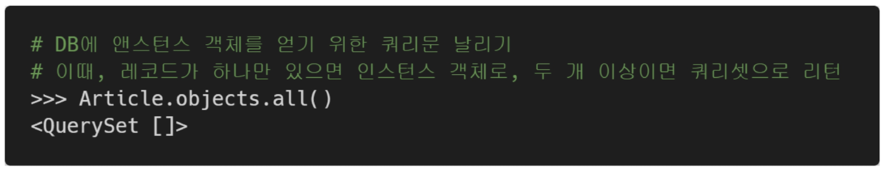

# Create

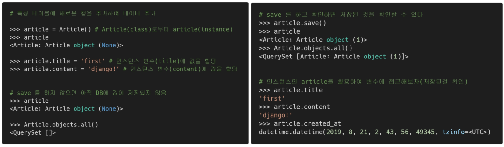

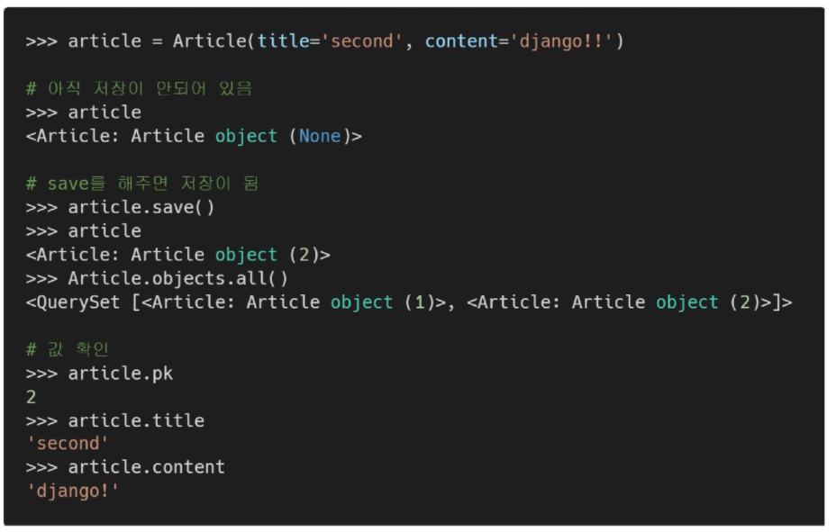

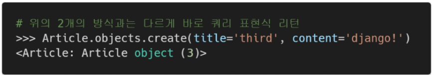

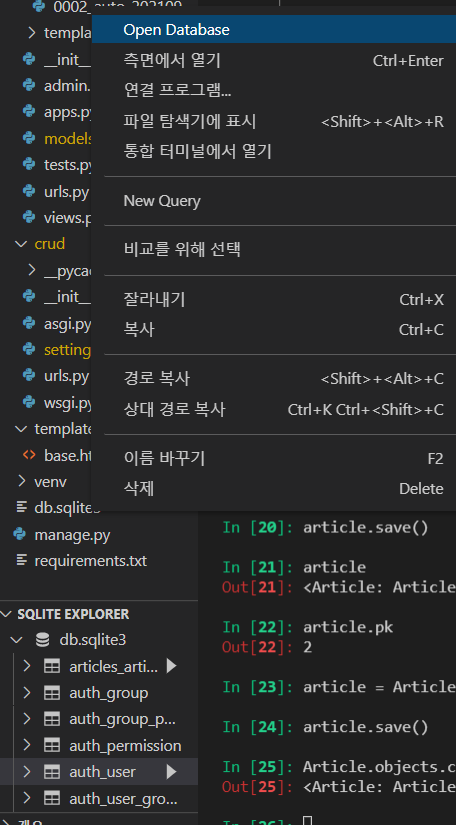

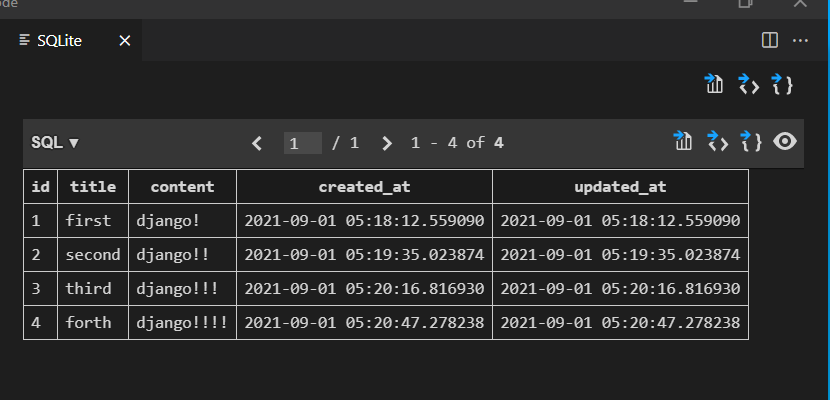

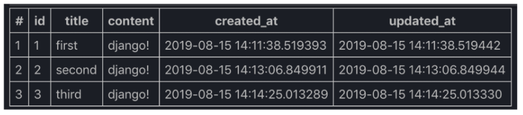

실제로 저장이 되었는지 여부를 확인

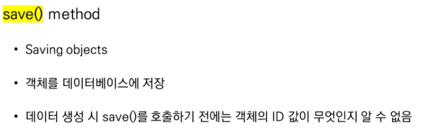

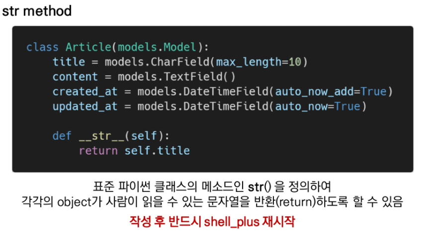

# Read

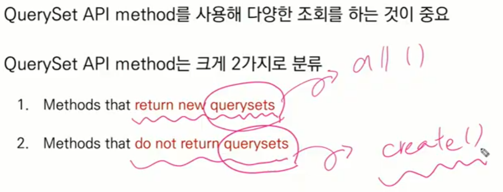

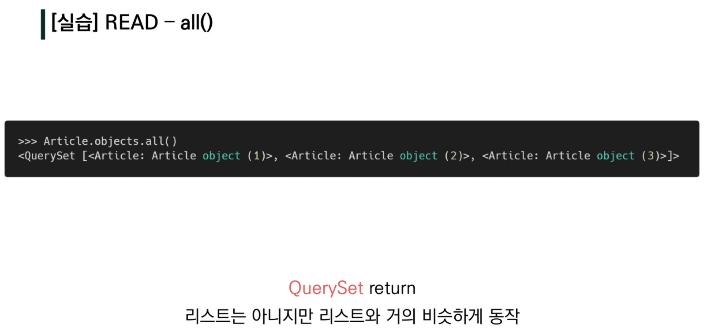

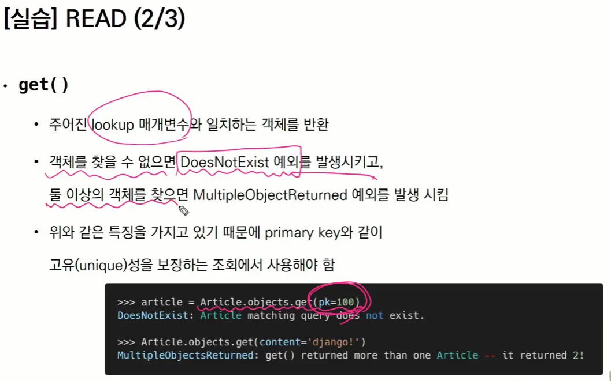

유일한 1개일 때에만 get()이 오류를 찾지 않음 => id(pk) 등 유니크한 특성을 보장하는(pk값을 찾을때) 파라미터로써 사용

컨텐트로 조회는 가능 => 목적과 부합하지는 않음

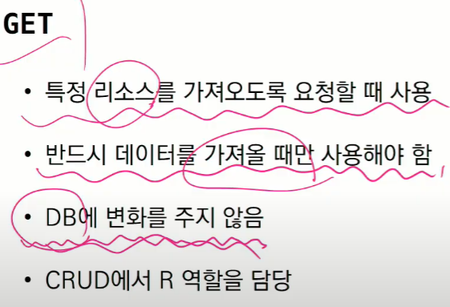

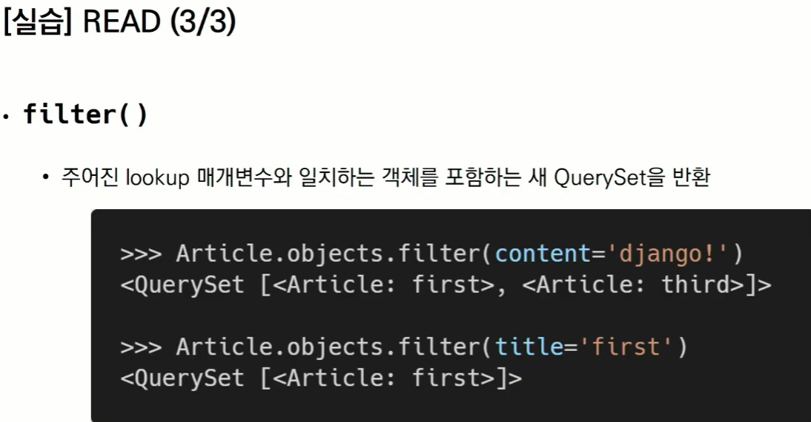

# Update

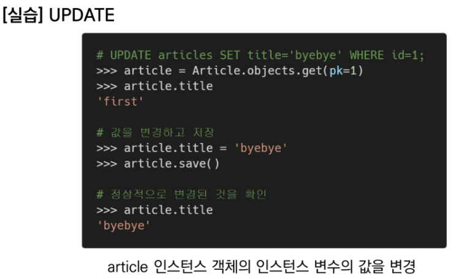

# Delete

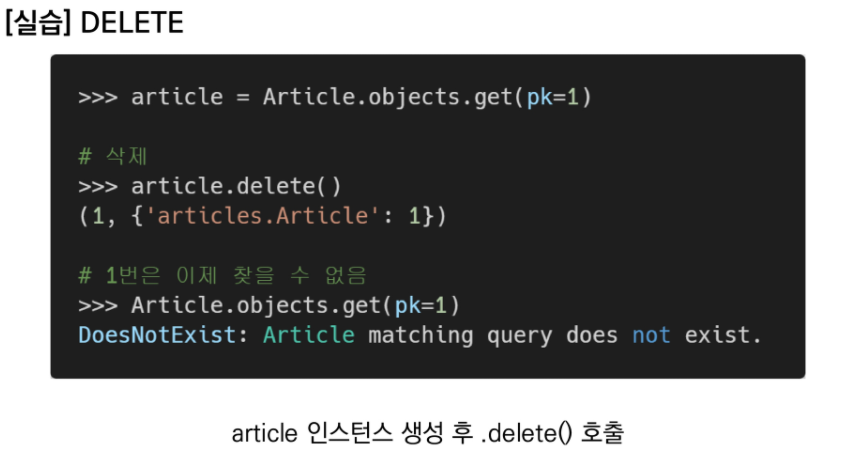

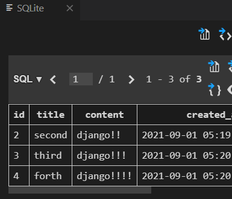

삭제하고 새로 집어넣으면 id = 5번으로 들어간다!

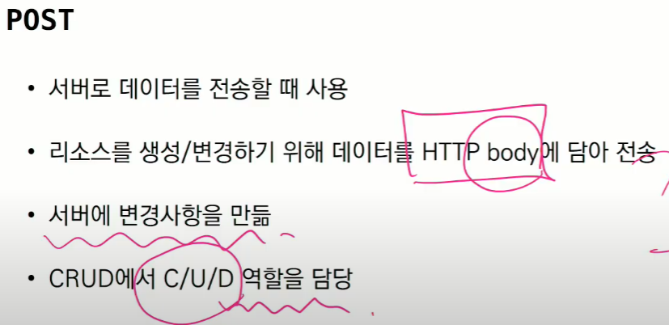

장고의 마지막 시간에 다룰 예정

