# Authentication System

## 장고 인증 시스템

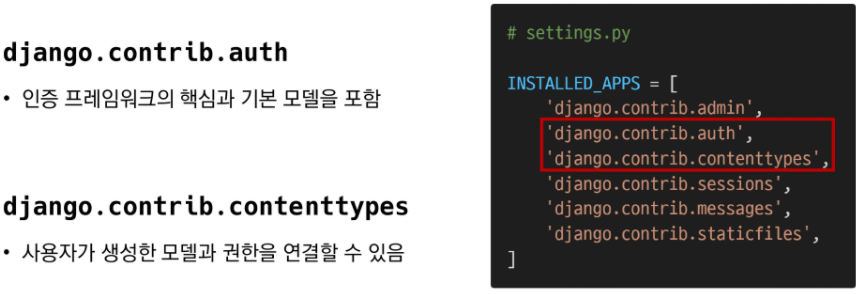

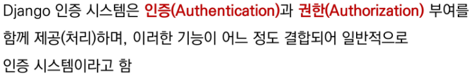

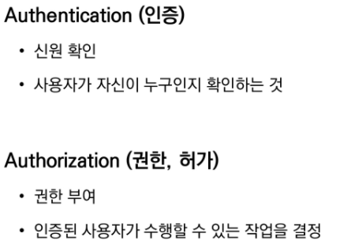

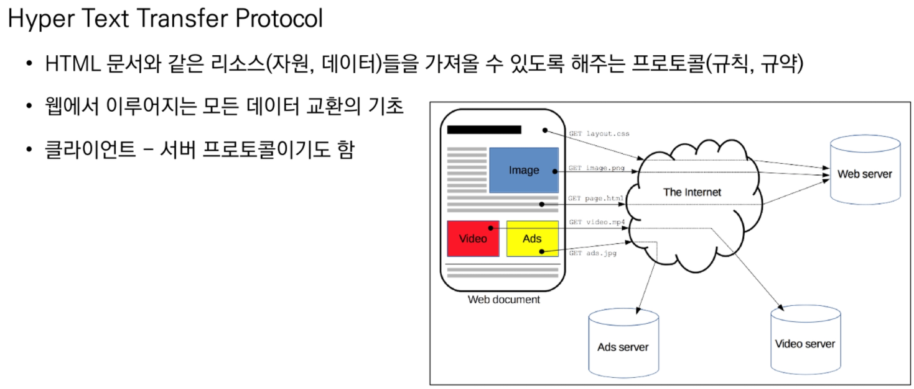

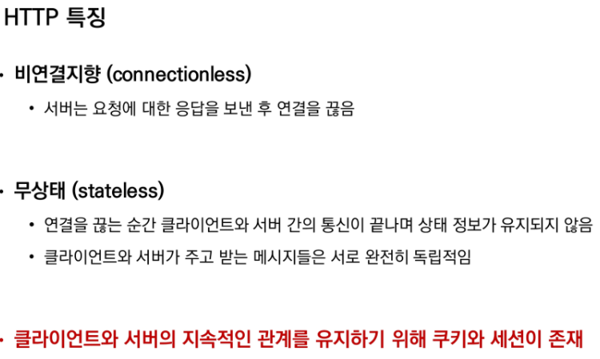

비연결지향으로 인해 무상태를 유지하게 된다

상태 정보 예시) 로그인 => 그러나 로그인은 풀려선 안된다

=> 그렇기 때문에 쿠키와 세션을 통해 (로그인과 같은) 지속적인 관계를 유지시킨다!!

## 쿠키와 세션

### 쿠키의 개념

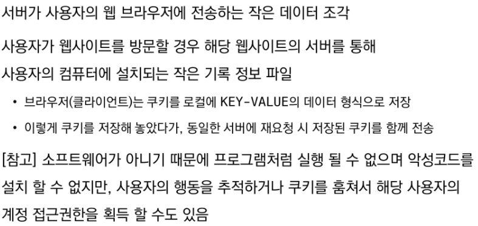

### 요청과 응답

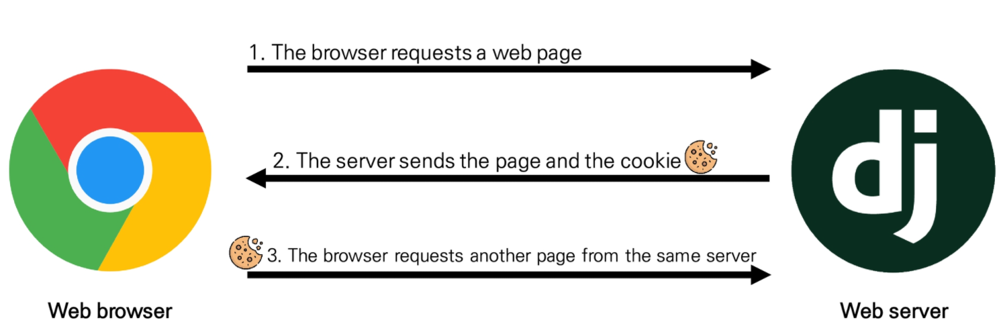

### 쿠키의 사용 목적

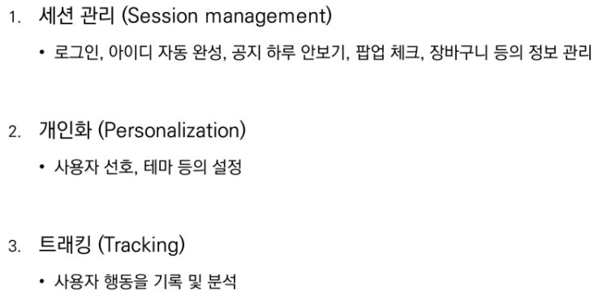

### 쿠키의 수명(lifetime)

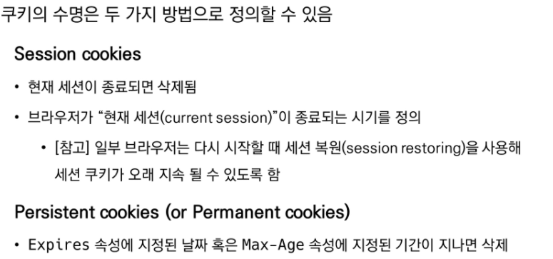

### 세션

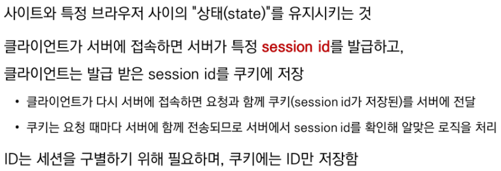

### Session in Django

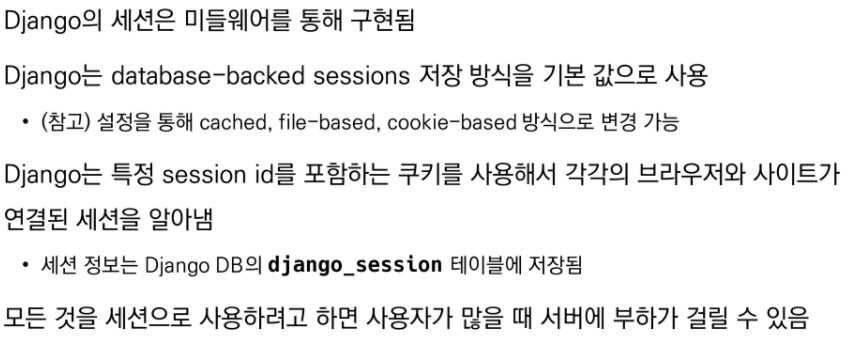

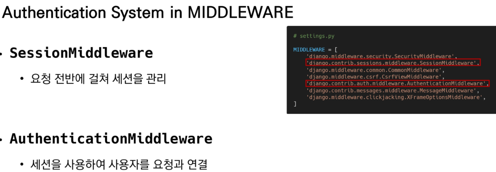

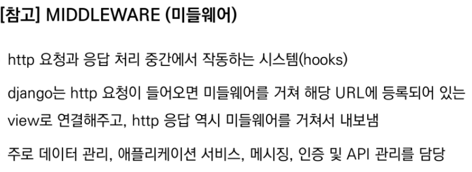

