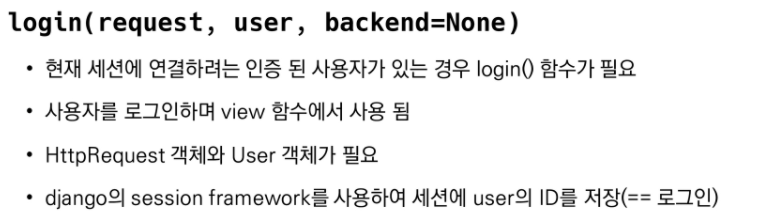
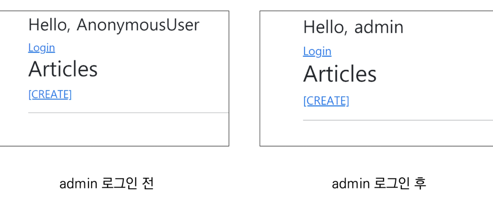
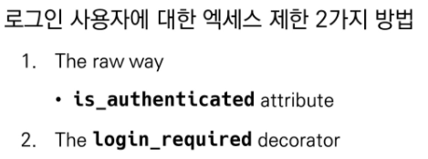
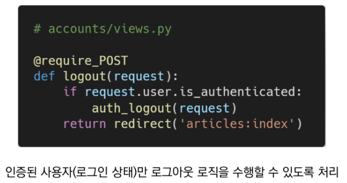
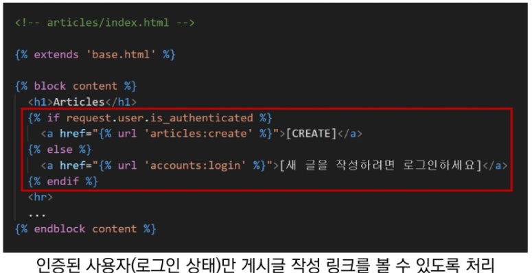
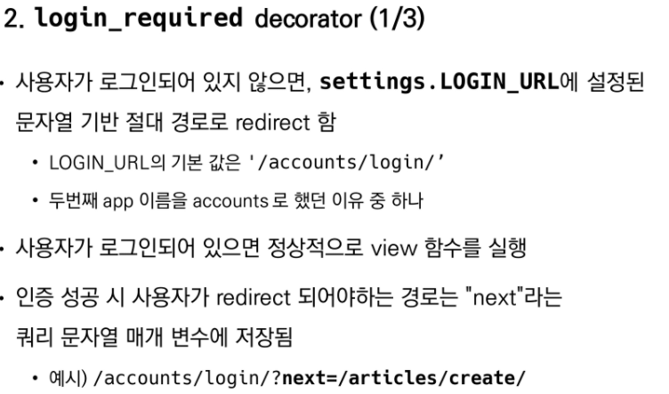
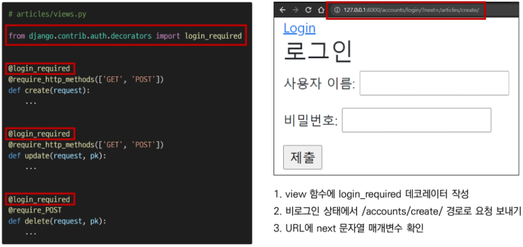

# Login




```python
# views.py
from django.shortcuts import redirect, render
from django.contrib.auth import login as auth_login
from django.contrib.auth.forms import AuthenticationForm

# Create your views here.
def login(request):
    if request.method == 'POST':
        form = AuthenticationForm(request, request.POST)
        if form.is_valid():
            # 로그인!
            auth_login(request, form.get_user())
            return redirect('articles:index')

    else:
        form = AuthenticationForm
    context = {
        'form' : form
    }
    return render(request, 'accounts/login.html', context)
```


## Authemtication data in templates





# Logout

### 로그아웃은 Session을 Delete하는 로직과 같음


## 로그인 사용자 접근 제한













