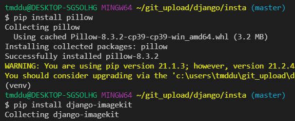

# Django_Framework 사용 방법 총 정리

A부터 Z까지 총 정리

[TOC]

# Intro

## 프로젝트 시작 전, 가상 환경 설정하기

### 가상환경 설치

> 매 프로젝트마다 설치를 해야한다

```bash
python -m venv venv
```


### 가상환경 실행

```bash
source venv/Scripts/activate
```


맥은 경로가 다름 venv/bin/activate

(venv) 가 뜨면 성공한거임


꺼지면 활성화 시켜야함

생성된 파일에 독립적인설정 가능


### Django 설치

```bash
pip install django
```


### requirement.txt 설치 및 생성

```bash
pip install -r requirements.txt
```

```bash
pip freeze > requirements.txt
```


## 파일 생성 & 프로젝트 생성

> [주의]
>
> project 를 생성할 때, Python 이나 Django 에서 사용중인 이름은 피해야 한다. 
>
> `-` 도 사용할 수 없다. (ex. django, test, class, django-test...)
>
> 폴더를 생성하면서 프로젝트를 시작하는 코드

```bash
$ django-admin startproject <project name> .
```

**프로젝트 구조**

- `__init__.py`
  - 빈 파일
  - Python에게 이 디렉토리를 하나의 Python 패키지로 다루도록 지시
- `settings.py`
  - 웹사이트의 모든 설정을 포함
  - 우리가 만드는 어떤 application이라도 등록이 되는 곳이며, static files의 위치, database 세부 설정 등이 작성
- `urls.py`
  - 사이트의 url와 view의 연결을 지정
- `wsgi.py`
  - Web Server Gateway Interface
  - 장고 어플리케이션이 웹서버와 연결 및 소통하는 것을 도움
- `asgi.py`
  - new in 3.0
  - Asynchronous Server Gateway Interface
  - 장고 어플리케이션이 비동기식 웹 서버와 연결 및 소통하는 것을 도움

## **Application 생성**

```bash
$ python manage.py startapp <app name>
```

**Application (app)**

- 실제로 어떠한 역할을 해주는 친구가 app.
- 프로젝트는 이러한 app의 집합이고, 실제 요청을 처리하고 페이지를 보여주고 하는 것들은 이 app의 역할.
- 하나의 프로젝트는 여러 개의 app을 가질 수 있다.
  - app은 하나의 역할 및 기능 단위로 쪼개는 것이 일반적
  - 그러나 작은 규모의 서비스에서는 잘 나누지 않으며 반드시 이렇게 나눠야 한다 같은 기준 또한 없다.
- **일반적으로 app 이름은 `복수형`으로 작성 하는 것을 권장한다.**

<br>

**Application 구조**

- `admin.py`
  - 관리자용 페이지 관련 기능을 작성 하는 곳.
- `apps.py`
  - 앱의 정보가 있는 곳. 
  - 우리는 수정할 일이 없다.
- `models.py`
  - 앱에서 사용하는 Model(Database)를 정의하는 곳.
- `tests.py`
  - 테스트 코드를 작성하는 곳.
- `views.py`
  - view가 정의 되는 곳. 


### Application 등록

> 반드시 **app 생성 후 등록** 순서를 지켜야한다.

- 방금 생성한 app을 사용하려면 프로젝트에 등록 해야 한다.

  ```python
  # settings.py
  
  INSTALLED_APPS = [
  	'articles',
      'django.contrib.admin',
      'django.contrib.auth',
      'django.contrib.contenttypes',
      'django.contrib.sessions',
      'django.contrib.messages',
      'django.contrib.staticfiles',
  ]
  
  # settings.py
  
  LANGUAGE_CODE = 'ko-kr'
  
  TIME_ZONE = 'Asia/Seoul'
  ```
  


### 이미지 처리를 위한 라이브러리 추가



이미지 처리를 위한 라이브러리 추가

Add `'imagekit'` to your `INSTALLED_APPS` list in your project's settings.py

