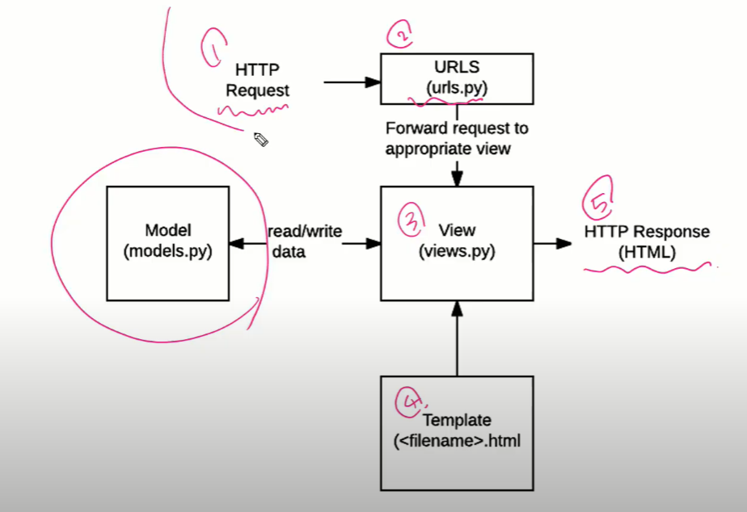
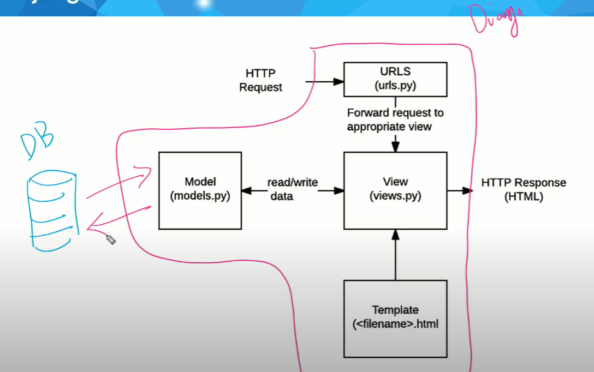
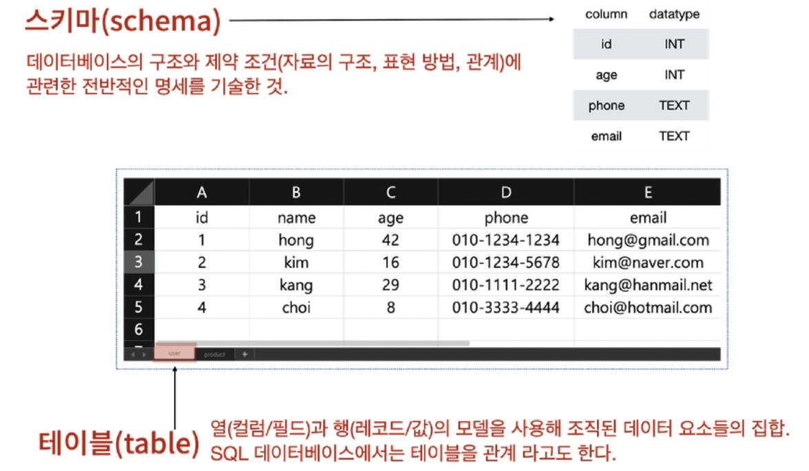
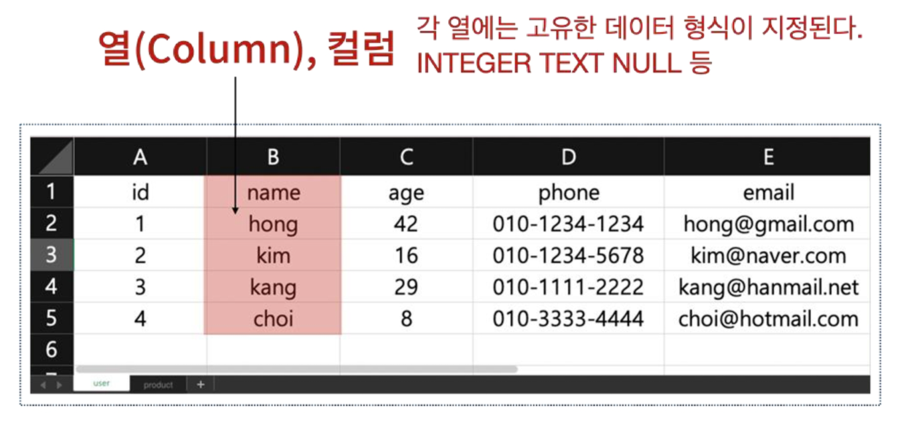
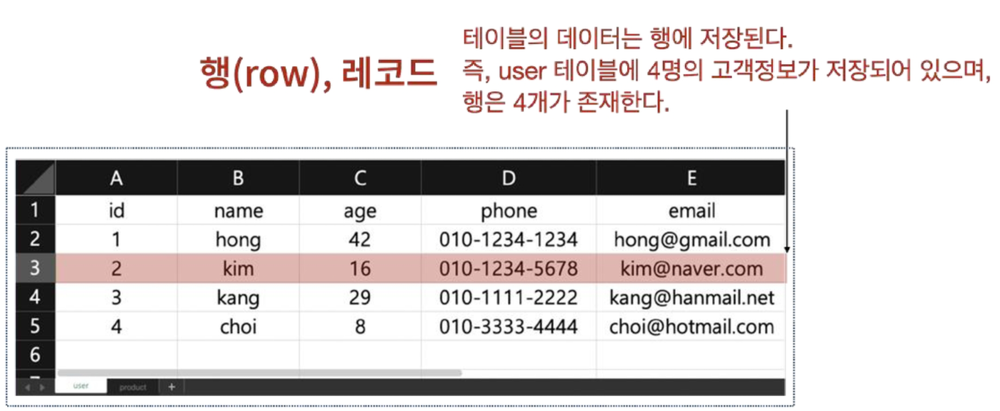
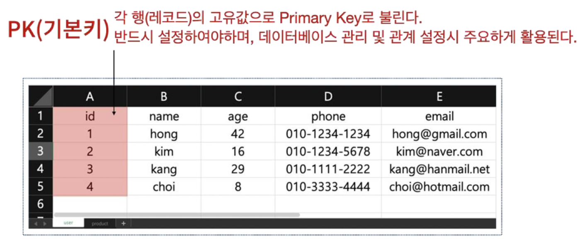
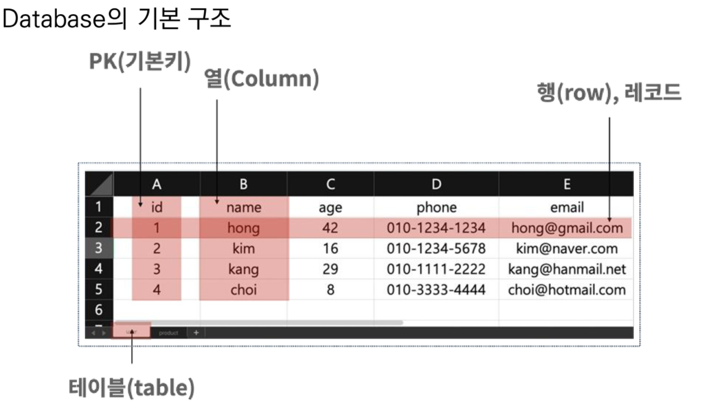

# Django Model

1. 클라이언트가 요청을 보냄
2. url이 적절한 view에게 매칭
3. view가 template를 매칭
4. template가 사이틀를 구성
5. 요청을 응답

## Model이란?

- 단일한 데이터에 대한 정보를 가짐
  - 사용자가 저장하는 데이터들의 필수적인 필드들과 동작들을 포함
- 저장된 데이터베이스의 구조(layout)
- django는 model을 통해 데이터에 접속하고 관리
- 일반적으로 각각의 moedl은 하나의 데이터베이스 테이블에 매핑
- 웹 어플리케이션의 데이터를 구조화하고 조작하기 위한 도구

모델 != 데이터베이스

## Database

- 데이터베이스(DB)
  - 체계화된 데이터들의 모임
- 쿼리(Query)
  - 데이터를 조회하기 위한 명령어 
  - 조건에 맞는 데이터를 추출하거나 조작하는 명령어

## Database 기본구조

### 스키마

- 데이터베이스에서 자료의 구조, 표현방법, 관계 등을 정의한 구조

### 테이블

#### 행(row) : 필드(field) or 속성

#### 열, 컬럼(column) : 레코드(record) or 튜플

테이블을 관계(relation)이라고도 한다...!

위의 사진에서는 행이 4개, 레코드가 4개, 데이터가 4개 (다 같은 소리)

