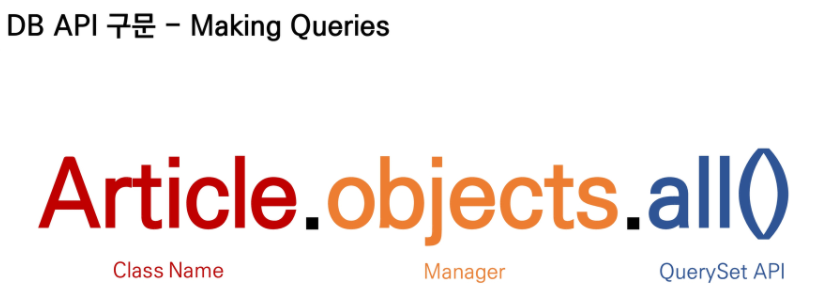
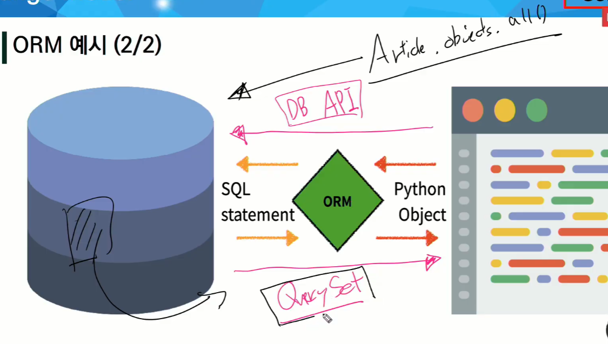
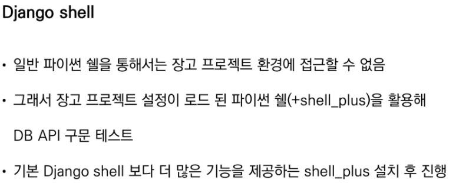
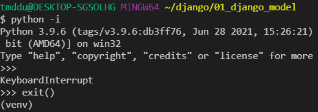
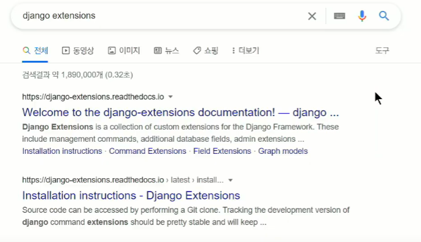
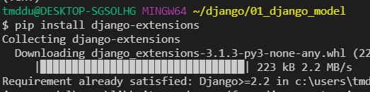

# Database_API

- 파이썬(객체)
- 'DB를 조작하기 위한 도구'
- django가 기본적으로 ORM을 제공함에 따른 것으로 DB를 편하게 조작할 수 있음
- Model을 만들면 django는 객체들을 만들고 읽고 수정하고 지울 수 있는 database-abstract API를 자동으로 만듦
- database-abstract API 혹은 database-access API 라고도 함

​											모든 게시글을 조회하는 명령어 : `Article.objects.all()`

queries = 명령문, 명령어

### Manager

#### 	django 모델에 데이터베이스 query 작업이 제공되는 인터페이스

​			단지 인터페이스일 뿐이다!

#### 	기본적으로 모든 django 모델 클래스에 objects라는 Manager를 추가 

### QuerySet (중요)

#### 	데이터베이스로부터 전달받은 객체 목록

#### 	queryset 안의 객체는 0개, 1개 혹은 여러 개일 수 있음

#### 	데이터베이스로부터 조회, 필터, 정렬 등을 수행 할 수 있음

쿼리셋 => [O, O, O, ....] O=데이터

리스트처럼 쓸 수 있다 = 인덱스 접근, 슬라이싱

리스트는 아니지만, 리스트처럼 쓸 수 있다!!!!

위의 명령어를 쓰기 위해서는 shell을 설치해야한다

