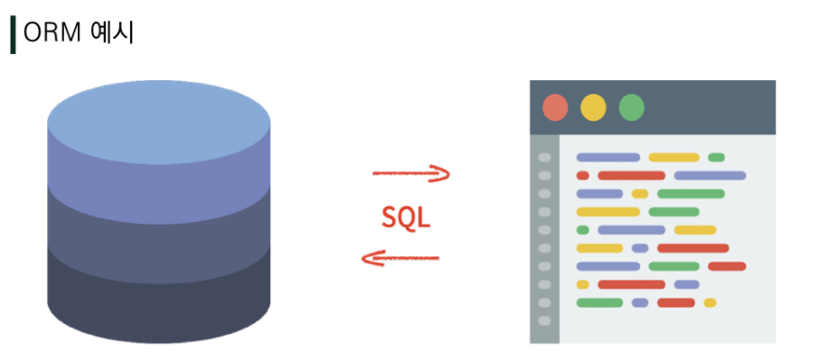
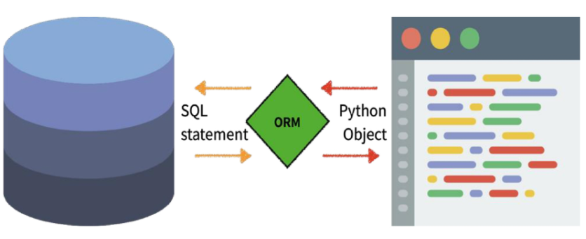

# Django_Model_ORM

# ORM : Object-Relational-Mapping

- 객체 지향 프로그래밍 언어를 사용하여 호환되지 않는 유형의 시스템 간에(Django-SQL)데이터를 변환하는 프로그래밍 기술
- OOP 프로그래밍에서 RDBMS을 연동할 때, 데이터베이스와 객체 지향 프로그래밍 언어간의 호환되지 않는 데이터를 변환하는 프로그래밍 기법
- Django는 내장 Django ORM을 사용

####    			  	DD(SQL)																		Django(python)

## ORM 장, 단점

- 장점
  - SQL을 잘 알지 못해도 DB 조작이 가능
  - SQL의 절차적 접근이 아닌 객체 지향적 접근으로 인한 높은  생산성
- 단점
  - ORM 만으로 완전한 서비스를 구현하기 어려운 경우가 있음
- 현대 웹 프레임워크의 요점은 웹 개발의 속도를 높이는 것. **(생산성)**

### "우리는 DB를 객체(object)로 조작하기 위해 ORM을 사용한다."

