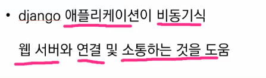

# Web_Framework

### MTV Pattern

#### model

- 데이터베이스의 기록을 관리
- 데이터베이스 : CRUD 컨트롤 리드 ? 딜리트

#### template

- HTML, CSS 와 같은 레이아웃 정의

#### view

- 동작하고 컨트롤 시킨다
- HTTP 요청을 수신하고 응답을 반환

## Web

HTTP라는 프로토콜(약속)

동기적으로 일어난다 => a다음 b가 일어나는 연속적인 행위

비동기적 => 세탁기, 로봇 청소기, 식기세척기 등 시키는 행위