# 장고 설정방법

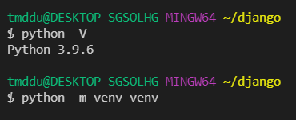

-m : 모듈을 만들겠다

venv : venv모듈을

venv : venv 이름으로

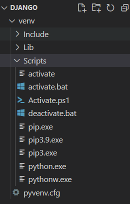

가상 환경을 만드는 행위 -> 만들어진 결과

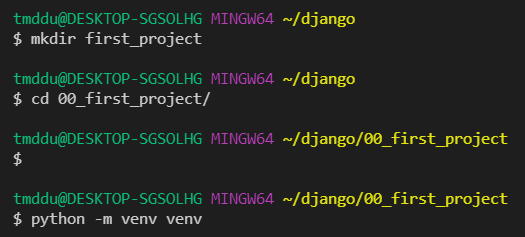

빈칸은 오타

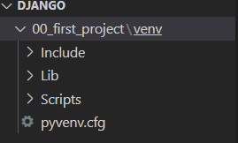

맥은 경로가 다름 venv/bin/activate

(venv) 가 뜨면 성공한거임

꺼지면 활성화 시켜야함

생성된 파일에 독립적인설정 가능

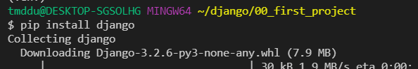

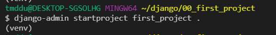

장고야 나는 현재 폴더에다가 프로젝트를 시작할꺼야 파일명은 first_project

`.` -> 현재 폴더 에다가

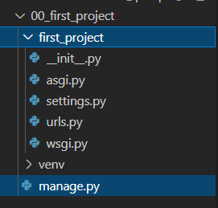

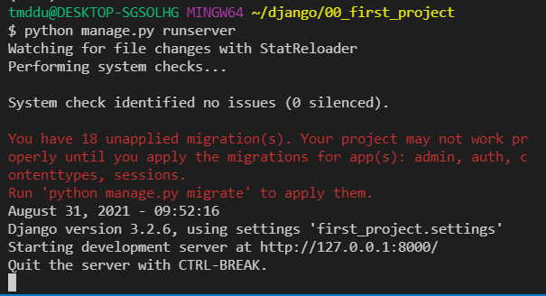

url 도메인 컨트롤 클릭

로컬호스트로 만들어진 url => 127.0.0.1

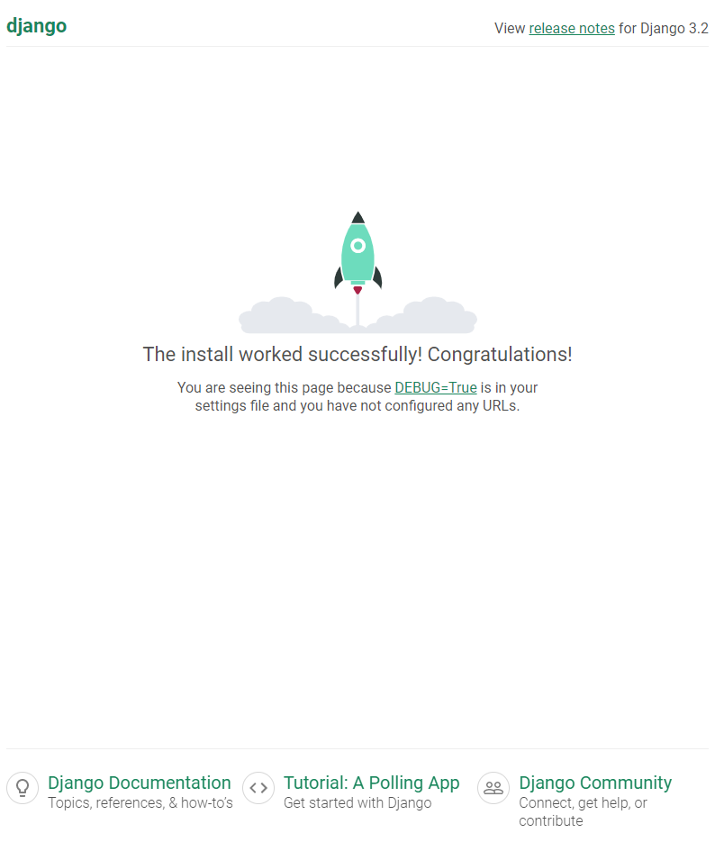

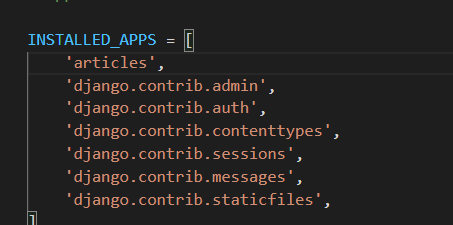

생성 후 등록

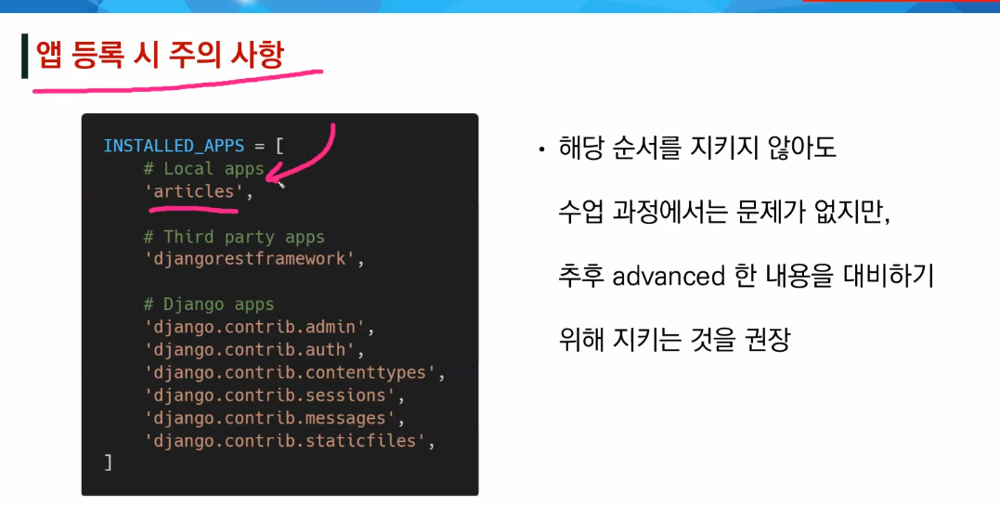

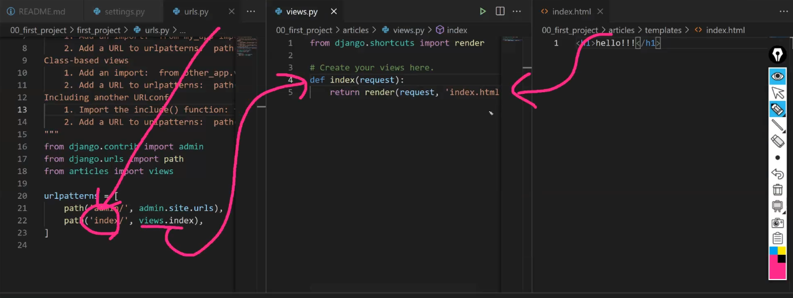

