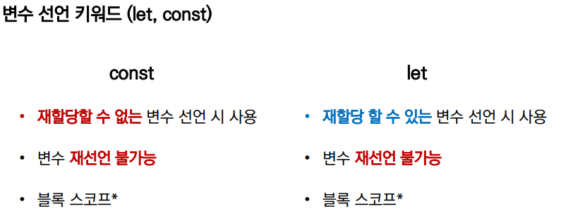

```javascript
# 재할당 불가능
const a = 10

# 재할당 가능
let a = 10
```

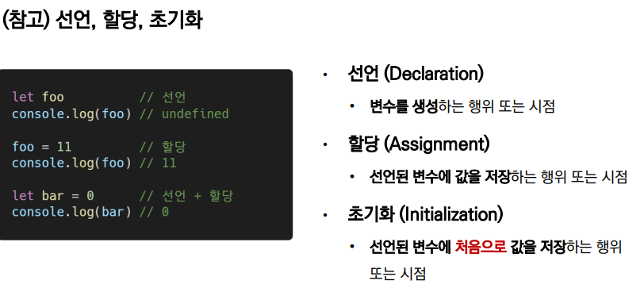

### 재할당이란?

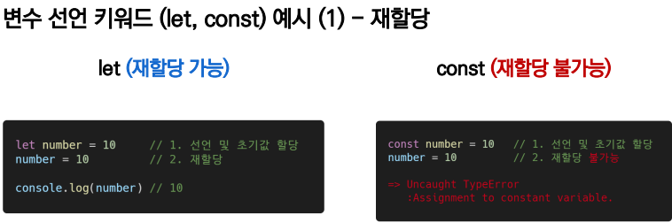

=> 할당은 불가능하지만, 수정은 가능! 밑에 예시 있음

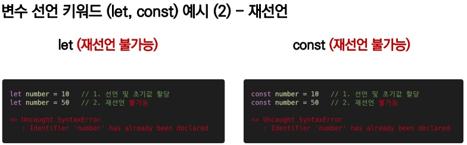


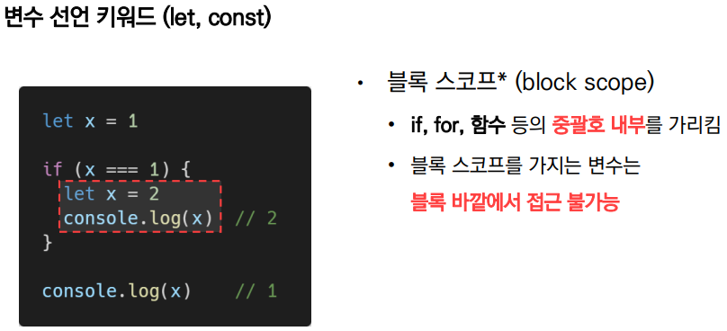

=> 블록 안에서 선언된 변수는 바깥에서 접근 불가능

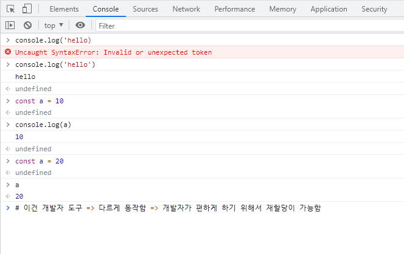

```javascript
let a = 10
const b = 20
a = 30
console.log(a)
```

```bash
$ node 00-variables.js 
30
```


```javascript
let a = 10
const b = 20
a = 30
b = 40
console.log(b)
```

```bash
node 00-variables.js 
30
C:\Users\tmddu\Desktop\javascript\js\00-variables.js:6
b = 40
  ^

TypeError: Assignment to constant variable.
    at Object.<anonymous> (C:\Users\tmddu\Desktop\javascript\js\00-variables.js:6:3)
    at Module._compile (node:internal/modules/cjs/loader:1101:14)
    at Object.Module._extensions..js (node:internal/modules/cjs/loader:1153:10)
    at Module.load (node:internal/modules/cjs/loader:981:32)
    at Function.Module._load (node:internal/modules/cjs/loader:822:12)
    at Function.executeUserEntryPoint [as runMain] (node:internal/modules/run_main:81:12)
    at node:internal/main/run_main_module:17:47
```


```javascript
const a = {
  'name' : 'change'
}
console.log(a)
```

```bash
$ node 00-variables.js 
{ name: 'change' }
```


```javascript
const a = {
  'name' : 'change'
}
a = {'age': 20}
console.log(a)
```

```bash
$ node 00-variables.js 
C:\Users\tmddu\Desktop\javascript\js\00-variables.js:13
a = {'age': 20}
  ^

TypeError: Assignment to constant variable.
    at Object.<anonymous> (C:\Users\tmddu\Desktop\javascript\js\00-variables.js:13:3)
?[90m    at Module._compile (node:internal/modules/cjs/loader:1101:14)?[39m
?[90m    at Object.Module._extensions..js (node:internal/modules/cjs/loader:1153:10)?[39m
?[90m    at Module.load (node:internal/modules/cjs/loader:981:32)?[39m
?[90m    at Function.Module._load (node:internal/modules/cjs/loader:822:12)?[39m
?[90m    at Function.executeUserEntryPoint [as runMain] (node:internal/modules/run_main:81:12)?[39m
?[90m    at node:internal/main/run_main_module:17:47?[39m
```


```javascript
const a = {
  'name' : 'change'
}
a.name = 'tom'
console.log(a)
console.log(a.name)
```

```bash
$ node 00-variables.js 
{ name: 'tom' }
tom
```

`a.name` => 오브젝트 자체를 할당하는 것은 안되지만, 오브젝트 안에 있는 데이터를 추가, 삭제, 수정하는 행동은 가능하다!!!


```javascript
const a = {
  'name' : 'change'
}
a = {'location':'seoul'}
console.log(a)
```

```bash
$ node 00-variables.js 
C:\Users\tmddu\Desktop\javascript\js\00-variables.js:13
a = {'location':'seoul'}
  ^

TypeError: Assignment to constant variable.
    at Object.<anonymous> (C:\Users\tmddu\Desktop\javascript\js\00-variables.js:13:3)
?[90m    at Module._compile (node:internal/modules/cjs/loader:1101:14)?[39m
?[90m    at Object.Module._extensions..js (node:internal/modules/cjs/loader:1153:10)?[39m
?[90m    at Module.load (node:internal/modules/cjs/loader:981:32)?[39m
?[90m    at Function.Module._load (node:internal/modules/cjs/loader:822:12)?[39m
?[90m    at Function.executeUserEntryPoint [as runMain] (node:internal/modules/run_main:81:12)?[39m
?[90m    at node:internal/main/run_main_module:17:47?[39m
```


```javascript
let a = {
  'name' : 'change'
}
a = {'location':'seoul'}
console.log(a)
```

```bash
$ node 00-variables.js 
{ location: 'seoul' }
```


#### var => 사용하지는 않는다

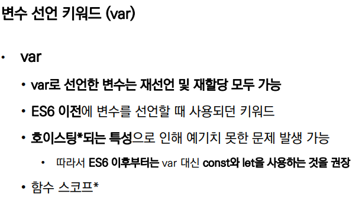

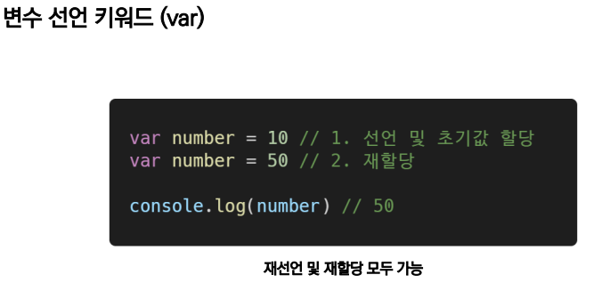

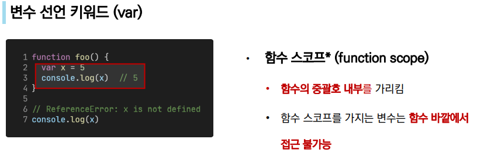

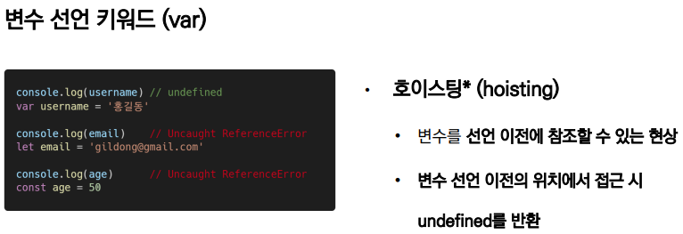


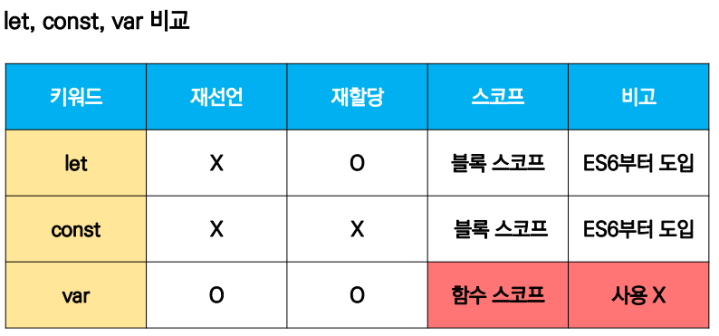

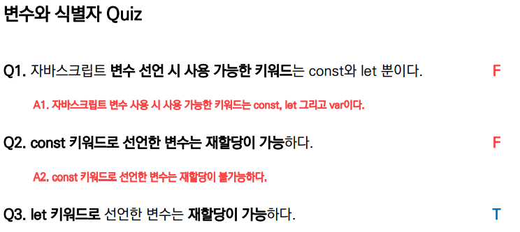

