# 타입과 연산자

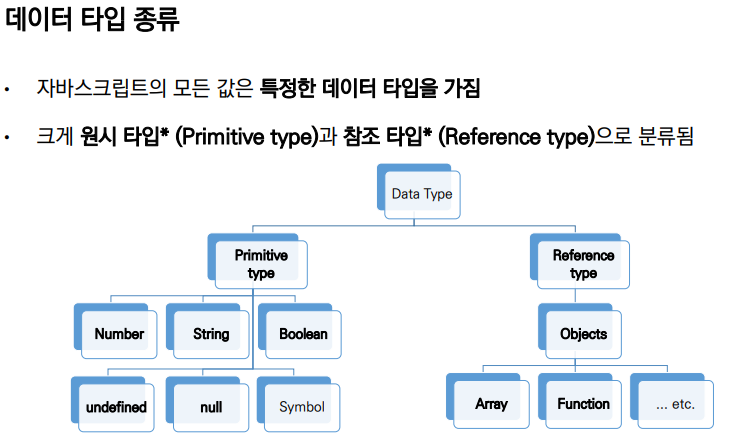


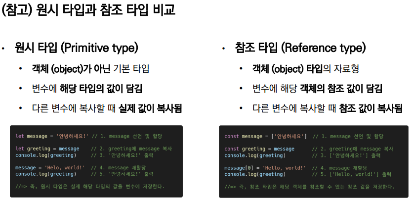


## 원시 타입

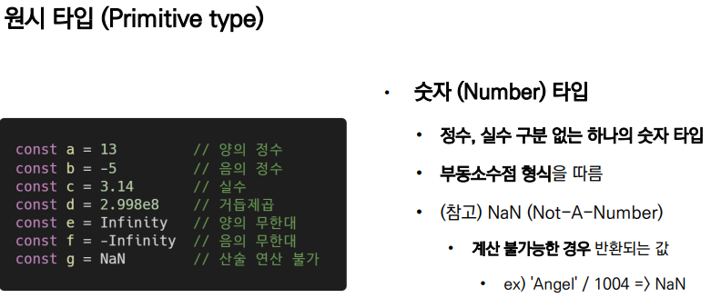

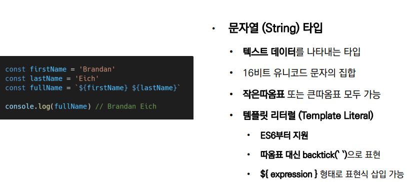

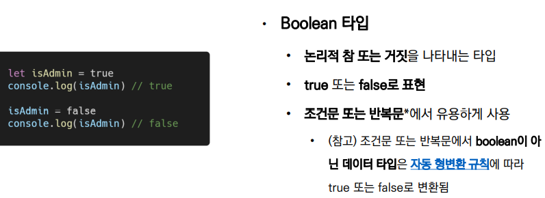


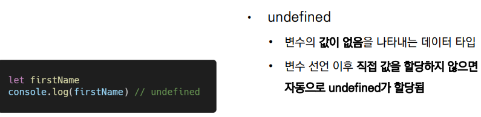

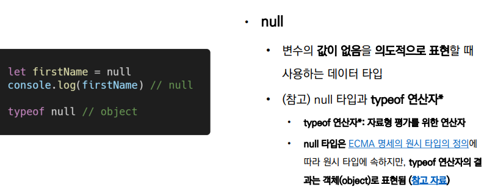

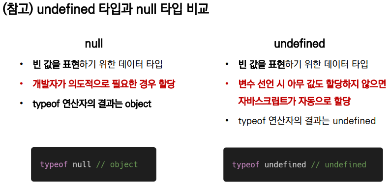


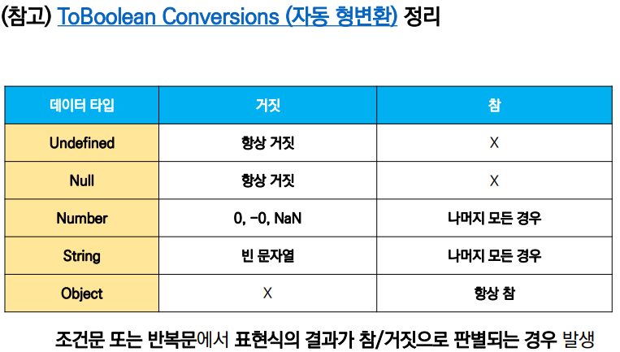

0, '', -0, 등등 => 거짓

{} => 참 => 그러면 null 값도 참인가? X => 비어있는 딕셔너리일 경우 참이다 나머지는 다 거짓

```javascript
let a = {}
boolean a 	// True
```


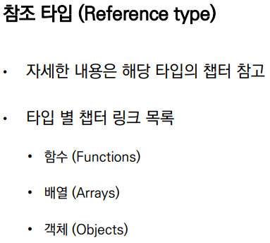


## 연산자

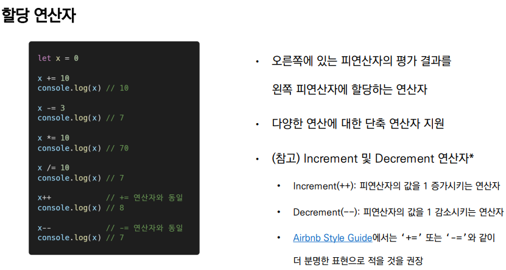

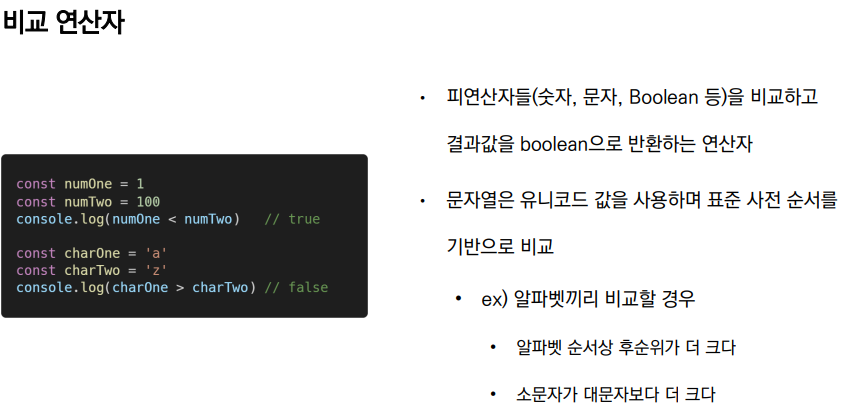

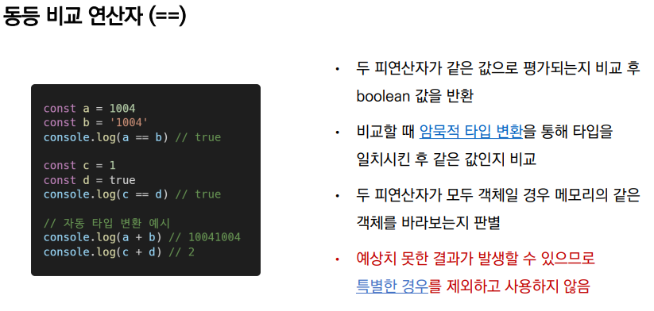

##### => 파이썬과 다르게 작동 => 그래서 일치 비교 연산자를 쓰는 것을 권장


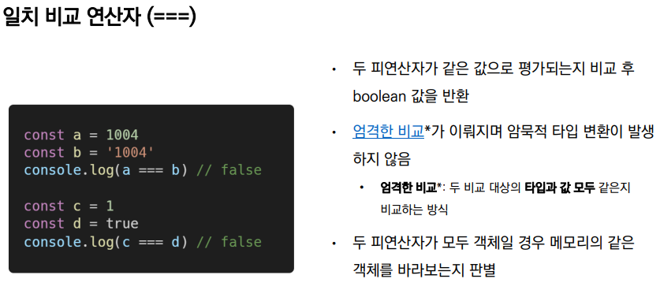

#### 타입, 값이 모두 같아야 한다


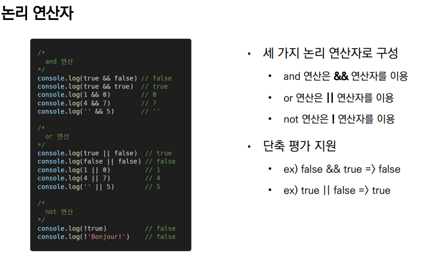

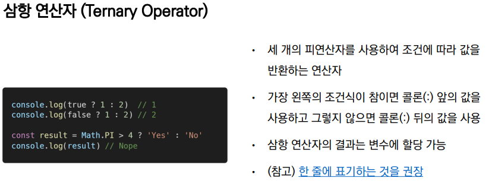


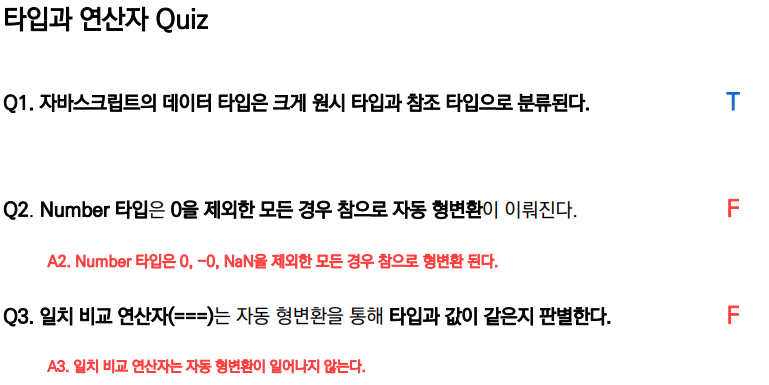
