# 함수

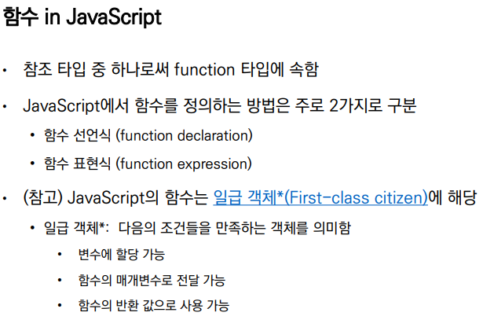

파이썬의 함수와 마찬가지로 JS의 함수도 일급 객체에 해당


## 함수 선언식

~== 파이썬 def

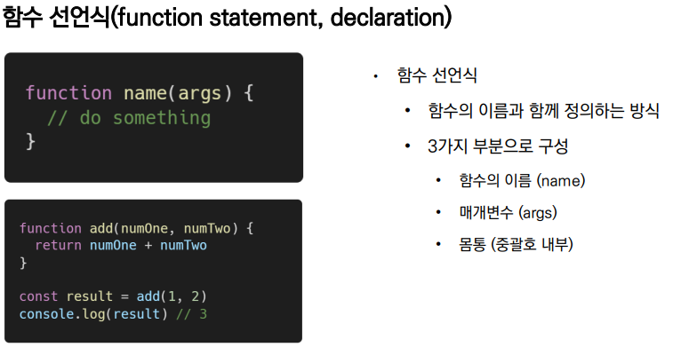


## 함수 표현식

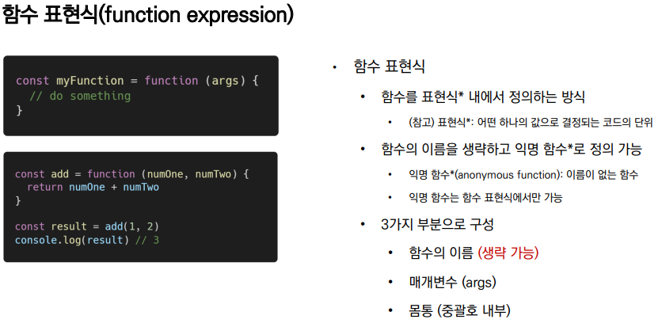

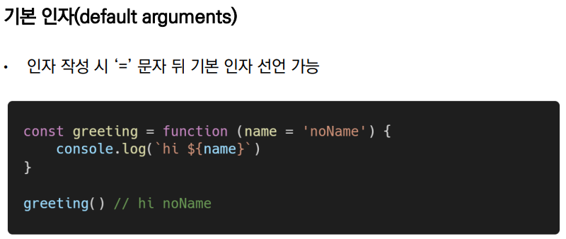


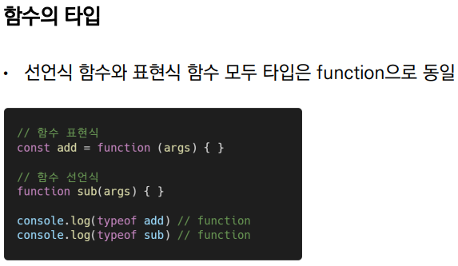

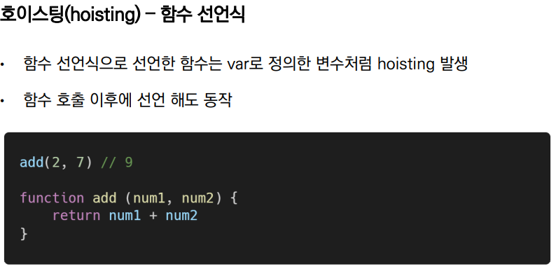

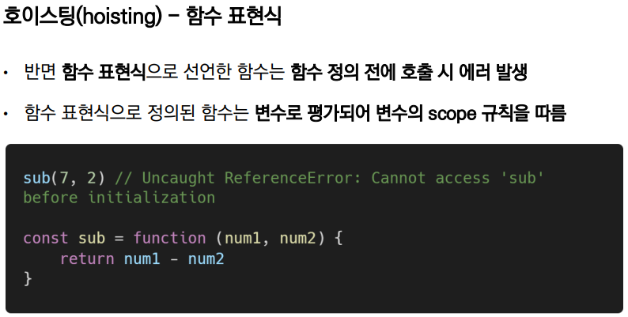

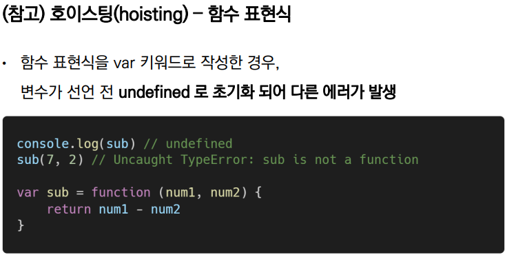


## Arrow Function

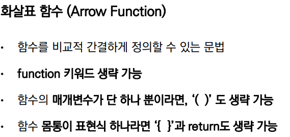

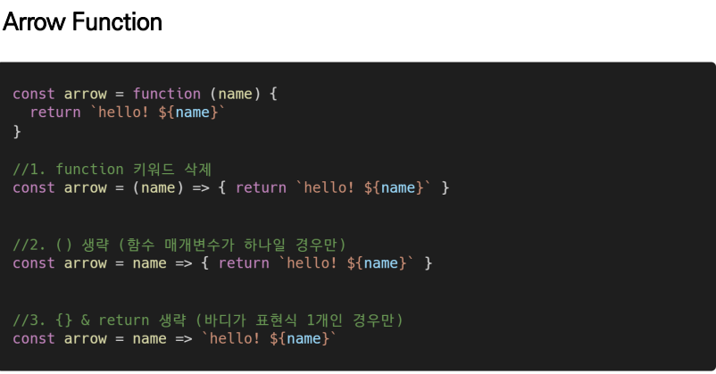

```javascript
// 1단계 함수 표현식
const func = function(name) {
  return `hello ${name}`
}


// 2단계 화살표 함수 변경
const func = (name) => {return `hello ${name}`}


// 3단계 소괄호 생략 (매개변수가 하나일 때!)
const func = name => {return `hello ${name}`}


// 4단계 중괄호& return 생략 (body(중괄호 안의 코드) 안의 코드가 표현식 1개로만 이루어진 경우)
// 표현식이 1개 == 결과문이 1개인 경우(리턴값이 한개)
const func = name => `hello ${name}`


console.log(func('tmddud'))
```


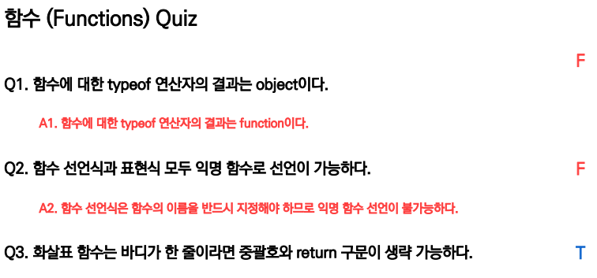

바디가 한줄 => 표현식이 하나라면 이 더 정확한 표현