# OOP(Object-Oriented Programming)

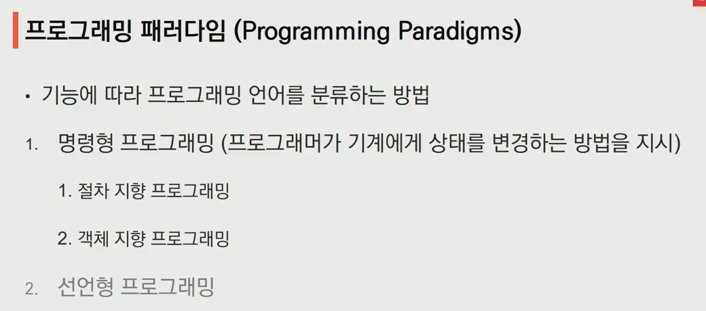

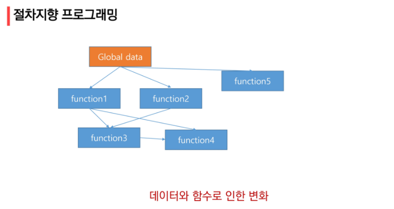

## 객체 지향 프로그래밍

- 컴퓨터 프로그래밍의 패러다임의 하나
- 컴퓨터 프로그램을 명령어의 목록으로 보는 시각에서 벗어나 여러 개의 독립된 단위, 즉 객체들의 모임으로 파악

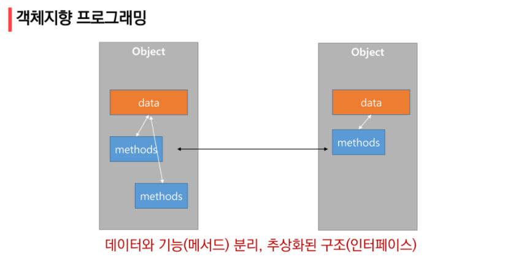

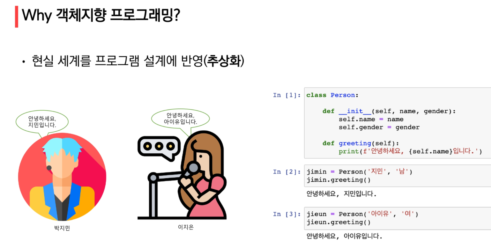

`jimin`이라는 인스턴스를 만들었다. 이름과 성별이라는 속성

`jimin.greeting()` -> 객체가 메서드를 호출

인사라는 행동을 할 수 있는 사람 클래스

class라는 틀로 개별적인 인스턴스를 만들고 나면, 인스턴스는 class 틀 안에 정의했던 동작들을 각자 다르게 수행할 수 있다

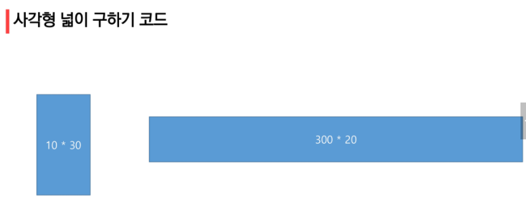

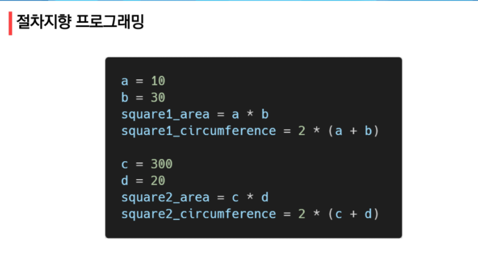

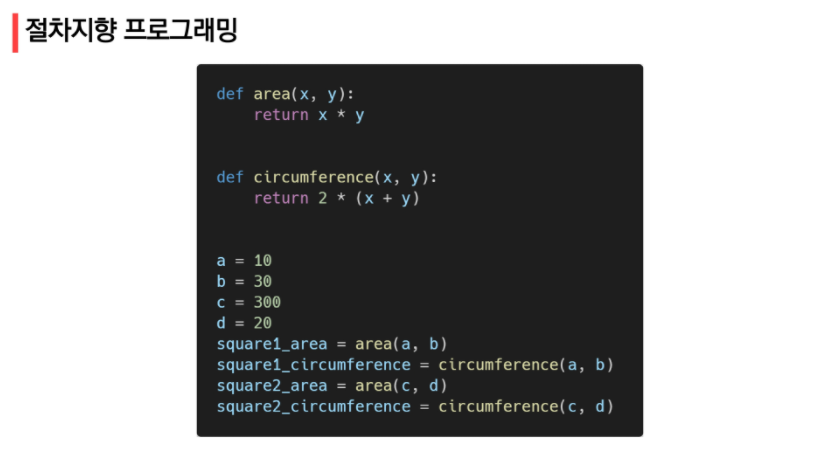

그동안의 코딩 방법

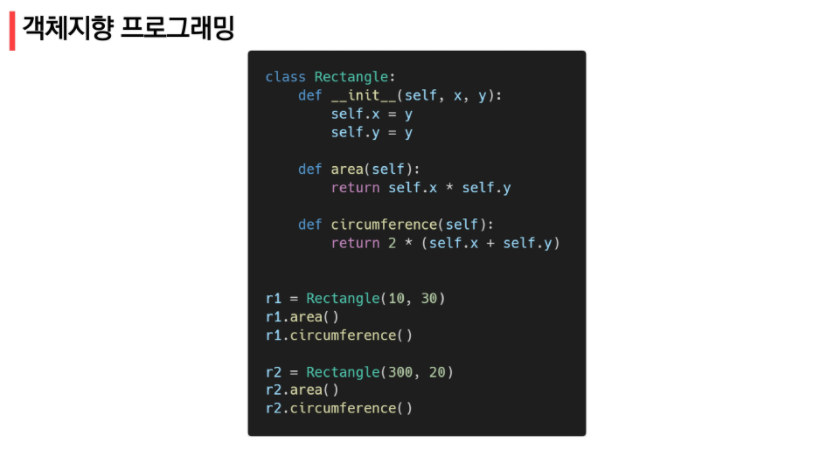

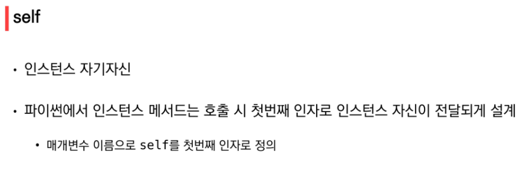

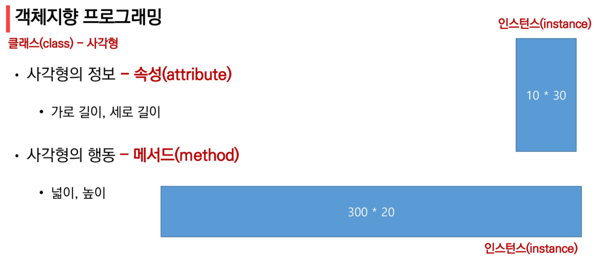

높이 -> 둘레

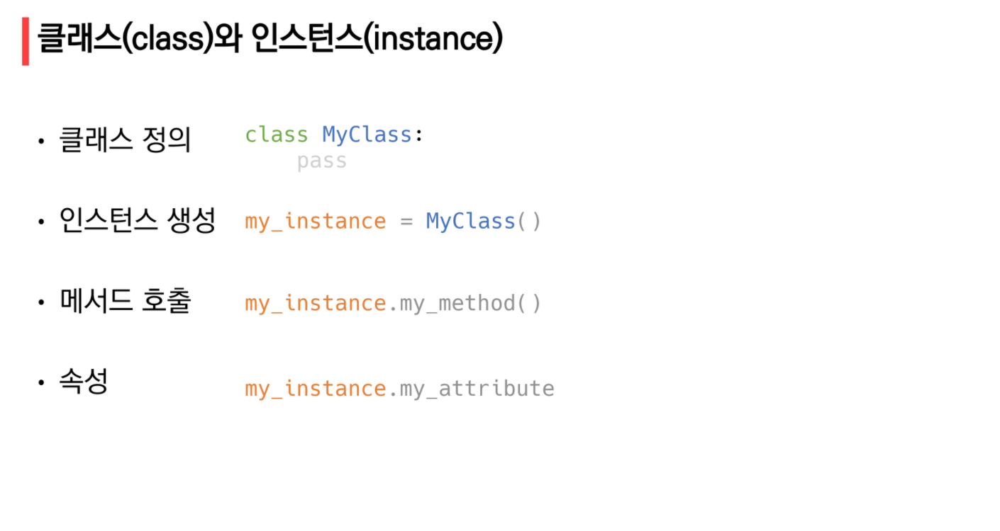

클래스 뒤에 () 붙이는게 좋음

클래스는 대문자로 시작 

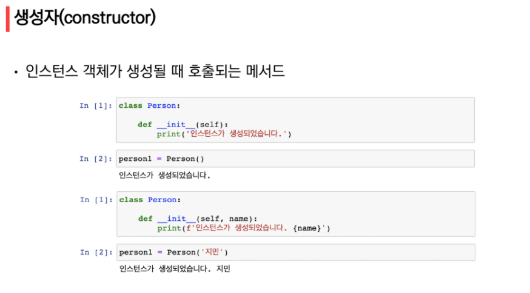

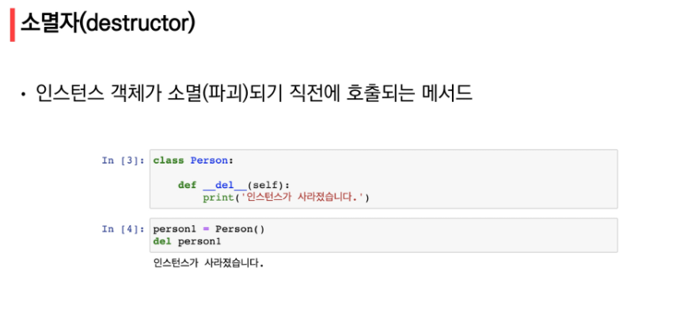

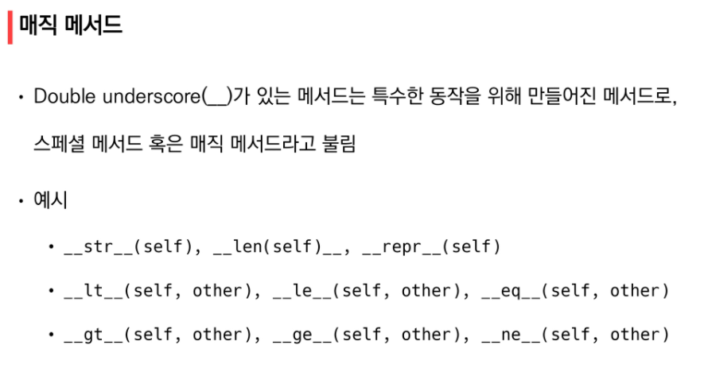

더블 언더스코어 == 던더스코어

https://zzsza.github.io/development/2020/07/05/python-magic-method/

클래스와 같은 코드가 한 곳에 모인 파이썬 파일을 모듈
