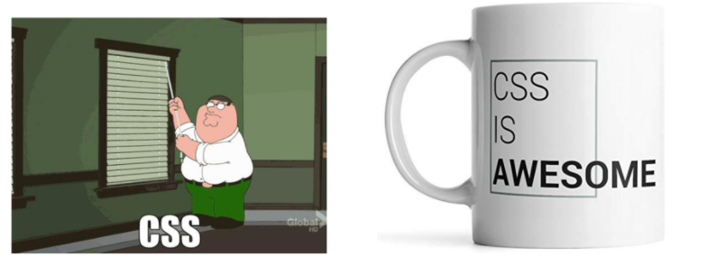
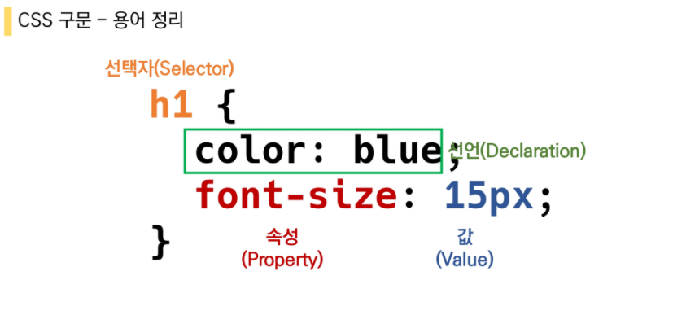
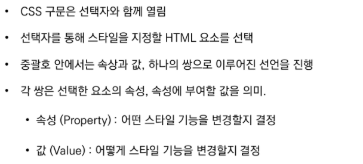
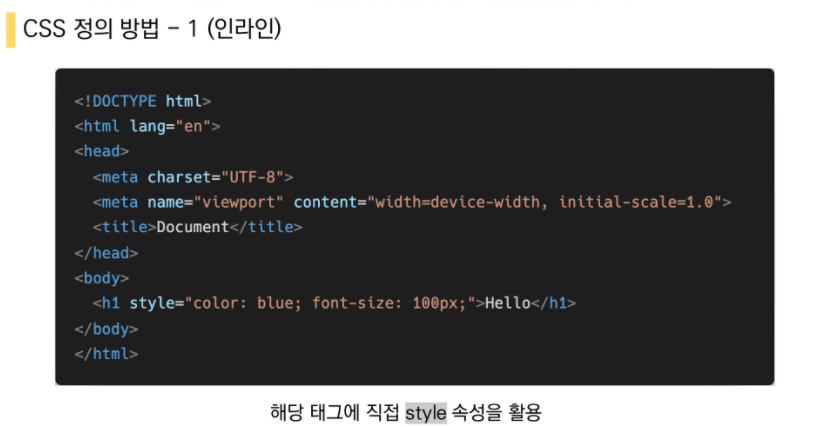
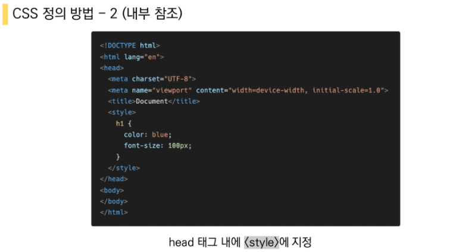
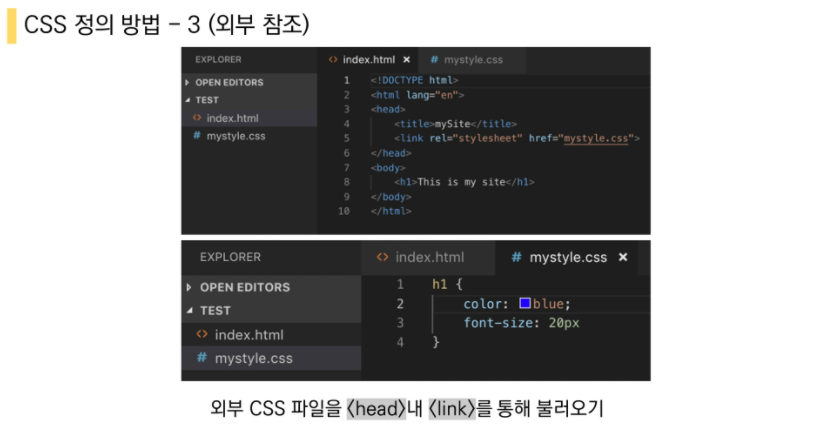

# Web_CSS

## CSS Cascading Style Sheets

- 스타일 레이아웃 등을 통해 문서(HTML)를 표시하는 방법을 지정하는 언어

속상 -> 속성

## CSS 정의 방법

1. 인라인
2. 내부참조(embedding) -<style>
3. 외부참조(link file) - 분리괸 CSS파일

참고문헌

https://developer.mozilla.org/ko/docs/Web/CSS/CSS_Selectors

https://www.w3schools.com/cssref/default.asp
