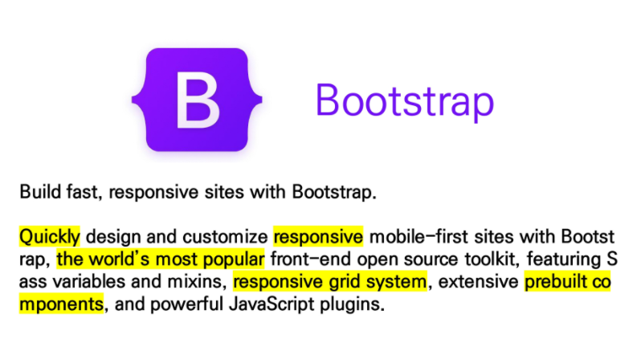
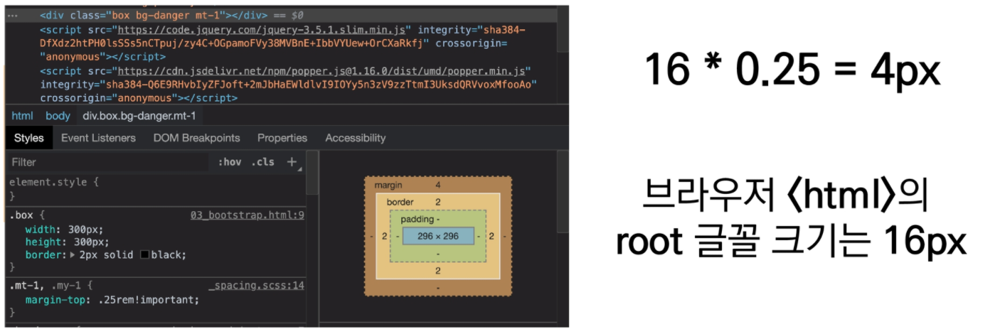

# CSS Bootstrap

# spacing

## .mt-1

마진 탑

## .mx-0

마진 x축

## .mx-auto

수평 중앙 정렬

## .py-0

패딩 y축

s -> start     e -> end

# color

.bg = background

# fiexbox in Bootstrap

# Responsive Web Design

