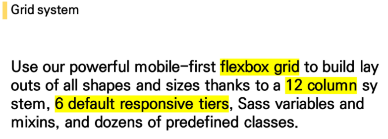
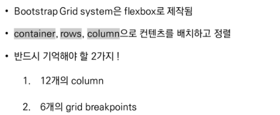
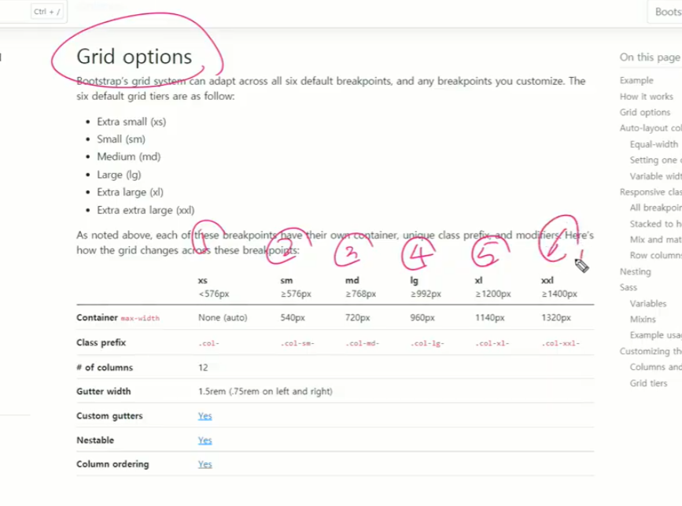
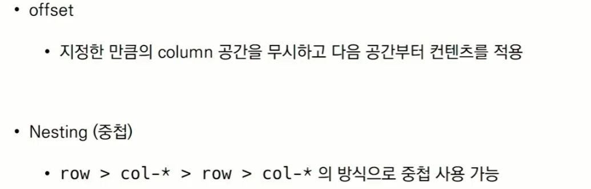

# Bootstrap Grid System

반응형으로 바뀌는 6개의 지점(기준점) 제공

column을 12개로 나누는 이유? => 약수가 많기 때문에(1, 2, 3, 4, 6, 12) => 배열할 때 다양하게 배치가 가능

flex = container > items

Grid Sy = container > rows > column

​			6개 지점

Bootstrap 공식문서 Doc에서 검색 또는 확인

​	grid => 6 responsive breakpoints, 각각의 픽셀값

class prefix

예)   col-sm-1 =>  sm 사이즈에서는 1 칸을 차지합니다

​		col-md-3 => md 사이즈에서는 3 칸을 차지합니다

​		xs 사이즈는 쓸 필요가 없다

