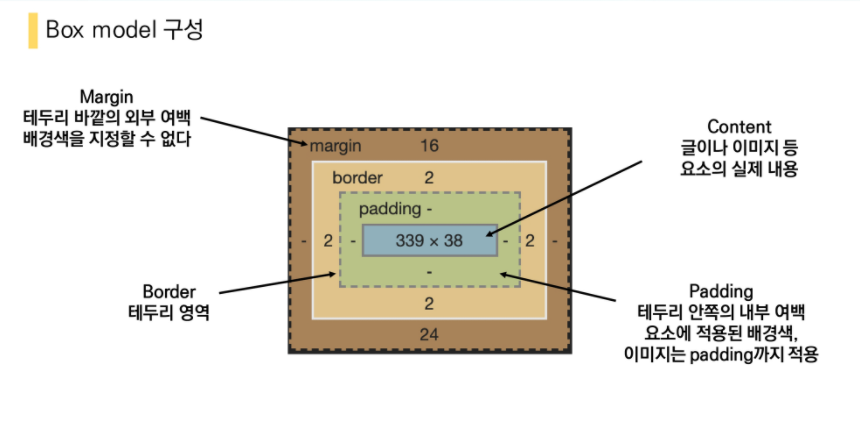

# CSS_Box_model

- 모든 HTML요소는 box 형태로 되어있음
- 하나의 박스는 네 부분(영역)으로 이루어짐
  - content
  - padding
  - border
  - margin



단축키

```html
<!-- ul>li*3 +tab -->
  <ul>
    <li></li>
    <li></li>
    <li></li>
  </ul>
```

참고

https://docs.emmet.io/abbreviations/syntax/