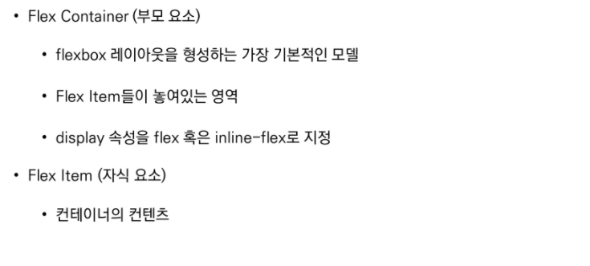

# CSS Flexbox

> CSS Flexible Box Layout


기본값 왼쪽에서 시작 -> 오른쪽에서 끝남

​		 	위에서 시작 -> 밑에서 끝남




**부모가 아이템들을 정렬시킨다!**


```html
  <style>
    .flex-container {
      /* 1. 정렬하고자 하는 부모 요소(flex container)에 선언 */
      display: flex;
      /* display: inline-flex; */
      /* 인라인 플랙스는 안에있는 컨텐츠만큼만 flex를 준다 */
      
      /* 2. 메인축 방향 설정 */
      /* flex-direction: row; */
      /* flex-direction: row-reverse; */
      /* flex-direction: column; */
      /* flex-direction: column-reverse; */

      /* 3. item들이 강제로 한 줄에 배치되게 할 것인지에 대한 여부 */
      /* flex-wrap: nowrap;
      flex-wrap: wrap;
      flex-wrap: wrap-reverse; */

      /* 4. flex-directon + flex-wrap의 shortand */
      /* flex-flow: column wrap; */

      /* 5. 메인축 정렬 */
      justify-content: flex-start;
      /* justify-content: center; */
      /* justify-content: flex-end; */
      /* 좌우정렬, 아이템간의 간격 동일, 양쪽은 붙임 */
      /* justify-content: space-between; */
      /* 균등 좌우정렬 내부 간격이 외부 간격의 2배 */
      /* justify-content: space-around; */
      /* 균등 좌우정렬 내부 간격 = 외부 간격*/
      /* justify-content: space-evenly; */

      /* 6. 교차축 정렬 */
      /* 교차축을 기준으로 움직인다 */
      /* align-items: stretch; */
      /* align-items: flex-start; */
      /* align-items: center; */
      /* align-items: flex-end; */
      /* 글자의 위치가 첫번째 글자의 위치(밑줄부분으로)로 맞춰진다 */
      /* align-items: baseline; */   
    }
 
    /* 주체는 item이기 때문에 부모에서 벗어나서 개별로 써야함*/
    /* 7. 교차축 개별 정렬 */
    /* 8. order */
    /* order: 값이 작을수록 앞으로 정렬(기본값 0) */
    .item1 {
      /* align-self: flex-start; */
      order: 0;
      /* order의 기본값은 0 */
    }
    .item2 {
      /* align-self: center; */
      order: -1;
      /* 오더의 기본값보다 작기 때문에 맨 앞으로 오게 된다 */
    }
    .item3 {
      /* align-self: flex-end; */
      order: 1;
      /* 오더의 기본값보다 크기 때문에 맨 끝으로 가게된다 */
    }
  </style>
```


상하좌우정렬이 2줄


```html
.item1 {
      flex-grow: 1;
    }
    .item2 {
      flex-grow: 2;
    }
    .item3 {
      flex-grow: 3;
    }
/* flex-grow : 메인축에서 남은 공간을 각 항목에게 분배 */
/* 남은 공간에 대한 배분! */
/* 기본값 0 */
```


   

### 적용 예시


얘네는 align-content


