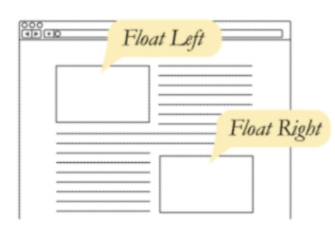
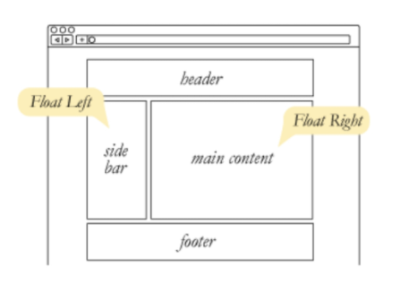
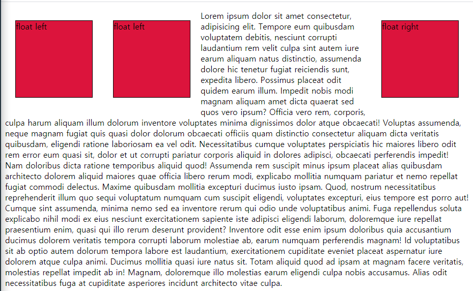
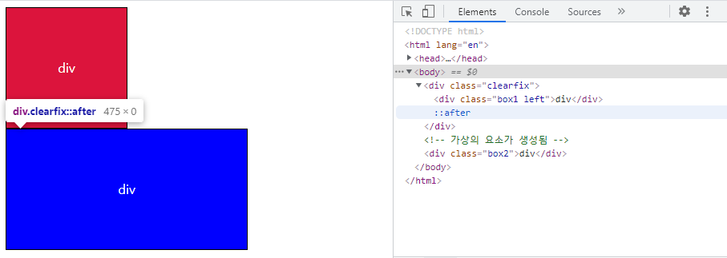
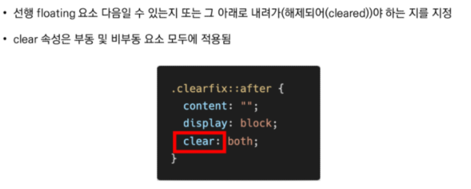
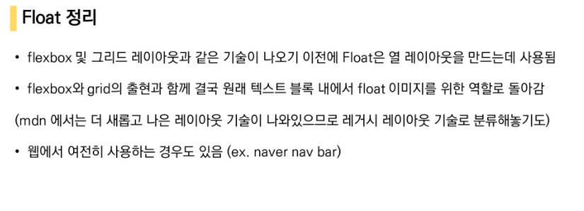

# CSS float

> 이미지 좌, 우측 주변으로 텍스트를 둘러싸는 레이아웃을 위해 도입
>
> 더 나아가 이미지가 아닌 요소들에도 적용해 웹 사이트의 전체 레이아웃을 만드는데까지 발전




## Float 속성

- none : 기본값
- left : 요소를 왼쪽으로 띄움
- right : 요소를 오른쪽으로 띄움



```html
<style>
    .box {
      width: 150px;
      height: 150px;
      border: 1px solid black;
      background-color: crimson;
      margin: 20px;
    }

    .left {
      float: left;
    }
</style>
<body>
  <div class="box left">float left</div>
  <div class="box left">float left</div>
  <div class="box right">float right</div>
  <p><--의미 없는 문장-->.</p>
</body>
```




## Float clear

- **선택한 요소의 맨 마지막 자식으로 가상 요소(의사 요소)를 하나 생성**
- 보통 content 속성과 함꼐 짝지어, 요소에 장식용 콘텐츠를 추가할 때 사용
- 기본값은 inline

다양한 요소는 ndm 을 참고



```html
.left {
      float: left;
    }
    .clearfix::after {
      /* ::after -> 의사요소 또는 가상요소 */
      content: "";
      display: block;
<!-- 기본값이 인라인이기 때문에 블럭으로 바꾸어야한다 -->
      clear: both;
    }

  </style>
</head>
<body>
  <div class="clearfix">
    <div class="box1 left">div</div>
  </div>
  <!-- 가상의 요소가 생성됨 -->
  <div class="box2">div</div>
```

크게 3가지 방법이 있다

위의 방법이 가장 일반적






