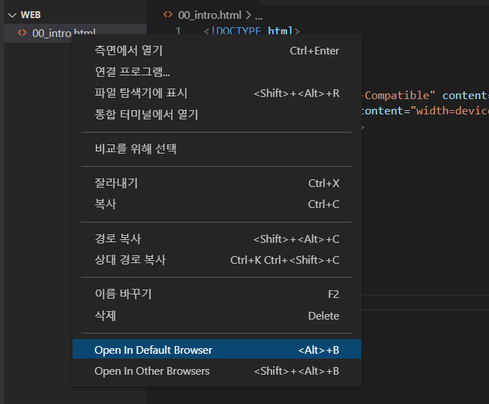
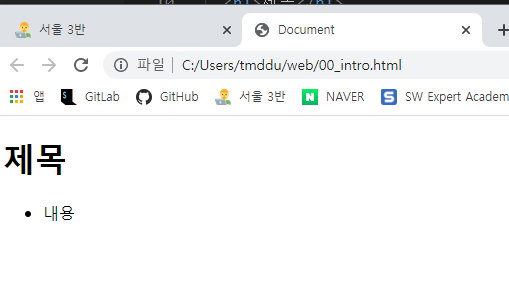
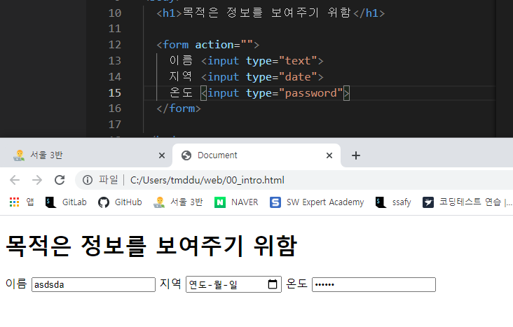

# HTML 문서 구조화

vscode에서 html문서를 만든 후

!를 누르고 +tab을 쓰면 밑에 코드가 자동완성 된다

```html
<!DOCTYPE html>
<html lang="en">
<head>
  <meta charset="UTF-8">
  <meta http-equiv="X-UA-Compatible" content="IE=edge">
  <meta name="viewport" content="width=device-width, initial-scale=1.0">
  <title>Document</title>
</head>
<body>
  
</body>
</html>
```

+head와 body는 html안에 있지만, 관념적으로 같은 라인에 써도 된다!

```html
ul을 누르고 tab를 누르면
<ul><ul/>가 자동완성!
```







