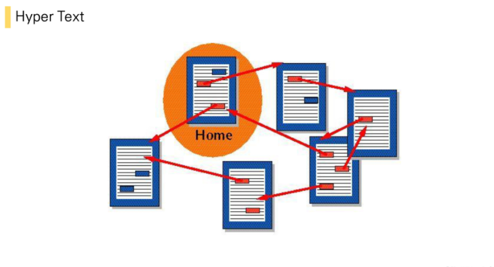
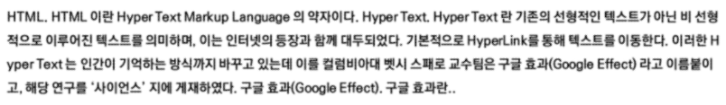
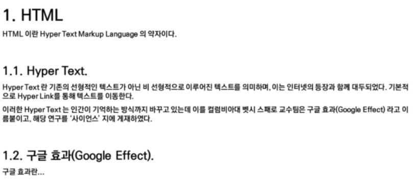
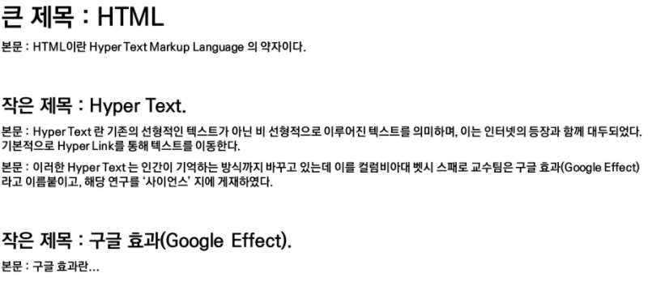

# Web: HTML

## HTML

> Hyper Text Markup Language

- Hyper
  - 텍스트 등의 정보가 동일 선상에 있는 것이 아니라 다중으로 연결 되어있는 상태
- Hyper Text
  - 참조(하이퍼링크)를 통해 사용자가 한 문서에서 다른 문서로 즉시 접근할 수 있는 텍스트

- Markup
  - example

Markup : 단순히 문자를 크게 하는 것 뿐만이 아닌 대주제, 본문 등의 역할을 부여

- Markup Language 
  - 태그 등을 이용하여 문서나 데이터의 구조를 명시하는 언어
  - 프로그래밍 언어와는 다르게 단순하게 데이터를 표현하기만 한다
  - 예시) HTML, Markdown

### HTML

### 웹 페이지를 작성하기 위한(구조를 잡기 위한) 언어

### 웹 컨텐츠의 의미와 구조를 정의

> 문서파일 .html

