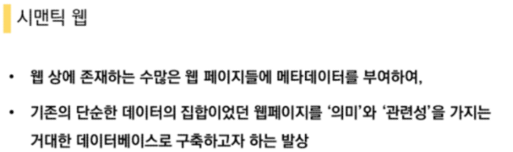
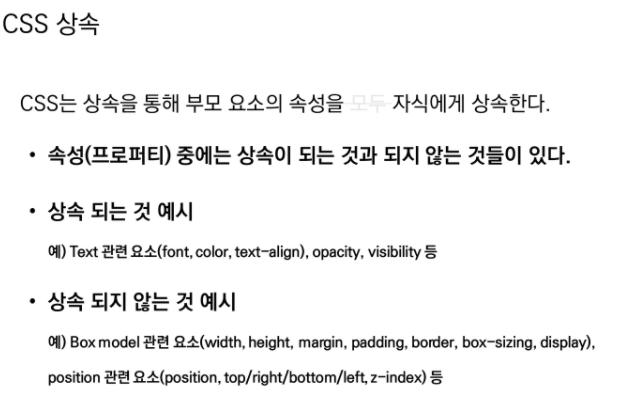

# HTML, CSS

## web

웹 어플리케이션 개발을 통해 SW 개발 방법 및 학습 과정을 익히기 위해서 배운다

### 표준 웹 

W3C - HTML

웹표준은 W3C에서 발표한다

WHATWG - HTML Living Standard

## HTML

### Hyper Text Markup Language

Hyper Text

- 참조(하이퍼링크)를 통해 사용자가 한 문서에서 다른 문서로 즉시 접근할 수 있는 텍스트

Markup : 단순히 문자를 크게 하는 것 뿐만이 아닌 대주제, 본문 등의 역할을 부여

Markup Language 

- 태그 등을 이용하여 문서나 데이터의 구조를 명시하는 언어
- 프로그래밍 언어와는 다르게 단순하게 데이터를 표현하기만 한다
- 예시) HTML, Markdown

### HTML

### 웹 페이지를 작성하기 위한(구조를 잡기 위한) 언어

### 웹 컨텐츠의 의미와 구조를 정의

1) 웹 표준을 만드는 곳은 Mozilla 재단이다.   **F**
2) 표(table) 을 만들 때에는 반드시  태그를 사용해야 한다.  **F**
3) 제목(Heading) 태그는 제목 이외에는 사용하지 않는 것이 좋다.   **T**
4) 리스트를 나열하기 위해서는 태그만 사용 할 수 있다.   **F**
5) HTML의 태그는 반드시 별도의 닫는 태그가 필요하다.  **F**

들여쓰기 : 2spaces 권장

## 요소(element)

### 태그

## 속성(attribute)

HTML5에서 새롭게 추가된 시맨틱(semantic)  태그를 모두 고르시오.

header

footer

section

# CSS

스타일 레이아웃 등을 통해 문서(HTML)를 표시하는 방법을 지정하는 언어

속상 -> 속성

## CSS 정의 방법

1. 인라인
2. 내부참조(embedding) -<style>
3. 외부참조(link file) - 분리된 CSS파일

## Selectors 선택자

## CSS 우선순위

!important >> Inline style > id 선택자 > class 선택자 > 요소 선택자 > 소스 순서

## CSS 개념

1. HTML과 CSS는 각자 문법을 갖는 별개의 언어이다.  **T**
2. 웹 브라우저는 내장 기본 스타일이 있어 CSS가 없어도 작동한다.  **T**
3. 자식 요소 프로퍼티는 부모의 프로퍼티를 모두 상속 받는다. **F**
4. 디바이스마다 화면의 크기가 다른 것을 고려하여 상대 단위인 %를 사용한다. **F**
5. id 값은 유일해야 하므로 중복되어서는 안된다.  **T**

nth-child(n) -> 부모의 n번째 자식을 찾는다, 모든 자식중에 2번째

​							#ssafy에서 2번째 자식 -> 
첫번째 단락

nth-of-type(n)-> 부모에서 **p중에서** n번째 자식을 찾는다 -> 
두번째 단락

