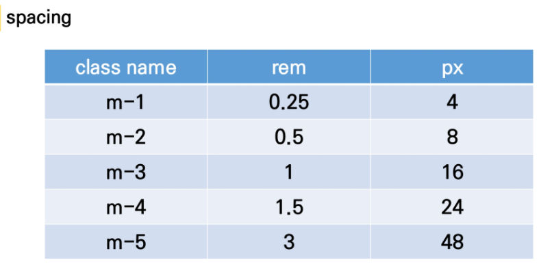

## .mx-0

마진 x축

## .mx-auto

수평 중앙 정렬

## .py-0

패딩 y축

s -> start     e -> end

# Bootstrap Grid System

반응형으로 바뀌는 6개의 지점(기준점) 제공

column을 12개로 나누는 이유? => 약수가 많기 때문에(1, 2, 3, 4, 6, 12) => 배열할 때 다양하게 배치가 가능

flex = container > items

Grid Sy = container > rows > column

​			6개 지점

Bootstrap 공식문서 Doc에서 검색 또는 확인

​	grid => 6 responsive breakpoints, 각각의 픽셀값

class prefix

예)   col-sm-1 =>  sm 사이즈에서는 1 칸을 차지합니다

​		col-md-3 => md 사이즈에서는 3 칸을 차지합니다

​		xs 사이즈는 쓸 필요가 없다

## 1. CSS flex-direction

- row : 주축을 왼쪽에서 오른쪽으로 설정(기본값)
- column : 주축을 위에서 아래로 설정
- row-reverse : 주축을 왼쪽에서 오른쪽으로 설정
- column-reverse : 주축을 위에서 아래로 설정

## 2. bootstrap

flex-row

flex-column

flex-row-reverse

flex-column-reverse

## 3. align-items

flex-start : 요소들을 컨테이너의 꼭대기로 정렬

flex-end : 요소들을 컨테이너의 바닥으로 정렬

baseline : 요소들을 컨테이너의 시작 위치에 정렬한다.

tretch : 요소들을 컨테이너에 맞도록 늘린다.

## 4. flex-flow

 flex-flow flex-flow 속성은 두가지 속성의 축약형이다. 올바르게 짝지어진 것을 고르시오. 

(1) flex-direction, flex-wrap 

(2) flex-direction, align-items 

(3) justify-content, flex-wrap 

(4) justify-content, align-item

(1)

## 5. Bootstrap Grid System

flex-column

flex-row

## 6. Breakpoint prefix

breakpoint 5가지의 값 디바이스의 크기 xl , md 등등

12칸중에 몇칸을 쓰는가 12가지