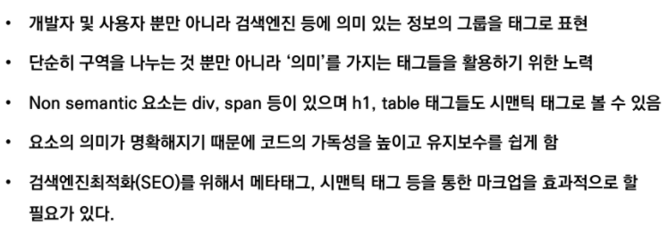
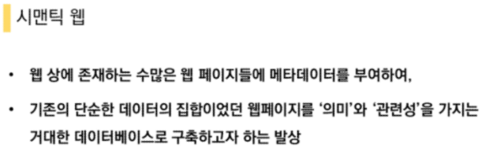
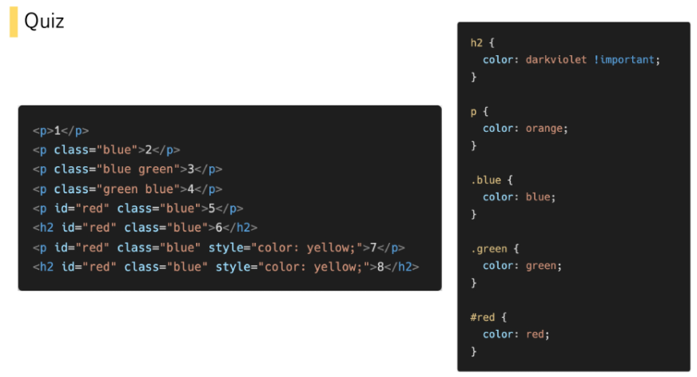
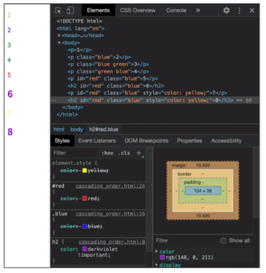
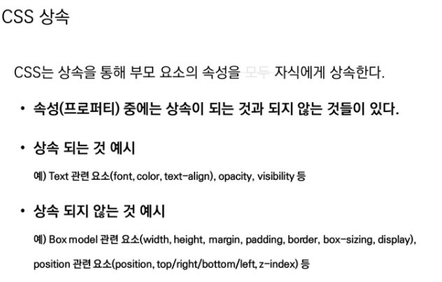
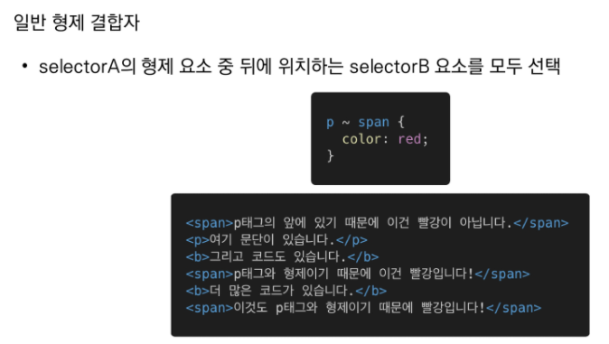
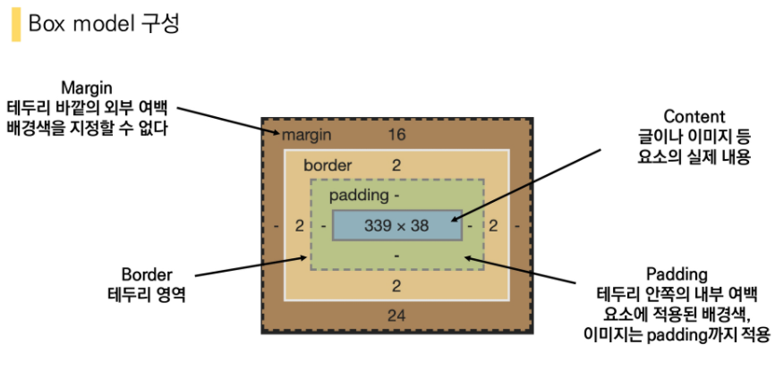
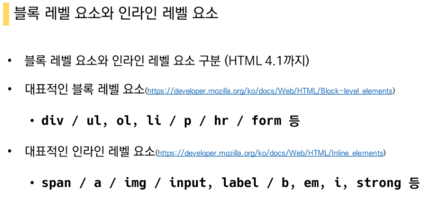
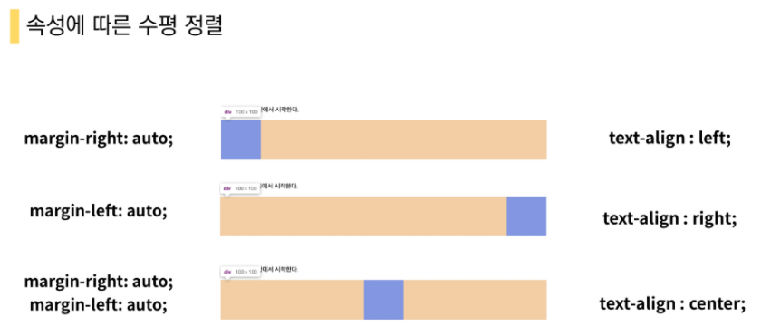
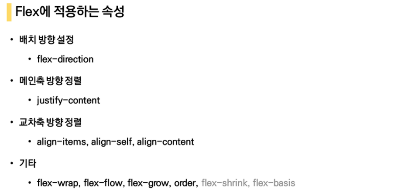

# 예상문제

W3C - HTML

웹표준은 W3C에서 발표한다

WHATWG - HTML Living Standard


### Hyper Text Markup Language

Hyper Text

- 참조(하이퍼링크)를 통해 사용자가 한 문서에서 다른 문서로 즉시 접근할 수 있는 텍스트

Markup : 단순히 문자를 크게 하는 것 뿐만이 아닌 대주제, 본문 등의 역할을 부여

Markup Language 


1) 웹 표준을 만드는 곳은 Mozilla 재단이다.   **F**
2) 표(table) 을 만들 때에는 반드시  태그를 사용해야 한다.  **F**
3) 제목(Heading) 태그는 제목 이외에는 사용하지 않는 것이 좋다.   **T**
4) 리스트를 나열하기 위해서는 태그만 사용 할 수 있다.   **F**
5) HTML의 태그는 반드시 별도의 닫는 태그가 필요하다.  **F**

들여쓰기 : 2spaces 권장






HTML5에서 새롭게 추가된 시맨틱(semantic)  태그를 모두 고르시오.

header

footer

section


## CSS 우선순위

!important >> Inline style > id 선택자 > class 선택자 > 요소 선택자 > 소스 순서

## CSS 개념

1. HTML과 CSS는 각자 문법을 갖는 별개의 언어이다.  **T**
2. 웹 브라우저는 내장 기본 스타일이 있어 CSS가 없어도 작동한다.  **T**
3. 자식 요소 프로퍼티는 부모의 프로퍼티를 모두 상속 받는다. **F**
4. 디바이스마다 화면의 크기가 다른 것을 고려하여 상대 단위인 %를 사용한다. **F**
5. id 값은 유일해야 하므로 중복되어서는 안된다.  **T**























```html
<style>
    .flex-container {
      /* 1. 정렬하고자 하는 부모 요소(flex container)에 선언 */
      display: flex;
      /* display: inline-flex; */
      /* 인라인 플랙스는 안에있는 컨텐츠만큼만 flex를 준다 */
      
      /* 2. 메인축 방향 설정 */
      /* flex-direction: row; */
      /* flex-direction: row-reverse; */
      /* flex-direction: column; */
      /* flex-direction: column-reverse; */

      /* 3. item들이 강제로 한 줄에 배치되게 할 것인지에 대한 여부 */
      /* flex-wrap: nowrap;
      flex-wrap: wrap;
      flex-wrap: wrap-reverse; */

      /* 4. flex-directon + flex-wrap의 shortand */
      /* flex-flow: column wrap; */

      /* 5. 메인축 정렬 */
      justify-content: flex-start;
      /* justify-content: center; */
      /* justify-content: flex-end; */
      /* 좌우정렬, 아이템간의 간격 동일, 양쪽은 붙임 */
      /* justify-content: space-between; */
      /* 균등 좌우정렬 내부 간격이 외부 간격의 2배 */
      /* justify-content: space-around; */
      /* 균등 좌우정렬 내부 간격 = 외부 간격*/
      /* justify-content: space-evenly; */

      /* 6. 교차축 정렬 */
      /* 교차축을 기준으로 움직인다 */
      /* align-items: stretch; */
      /* align-items: flex-start; */
      /* align-items: center; */
      /* align-items: flex-end; */
      /* 글자의 위치가 첫번째 글자의 위치(밑줄부분으로)로 맞춰진다 */
      /* align-items: baseline; */   
    }
 
    /* 주체는 item이기 때문에 부모에서 벗어나서 개별로 써야함*/
    /* 7. 교차축 개별 정렬 */
    /* 8. order */
    /* order: 값이 작을수록 앞으로 정렬(기본값 0) */
    .item1 {
      /* align-self: flex-start; */
      order: 0;
      /* order의 기본값은 0 */
    }
    .item2 {
      /* align-self: center; */
      order: -1;
      /* 오더의 기본값보다 작기 때문에 맨 앞으로 오게 된다 */
    }
    .item3 {
      /* align-self: flex-end; */
      order: 1;
      /* 오더의 기본값보다 크기 때문에 맨 끝으로 가게된다 */
    }
  </style>
```


반응형으로 바뀌는 6개의 지점(기준점) 제공


column을 12개로 나누는 이유? => 약수가 많기 때문에(1, 2, 3, 4, 6, 12) => 배열할 때 다양하게 배치가 가능

flex = container > items

Grid Sy = container > rows > column


## 4. flex-flow

 flex-flow flex-flow 속성은 두가지 속성의 축약형이다. 올바르게 짝지어진 것을 고르시오. 

(1) flex-direction, flex-wrap 

(2) flex-direction, align-items 

(3) justify-content, flex-wrap 

(4) justify-content, align-item


(1)