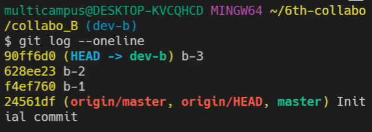
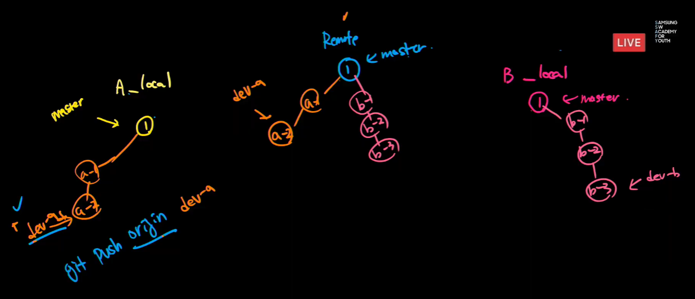
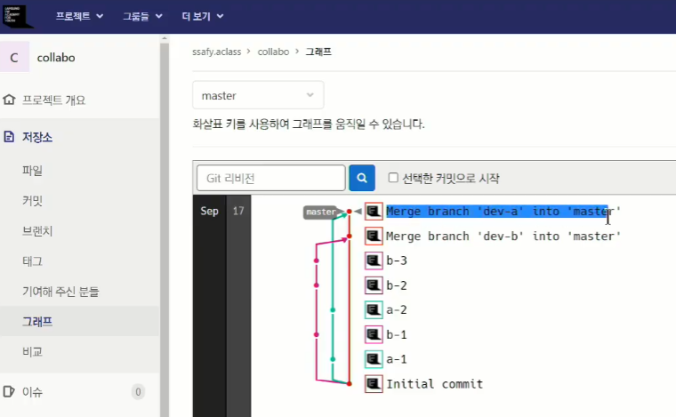

# command

> git 기본 명령어 정리


### git 생성


##### init

- 현재 폴더를 git으로 관리 하겠다!
- 현재 폴더에 `.git` 폴더를 생성
- 최초 한번만 실행하는 명령어
- 프로젝트 단위의 폴더에서 실행

```bash
git init
```


### 확인

##### status

- 현재 git이 관리하고 있는 파일들의 상태를 보여주는 명령어

 ```bash
  git status
 ```


##### log

- 커밋의 히스토리를 보여주는 명령어

```bash
git log
```


### 관리(로컬)


##### add

- working directory에서 staging area에 파일을 업로드하는 명령어
  - working directory = 내가 현재 수정하고 있는 곳, 로컬 컴퓨터
  - `.` : 현재 폴더, 하위 폴더, 하위 파일 모두 집어넣겠다

```bash
git add <file name>
git add . 
#주의 : add와 '.' 사이에 띄어쓰기 해야됨!
```


##### commit

- staging area에 올라온 파일들을 하나의 커밋으로 만들어주는 (스냅샷 찍는) 명령어

```bash
git commiit -m "commit message"
#'-m'을 뺀다면? ->bin이라는 옵션을 추가한다 -> 추후에 설명될 예정 -> 일단 추가해라
```


### 관리(원격)


##### remote add

- 원격 저장소 주소를 로컬에 저장하는 명령어
  - nickname에는 일반적으로 `origin`
  - 한번만 설정하면 된다

```bash
git remote add <nickname> <url>
# url이 너무 기니까 nickname으로 부르겠다
# nickname은 origin이 국룰
```


##### push

- 원격 저장소로 로컬의 커밋 기록을 업로드하는 명령어

 ```bash
  git push <nickname> <branch name>
  # nickname은 origin이 국룰
  # branch name에는 일단 master
 ```


#### oneline

```bash
git log --oneline 
# 현재의 branch에서 볼 수 있는 모든 커미션의 상황을 보여준다

git log --oneline --graph
# 그래프의 형태로 볼 수 있다!
```

#### 예시




## New branch

```bash
git switch -c <branch name>
# -c => create
# 이미 만들었다면 그냥 switch만 하면 된다

# 작성 후 커밋을 해야 한다
git add . 
git commit -m "commit message"

git push origin <branch name>

```


#### 삭제

```bash
git branch -d <branch name>
```





### Create merge request

#### = 병합 요청

깃허브 (또는 깃랩)에서 merge request를 해야만 한다!



요런 형식

