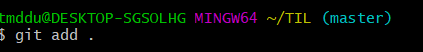
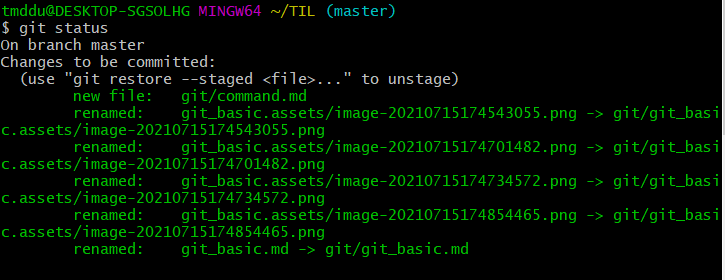
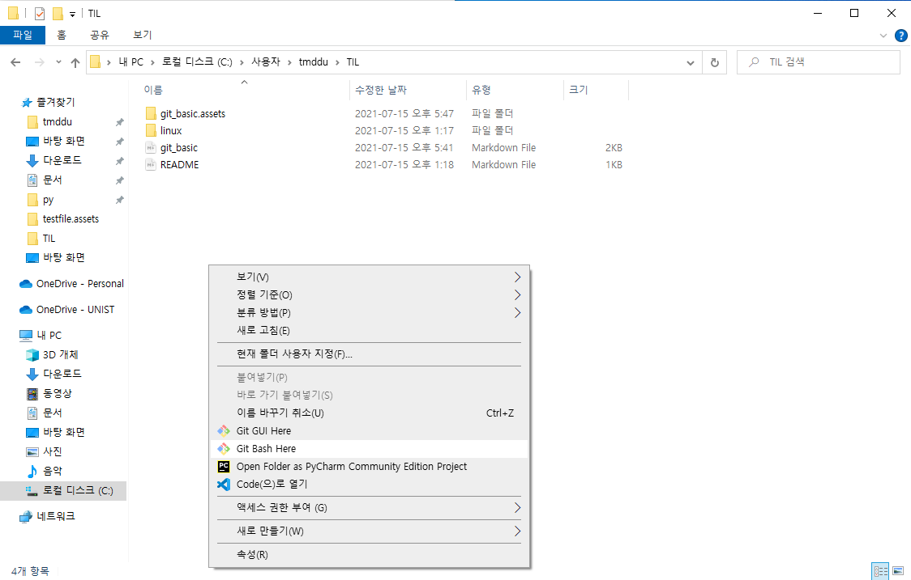
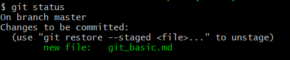
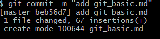
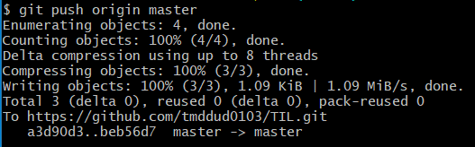

# git

### git이란?

분선 소스 버전 관리 시스템

내 개인 컴퓨터 -> 저장 -> github 등에 저장할 수 있다!


### 설치 (이미 했지만 혹시 모르니)

git 서버에 접속하기 전에 두 설정 값을 지정해야한다.

이미 했다면 추가 재설정 할 필요는 없다. 

```bash
#이름, 이메일 설정
git config -- global user.name 'tmddud(예시)'
git config -- global user.email 'tmddud123456@naver.com(예시)'
```


### 생성

현재 폴더에 `.git` 폴더를 생성

최초 한번만 실행하는 명령어

프로젝트 단위의 폴더에서 실행

```bash
git init
```



생성이 되었다면 위의 사진처럼 `(master)`이 생긴다

-> 이 파일(폴더)을 git으로 관리 하겠다


### 확인

현재 git이 관리하고 있는 파일들의 상태를 보여주는 명령어

 ```bash
 git status
 ```



### 저장소 히스토리

```bash
git log

>>commit a3d90d36bd69c3854c3b8abaaabfc1e2e5863278 (HEAD -> master, origin/master)
>>Author: tmddud <tmddud0103@gmail.com>
>>Date:   Thu Jul 15 13:19:10 2021 +0900
>>
>>    add command.md
>>
>>commit cf619f969c237eb6df4c55bcded03e9575adf65e
>>Author: tmddud <tmddud0103@gmail.com>
>>Date:   Thu Jul 15 11:46:39 2021 +0900
>>
>>    add command.md
>>
>>commit 9c3d8f54235aef5ba48f6f07ccefa37bfa026b5c
>>Author: tmddud <tmddud0103@gmail.com>
>>Date:   Thu Jul 15 11:08:21 2021 +0900
>>
>>    add README.md
#뭐 대충 이런 형식으로 로그가 뜬다
```


### 관리(로컬)


working directory에서 staging area에 파일을 업로드하는 명령어

- working directory = 내가 현재 수정하고 있는 곳, 로컬 컴퓨터
- `.` : 현재 폴더, 하위 폴더, 하위 파일 모두 집어넣겠다

```bash
git add <file name>
git add . 
#주의 : add와 '.' 사이에 띄어쓰기 해야됨!
```


staging area에 올라온 파일들을 하나의 커밋으로 만들어주는 (스냅샷 찍는) 명령어

```bash
git commiit -m "commit message"
#'-m'을 뺀다면? ->bin이라는 옵션을 추가한다 -> 추후에 설명될 예정 -> 일단 추가해라
```


### 관리(원격)


원격 저장소 주소를 로컬에 저장하는 명령어

- nickname에는 일반적으로 `origin`
- 한번만 설정하면 된다

```bash
git remote add <nickname> <url>
# url이 너무 기니까 nickname으로 부르겠다
# nickname은 origin이 국룰
```


원격 저장소로 로컬의 커밋 기록을 업로드하는 명령어

 ```bash
 git push <nickname> <branch name>
 # nickname은 origin이 국룰
 # branch name에는 일단 master
 ```


### 저장하기


```bash
git add linux/command.md
#linux/command.md <- linux 파일 안에 있는 command.md 파일을 추가 하겠다
git status
#모르겠다
git commit -m "add command.md"
#add된 command.md를 커밋(커미션)하겠다. -> 사진을 찍겠다
git push origin master
#커밋된 파일을 오리진마스터(깃허브?)에 push하겠다(업로드 하겠다)
```


### 저장을 실제로 한다면



git bash를 TIL 폴더에서 여는게 먼저

```bash 
git add <folder name>
#또는
git add .


#추가됨 별다른 설명 없음
```

```bash
git status
#아래 사진처럼 현재 status에서 새로운 파일이 있는지에 대한 내용이 나온다.
```



```bash
git commit -m "add git_basic.md"
#""안에는 설명을 추가한다
#예시 : 
git commit -m "add git/command.md & file move"
#아래 사진은 커밋에 성공함
```



```bash
git push origin master
#올라가짐, 빵끗
```


