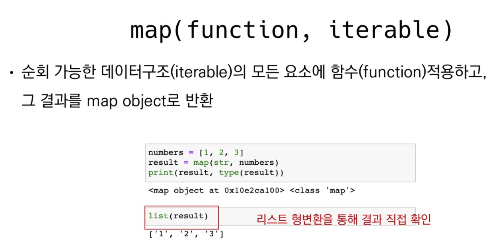
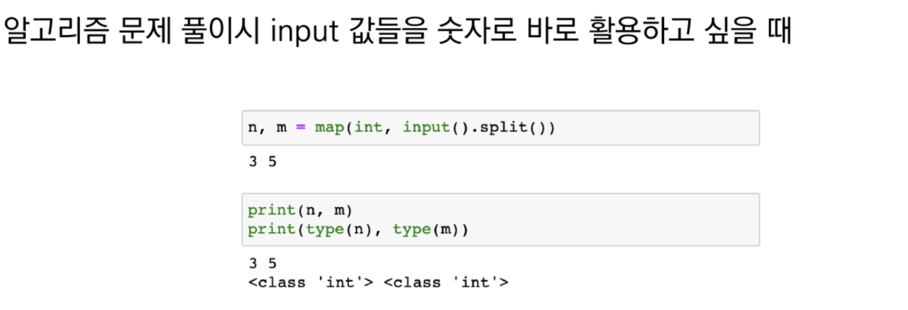
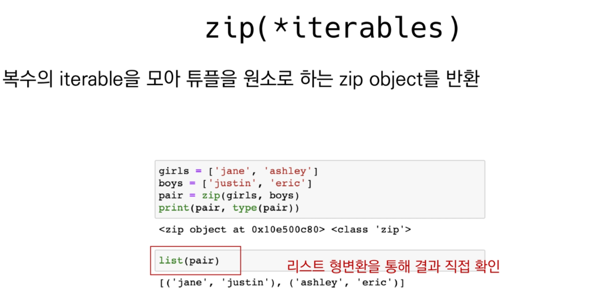

# Built-in function 

예시

```python
 dir(__builtins__)
```

```bash
['ArithmeticError', 'AssertionError', 'AttributeError', 'BaseException', 'BlockingIOError', 'BrokenPipeError', 'BufferError', 'BytesWarning',
 'ChildProcessError', 'ConnectionAbortedError', 'ConnectionError',
 'ConnectionRefusedError', 'ConnectionResetError', 'DeprecationWarning',
 'EOFError', 'Ellipsis', 'EnvironmentError', 'Exception', 'False', 'FileExistsError', 'FileNotFoundError', 'FloatingPointError', 'FutureWarning', 'GeneratorExit', 'IOError', 'ImportError', 'ImportWarning', 'IndentationError', 'IndexError', 'InterruptedError', 'IsADirectoryError', 'KeyError', 'KeyboardInterrupt', 'LookupError', 'MemoryError', 'ModuleNotFoundError', 'NameError', 'None', 'NotADirectoryError', 'NotImplemented',
 'NotImplementedError', 'OSError', 'OverflowError', 'PendingDeprecationWarning',  'PermissionError', 'ProcessLookupError', 'RecursionError', 'ReferenceError',  'ResourceWarning', 'RuntimeError', 'RuntimeWarning', 'StopAsyncIteration',  'StopIteration', 'SyntaxError', 'SyntaxWarning', 'SystemError', 'SystemExit',
 'TabError', 'TimeoutError', 'True', 'TypeError', 'UnboundLocalError',  'UnicodeDecodeError', 'UnicodeEncodeError', 'UnicodeError', 'UnicodeTranslateError',
 'UnicodeWarning', 'UserWarning', 'ValueError', 'Warning', 'WindowsError',
 'ZeroDivisionError', '__IPYTHON__', '__build_class__', '__debug__', '__doc__',  '__import__', '__loader__', '__name__', '__package__', '__spec__', 'abs', 'all', 'any',
 'ascii', 'bin', 'bool', 'breakpoint', 'bytearray', 'bytes', 'callable', 'chr',  'classmethod', 'compile', 'complex', 'copyright', 'credits', 'delattr', 'dict', 'dir',
 'display', 'divmod', 'enumerate', 'eval', 'exec', 'filter', 'float', 'format',  'frozenset', 'get_ipython', 'getattr', 'globals', 'hasattr', 'hash', 'help', 'hex',
 'id', 'input', 'int', 'isinstance', 'issubclass', 'iter', 'len', 'license', 'list',
 'locals', 'map', 'max', 'memoryview', 'min', 'next', 'object', 'oct', 'open', 'ord',
 'pow', 'print', 'property', 'range', 'repr', 'reversed', 'round', 'set', 'setattr',
 'slice', 'sorted', 'staticmethod', 'str', 'sum', 'super', 'tuple', 'type', 'vars',
 'zip']
```


 

# filter


# map(function, iterable)



- map(function, iterable)
- 각각의 요소(iterable)가 function에 적용하고 그 결과를 반환



# zip(*iterables)



갯수가 안맞을 경우에는...?

확인 해 볼것!

