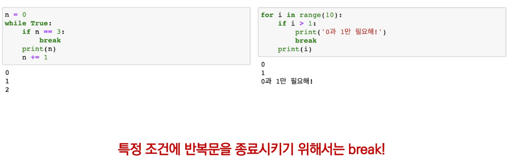
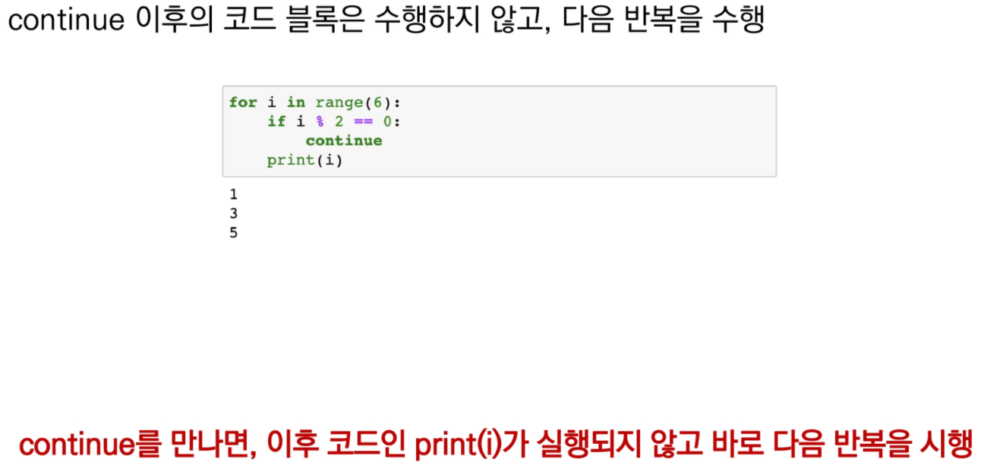
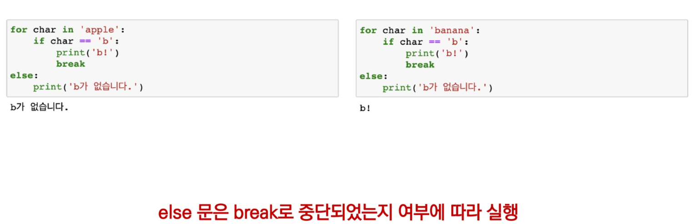
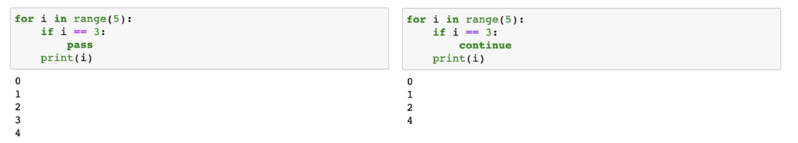

# 반복제어(break, continue, for-else)

#### break

- 반복문 종료

#### continue

- continue 이후의 코드 블록은 수행하지 않고, 다음 반복을 수행

#### for-else

- 끝까지 반복문을 실행한 이후에 else문 실행
  - break를 통해 중간에 종료되는 경우 else 문은 실행되지 않음

#### pass 문

- 아무것도 하지 않음
- 할 일이 없을때 **자리를 채우는 용도**로 사용
  - 자리를 안채우면 error가 나는 경우가 있음
- **반복문 아니어도 사용 가능**

**-> pass와 continue의 차이**

