# 제어문(Control Statement)

> 파이썬은 기본적으로 위에서부터 아래로 순차적으로 명령을 수행
>
> 특정 상황에 따라 코드를 선택적으로 실행(분기/조건)하거나 계속해서 실행(반복)하는 제어가 필요
>
> 제어문은 순서도(flow chat)로 표현이 가능


## 조건문(Control Statement)

- if문은 참/거짓을 판단할 수 있는 조건식과 함께 사용
  - expression(표현식)에는 참/거짓에 대한 조건식
    - expression(표현식) = 실행을 했을때 결과값이 나와야한다!
  - 조건이 참인 경우 이후 들여쓰기 되어있는 코드 블럭을 실행
  - 이외의 경우 else 이후 들여쓰기 되어있는 코드 블럭을 실행
    - else는 선택적으로 활용 가능함

```bash
if <expression>:
	# code block
else:
	# code block
```

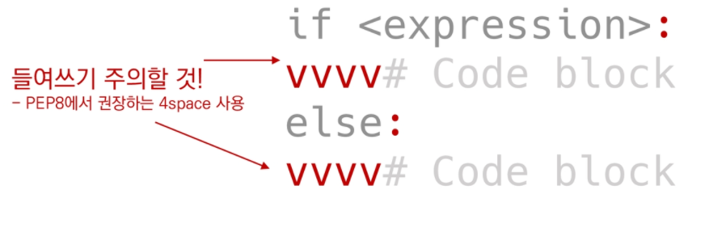

4 space != 1 tab

but 1 tab을 4 space로 설정해서 편의성 높임


### 실습 문제


```bash
#input으로 받는 모든 것들은 문자열 타입 -> int를 통해 숫자로 변환
num = int(input())
#나머지가 1이면 True
if num % 2: #if num % 2 ==1:
	print("홀수")
else:
	print("짝수")
```


### 복수 조건문

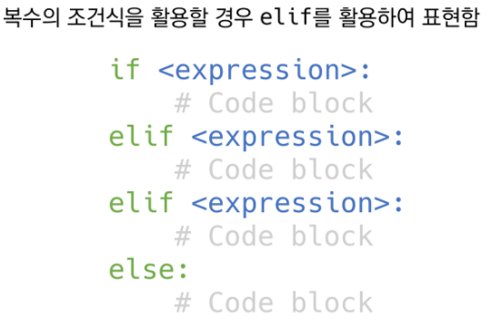

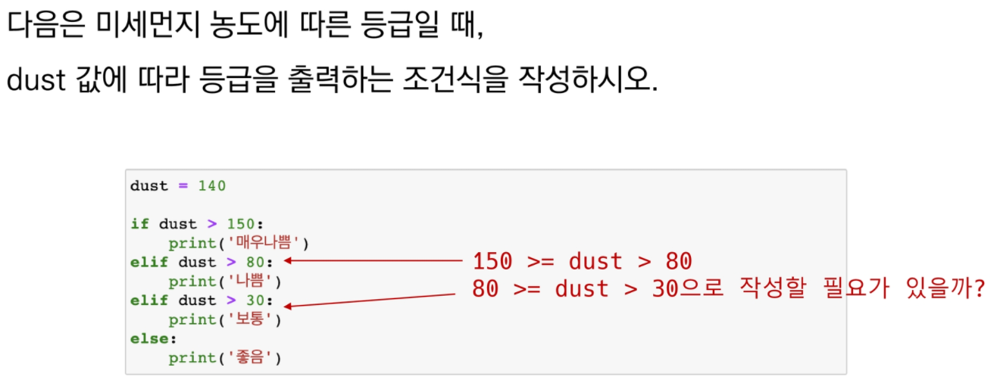

### 없다 -> 조건식을 동시에 검사하는 것이 아니라 순차적으로 비교하기 때문!


### 중첩조건문(Nested Conditional Statement)

- 조건문은 다른 조건문에 중첩되어 사용될 수 있음
- 들여쓰기 유의할 것

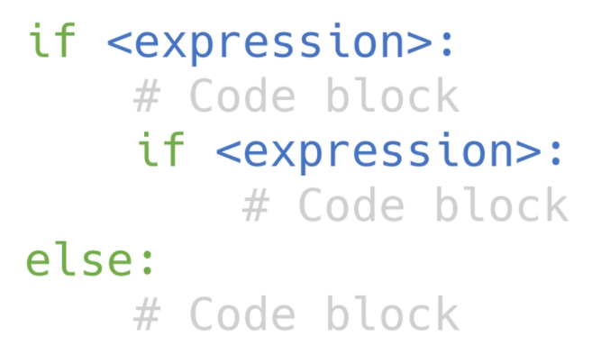

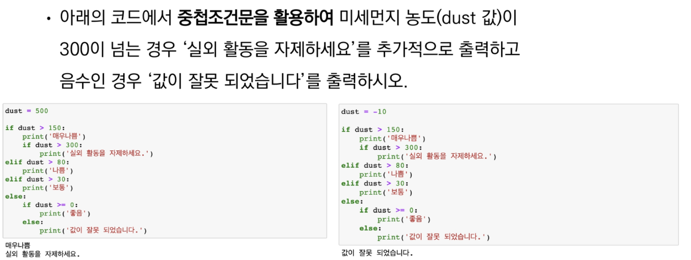


### 조건 표현식(Conditional Expression)

- 조건 표현식을 일반적으로 조건에 따라 값을 정할 때 사용
- 삼항 연산자(Ternary operator)로 부르기도 함

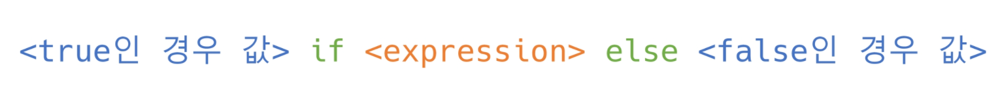

True인 경우 -> 왼쪽의 값이 나옴

False인 경우 -> 오른쪽의 값이 나옴

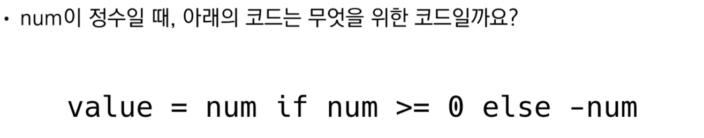

#### -> 절대값을 저장하기 위한 코드

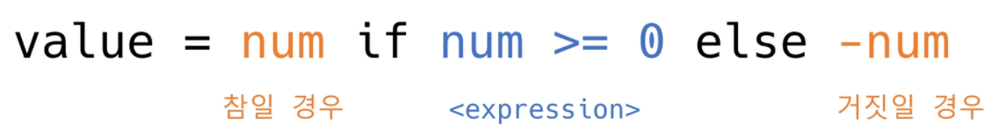

- 주의: value를 한번만 지정!


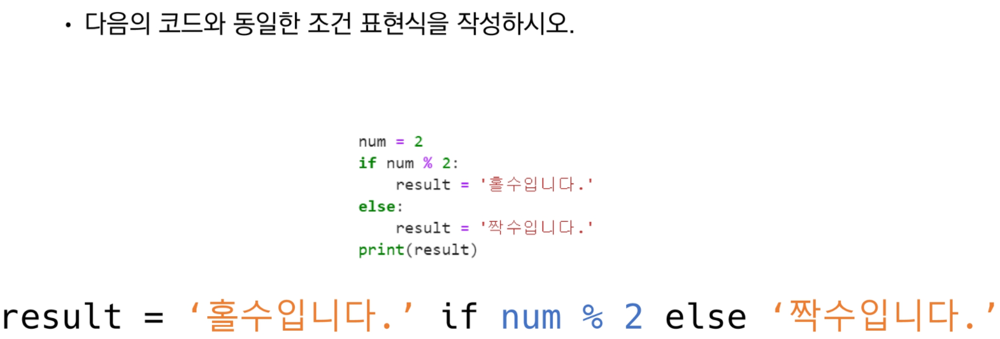


## 반복문(Loop Statement)


### while 문

- 종료조건에 해당하는 코드를 통해 반복문을 종료 시켜야함

  조건식이 참인경우 반복적으로 코드를 실행 -> **조건이 False가 될때까지 반복**

- 조건이 참인 경우 들여쓰기 되어 있는 코드 블록이 실행됨

- 코드블록이 모두 실행되고, 다시 조건식을 검사하며 반복적으로 실행됨

- while문은 무한루프를 하지 않도록 **종료조건이 반드시 필요**

```bash
while <expression>
	#code block
```

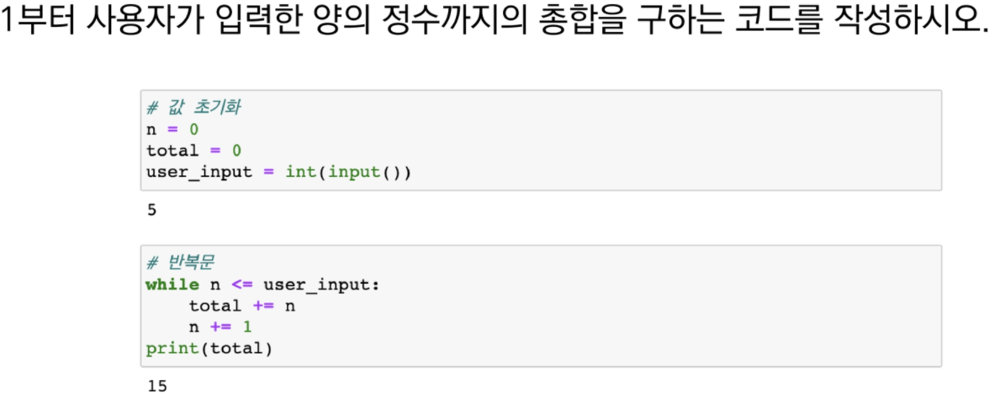


### for 문

- **반복 가능(iterable)한 객체**를 모두 순회하면 종료 (별도의 종료 조건이 필요 없음)
- 시퀀스(**string**, tuple, **list**, **range**)를 포함한 **순회가능한 객체(iterable)** 요수를 모두 순회함
  - **순회가능한** 객체(iter**able**) = 한개 이상의 요소들이 존재한다
  - 처음부터 끝까지 모두 순회하므로 별도의 종료 조건이 필요하지 않음

```bash
for <변수명> in <iterable>:
	#code block
```

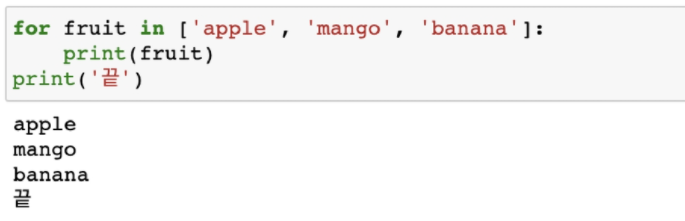

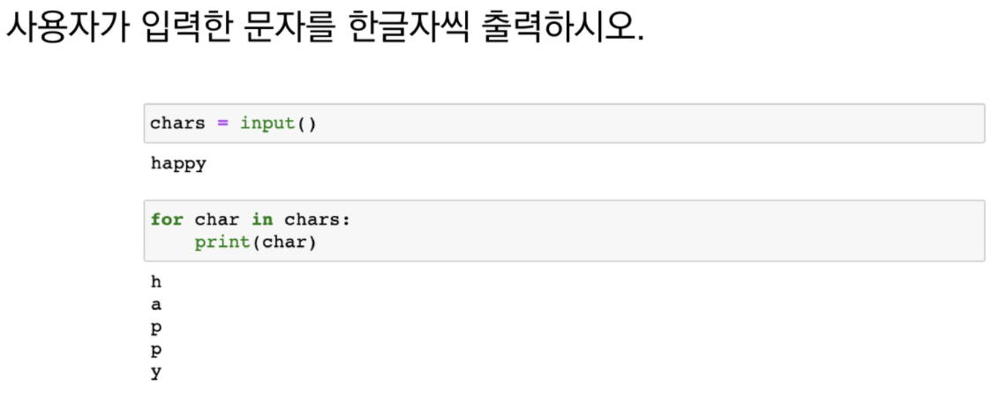

#### 						-> 단수,복수 처리 확실하게 해야한다!

#### 						-> 시퀀스는 복수형으로 쓰는걸 추천

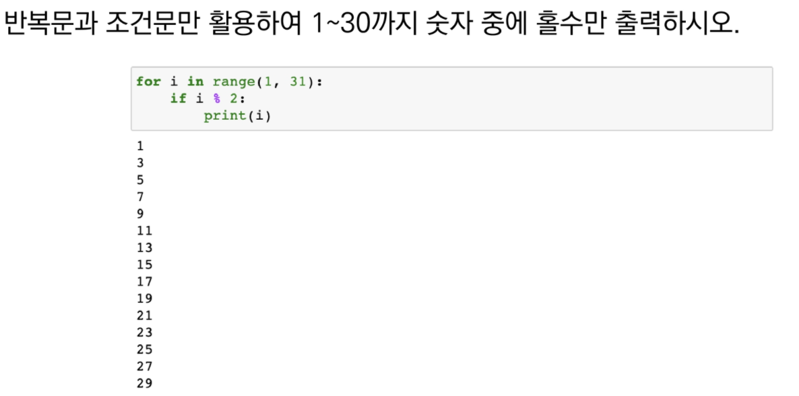

### 리스트 순회

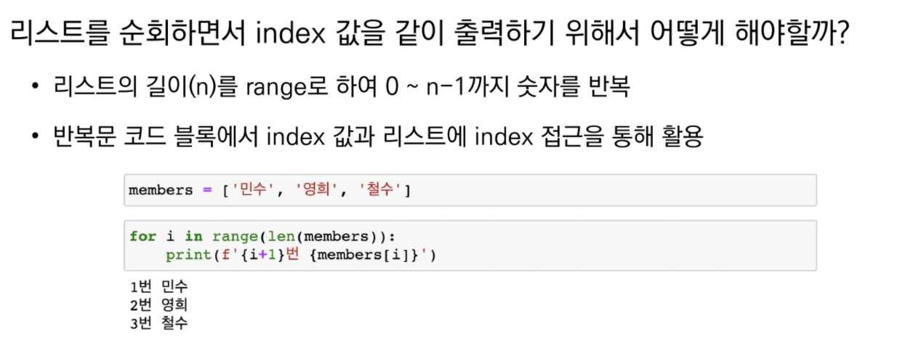


### enumerate 내장 함수

- 반복작업을 하지만, index도 필요한 경우!

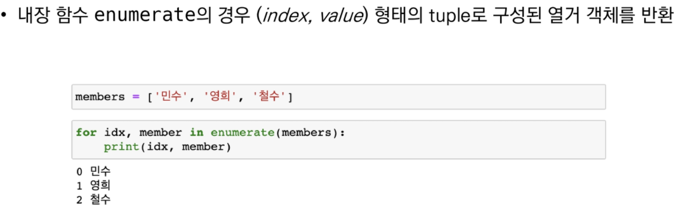

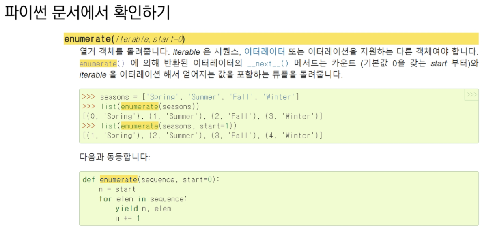

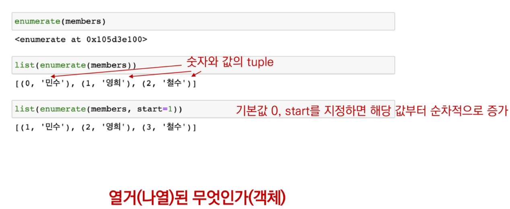

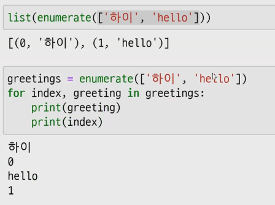

