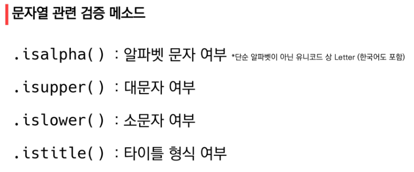
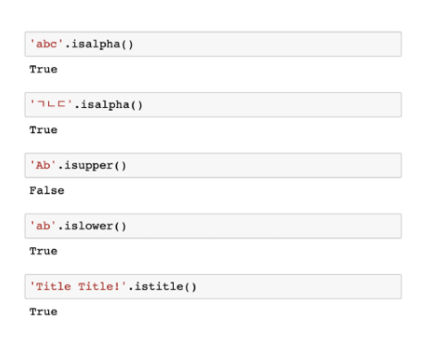
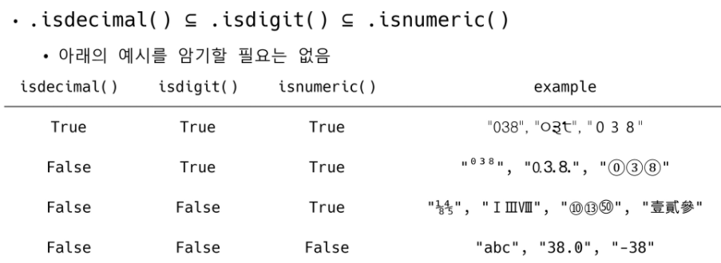

# Data structure (문자열, string)


## 문자열(string)

> 문자들의 나열(sequence of characters)

특징

- 변경할 수 없고 (Immutable)
- 순서가 있고 (Ordered)
- 순회 가능한 (Iterable)

문자열의 다양한 조작법(method)

https://docs.python.org/ko/3/library/stdtypes.html#string-methods


###  문자열 인덱스(Index)


## 문자열 조회/탐색 

## .find(x)

> x의 첫 번째 위치를 반환.
>
> 없으면 **-1을 반환**

```python
'apple'.find('p')
```

```bash
1
```

```python
'apple'.find('z')
```

```bash
-1
```


## .index(x)

> x의 첫 번째 위치를 반환.
>
> 없으면 **오류 발생**

```python
 'apple'.index('p')
```

```bash
1
```

```python
'apple'.index('z')
```

```bash
---------------------------------------------------------------------------
ValueError                                Traceback (most recent call last)
~\AppData\Local\Temp/ipykernel_7452/884352247.py in <module>
      1 # index 메서드로 문자열의 z의 위치를 확인해봅시다.
----> 2 a.index('z')

ValueError: substring not found
```


## 문자열 변경


## .replace(old, new[, count])

- 바꿀 대상 글자를 새로운 글자로 바꿔서 **반환**
- count를 지정하면, 해당 개수만큼만 시행

```python
a = 'yaya!'
a.replace('y', 'h')
b = 'wooooowoo'
b.replace('oo','_')
```

```bash
'haha!'
'w__ow_'
```

```python
a = 'yaya!'
a.replace('y', 'h')
print(a)
```

```bash
'yaya!'
```

**모든 데이터 변환은 원본 데이터는 수정되지 않는다!**

`result = a.replace('y', 'h')`

`print(result)` -> `'haha!'`


.replace(old, new**[,count]**)

 -> 선택적 인자

실제로 코드에서 대괄호를 쓰면 코드가 안돌아감

배커스-나우르 표기법 (BNF, form)

- 문서상의 표기법
- [] -> 선택적 인자라는 것을 표현


## .strip([chars])

특정한 문자들을 지정하면, 양쪽을 제거하거나 왼쪽을 제거하거나(lstrip), 오른쪽을 제거합니다(rstrip).

지정하지 않으면 공백을 제거합니다.

```python
a = '   hello!  \n'
b = 'hihihihahahahihi'

result = a.strip()
print(result)
result2 = a.lstrip()
print(result2)
result3 = b.rstrip('hi')
result4 = b.rstrip('hia')
result5 = b.rstrip('ih')
```

```bash
hello!
'hello!  \n'
'hihihihahaha'
''
'hihihihahaha'
```


## .split([chars])

- 문자열을 특정한 단위로 나누어 리스트로 반환합니다.
- 기준이 있어야한다. 
- 기준이 없으면 구분을 지을 수 없고, split을 하지 못함

```python
a = 'a_b_c'
a.split('_')

```

```bash
['a', 'b', 'c']
```


```python
i = input()
i.split()
# 1 2 3 4 5 6 7
```

```bash
['1', '2', '3', '4', '5', '6', '7']
```


## 'separator'.join(iterable)

- 특정한 문자열로 만들어 반환합니다.

- 반복가능한(iterable) 컨테이너의 요소들을 separator(구분자)로 합쳐(`join()`) 문자열로 반환합니다.

```python
word = '배고파'
words = ['안녕', 'hello']
'!'.join(word)
'   '.join(words)
```

```bash
'배!고!파'
'안녕   hello'
```


## .capitalize(), .title(), .upper()

- `.capitalize()` : 앞글자를 대문자로 만들어 반환합니다.
- `.title()` : 어포스트로피나 공백 이후를 대문자로 만들어 반환합니다.
- `.upper()` : 모두 대문자로 만들어 반환합니다.

```python
a = 'hI! Everyone, I\'m kim'
a.capitalize()
a.title()
a.upper()
```

```bash
"Hi! everyone, i'm kim"
"Hi! Everyone, I'M Kim"
"HI! EVERYONE, I'M KIM"
```


## .lower(), .swapcase()

- `lower()` : 모두 소문자로 만들어 반환합니다.
- `swapcase()` : 대 <-> 소문자로 변경하여 반환합니다.

```python
a = 'hI! Everyone, I\'m kim'
a.lower()
a.swapcase()
```

```bash
"hi! everyone, i'm kim"
"Hi! eVERYONE, i'M KIM"
```


## dir('string')

dir 함수로 문자열이 가지고 있는 메소드를 확인할 수 있습니다.

```python
dir('string')
```

```bash

```




### .is 로 시작하는 함수 특징

### True 또는  False 반환!



