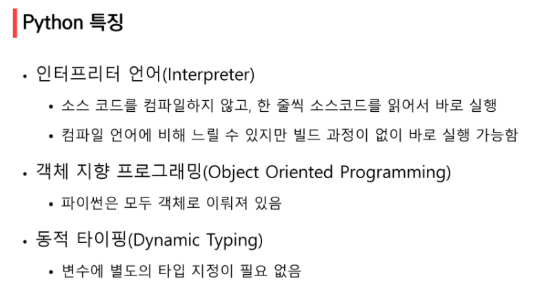
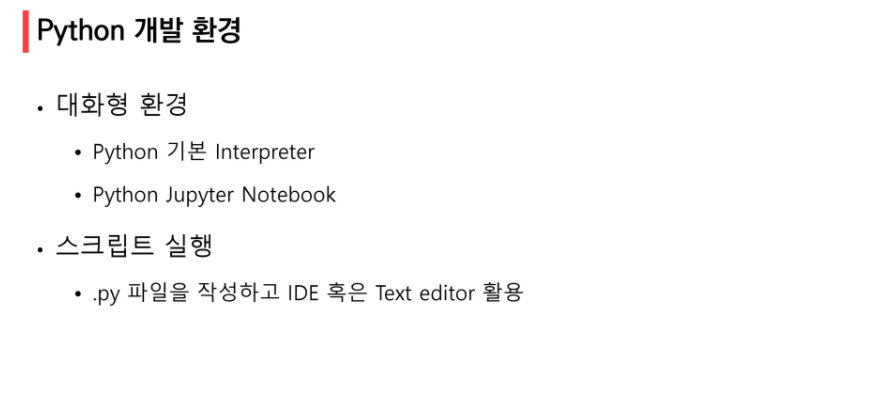
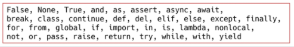
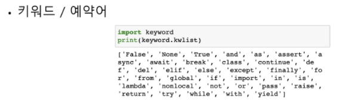
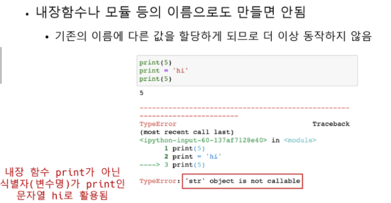

# Python Basic

## Python 개발 환경





### 코드 스타일 가이드

- 코드를 '어떻게 작성할지'에 대한 가이드 라인

PEP 8 - style guide for Python Code = 파이썬에서 제안하는 스타일 가이드

https://www.python.org/dev/peps/pep-0008/


### 주석

``` bash
#주석
"""
주석
주석
주석
"""

'''
얘도 주석
'''

def foo():
	"""함수나 기능을 설명합니다"""
#덕스트링의 특수한 형태의 주석
```

vs 코드 전체 주석 처리 : ctrl + /


## 변수와 식별자

### 변수

- 변수는 할당 연산자(=)를 통해 값을 할당 (assignment)


##### type()

> 변수에 할당된 값의 타입 확인


##### id()

> 변수에 할당된 값(객체)의 고유한 아이덴티티 값이며 메모리 주소를 확인

``` bash
id(x)
# 예시 : 4645387184
```


##### 할당 연산자 (=)

> 같은 값, 다른 값을 동시에 할당 할 수 있음 (multiple assignment)

```bash
x = y = 1000
#or
x, y = 3, 4
#but, 좌변과 우변의 갯수가 같아야한다!
```


##### 예시) 값 swap

> x =10, y = 20 일 때 각각의 값을 바꿔서 저장하는 코드?

 ``` bash
 #임시 변수 활용
 x =10, y = 20
 tmp =x
 x = y
 y = tmp
 print(x,y)
 # 20 10
 ```

``` bash
#pythonic한 방법
x =10, y = 20
y, x = x, y
print(x, y)
#20 10
```


##### 식별자(Identifiers)

- 변수, 함수, 모듈, 클래스 등을 식별하는데 사용하는 이름(name)
- 규칙이 존재
  - 식별자의 이름은 영문 알파벳, 언더스코어(_), 숫자로 구성
  - 첫 글자에 숫자가 올 수 없음
  - 길이제한 없음
  - 대소문자를 구별한다
  - 다음의 키워드는 예약어(reserved words)로 사용할 수가 없음
  

``` bash
#키워드/ 예약어
import keyword
print(keyword.kwlist)
#위의 예약어 리스트가 나옴
```



- 내장함수나 모듈 등의 이름으로도 만들면 안됨



