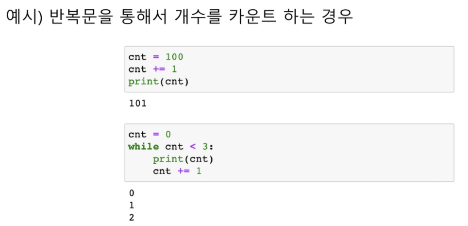
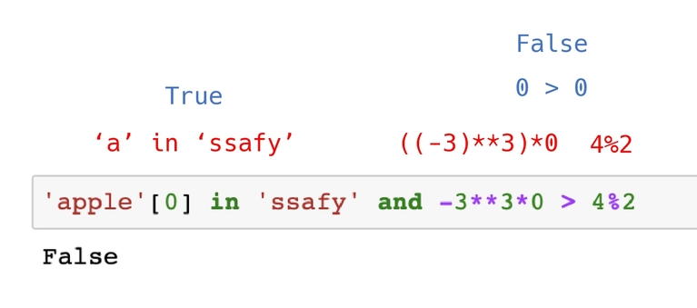
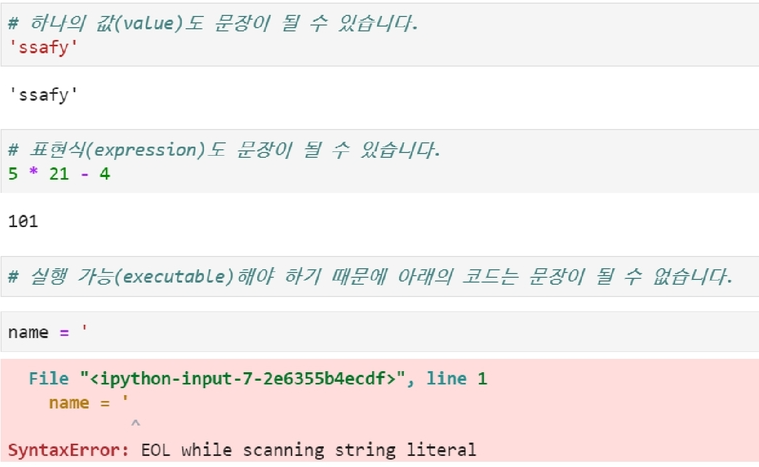
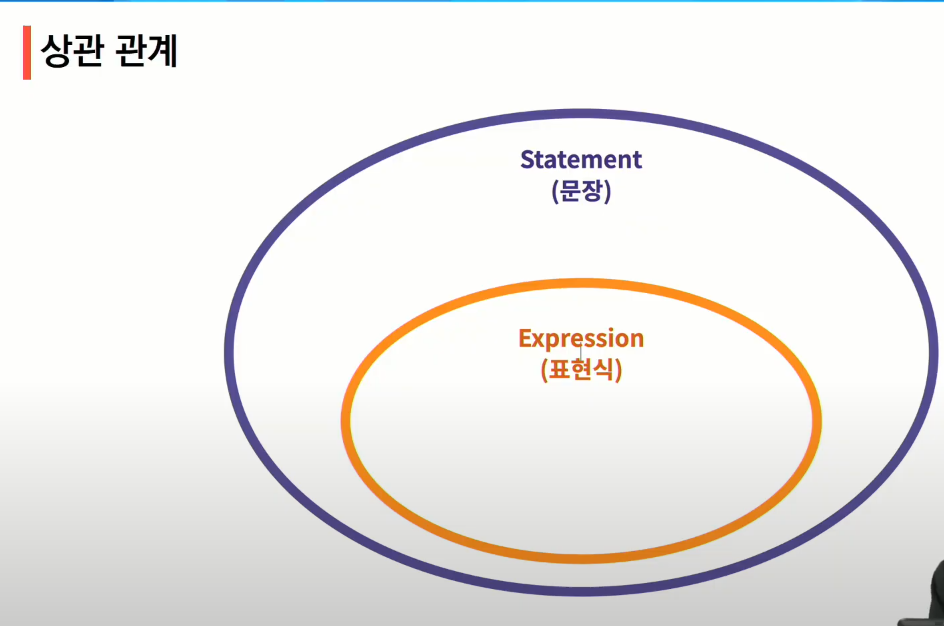
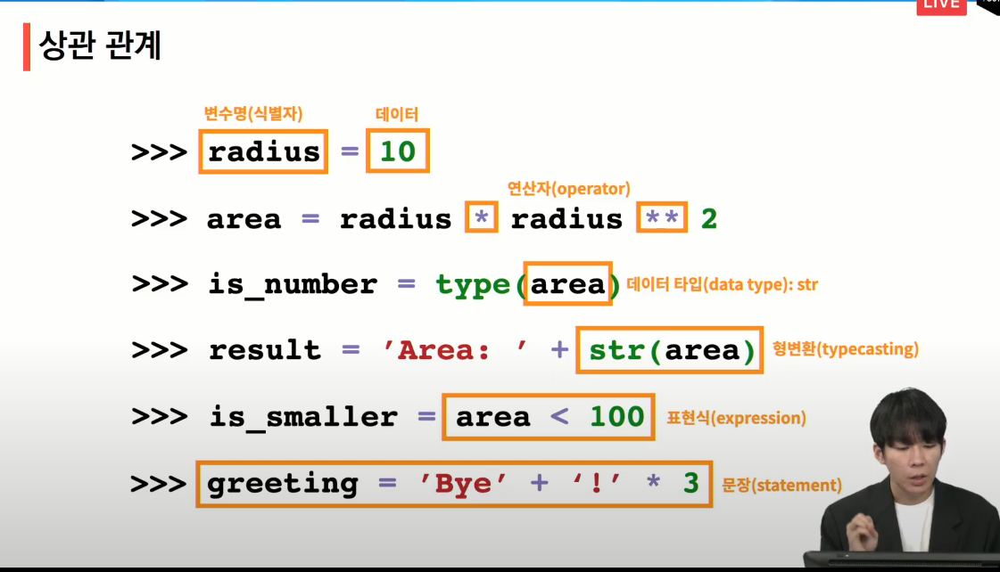

# 연산자(Confidential)

- 기본적인 사칙연산, 수식 계산


> 나눗셈은 항상 결과가 float


## 비교 연산자

- 값을 비교, True/False 값을 리턴함


- 특수 상황

.assets/image-20210719103527342.png)


## 논리 연산자

### and

- A and B : A와 B 모두 True시, True

### or 

- A or B : A와 B 모두 False시, False

### not

- False를 True로, True를 False로

.assets/image-20210719103756531.png)

### 논리 연산자 - 단축평가

- 결과가 확실한 경우 두번째 값은 확인하지 않음
- 결과가 확실한 경우 =  첫번째 값 반환
- 결과가 확실하지 않고 뒤의 값을 확인해야 할 경우 = 두번째 값 반환

```bash
a = 5 and 0
print(a)
#0
#and 연산에서 첫번째 값이 True인 경우 확인을 해봐야 함-> 두번째 값 반환
b = 5 or 0
print(b)
#5
#or 연산에서 첫번째 값이 True 경우 무조건 True -> 첫번째 값 반환
c = 0 and 5
print(c)
#0
#and 연산에서 첫번째 값이 False인 경우 무조건 False -> 첫번째 값 반환
d = 0 or 3
print(d)
#3
#or 연산에서 첫번째 값이 False 경우 뒤에 확인을 해봐야함 -> 두번째 값 반환
```


### 복합 연산자

- 연산과 대입이 함께 이루어지는 경우




### Concatenation

- +는 숫자가 아닌 자료형에서도 사용 가능함
  - 컨테이너, OOP에서 연산자의 다양한 활동을 확인 

.assets/image-20210719104939085.png)

### Containment Test (포함 검사)


### Identity

- is 연산자를 통해 동일한 객체(object)인지 확인 가능함

```bash
#파이썬에서 -5부터 256까지의 숫자의 id는 동일
a = 3
b = 3
print(a is b)
#True
#id의 값이 같음
```

```bash
a = 257
b = 257
print(a is b)
#False
#id의 값이 다름
```

```bash
x = 3
x is None
#False
```


### Indexint / Slicing

- []를 통해 값을 접근, [:]를 통해 슬라이싱 가능

.assets/image-20210719105336748.png)


### 연산자 우선 순위

.assets/image-20210719105418187.png)

```bash
'apple'[0] in 'ssafy' and -3**3*0 > 4%2
#'apple'[0] = 'a' -> True
#'a' in 'ssafy' -> True
#((-3)**3)*0 = 0 > 4%2 =0
# -> 0 > 0 -> False
# 따라서 False
```




### 표현식 / 문장

#### 표현식, 식 (expression)

- 표현식은 평가(evaluate)되고, 값으로 변경
- 하나의 값으로 환원(reduce)될 수 있는 문장
- 식별자, 값, 연산자로 구성

.assets/image-20210719110749705.png)

#### 문장(statement)

- 파이썬이 실행 가능한 최소한의 코드 단위
- 모든 표현식(expression)은 문장(statement)
  - 표현식이 아닌 문장이 존재함 예) del 5







