# 컨테이너(Container)

> 여러개의 값을 저장할 수 있는 것 (객체)

- 시퀀스형(sequence): 순서가 있는(ordered, 인덱스가 있는) 데이터
  - 순서가 있다 != 정렬되어있다
  - 리스트(list), 튜플(tuple), 레인지(range), 문자형(string), 바이너리(binary)

- 비시퀀스형(non-sequence): 순서가 없는(unordered) 데이터
  - 세트(set), 딕셔너리(dictionary)
  - 순서가 없기 때문에 딕셔너리는 키(key)로 접근


## 시퀀스형 컨테이너(순서가 있음)

> 리스트(list), 튜플(tuple), 레인지(range), 문자형(string), 바이너리(binary)
>
> for문을 통해 확인 가능


### List

- 순서 O
- 시퀀스로 인덱스를 통해 접근
  - 대괄호([]) 혹은 list()를 통해 생성
- 인덱스는 0부터 접근
  - list[]

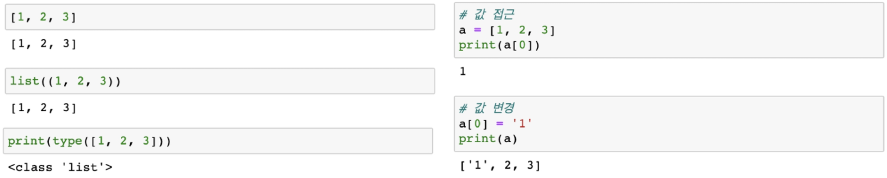

#### 중첩 리스트 실습

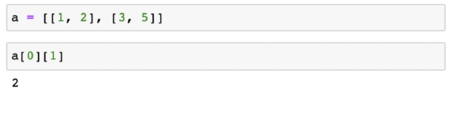


### tuple(튜플)

- **수정이 불가능한(immutable) 시퀀스**로 인덱스로 접근
  - 소괄호() 혹은 tuple을 통해 생성
  - 값에 대한 접근은 tuple_name[i]

.assets/image-20210719112131544.png)


- 튜플은 일반적으로 **파이썬 내부에서 활용**됨, 복수의 값을 반환하는 경우에도 활용

.assets/image-20210719112514778.png)


- 하나의 항목으로 구성된 튜플은 **생성시 값 뒤에 쉼표를 붙여야 함**

``` bash
a = (1)
print(type(a))
#<class 'int'>
b = (1, )
print(type(b))
#<class 'tuple'>
```


### range

- 숫자의 시퀀스를 나타내기 위해 사용
- 기본형 : range(n)
  - 0 부터 n-1까지의 숫자의 시퀀스
- 범위지정 : range(n, m)
  - n부터 m-1까지의 숫자의 시퀀스
- 범위, 스텝 지정 : range(n, m, s)
  - n부터 m-1까지 s만큼 증가시키는 숫자의 시퀀스

.assets/image-20210719112914043.png)

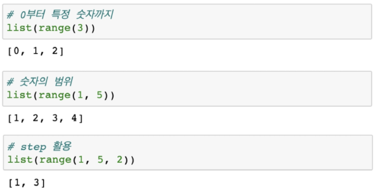


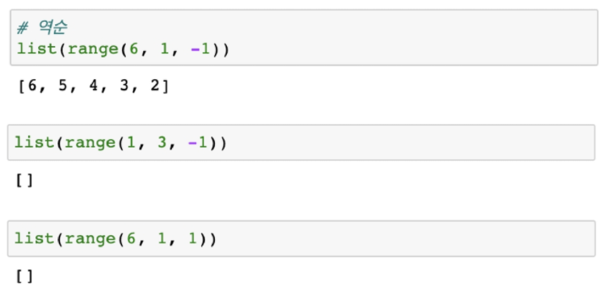

​						역순도 가능

​						but 지정이 잘못 되어진 경우에는 []값 안에 아무것도 출력되지 않음

```bash
for i in range(2):
	print("hello")
#hello
#hello
```


### string/binary


## 시퀀스에서 활용하는 연산자/ 함수

### in/ not in

.assets/image-20210719141046252.png)

### Concatenation(결합, +)

- 시퀀스간의 연결, 연쇄

  - range은 TypeError 발생

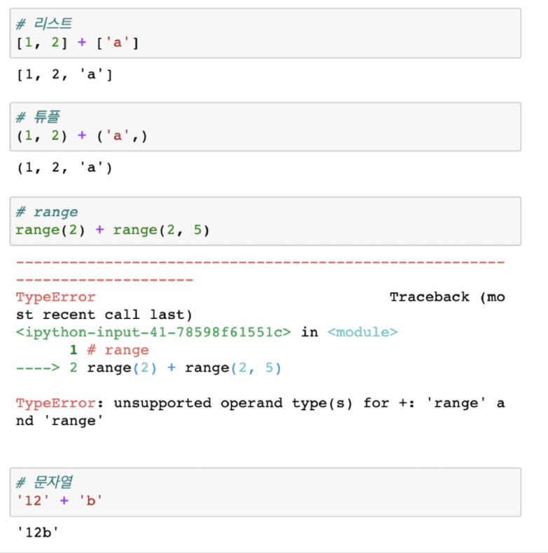


### 시퀀스 반복 (*)

- 시퀀스를 반복시킴
  - range는 TypeError

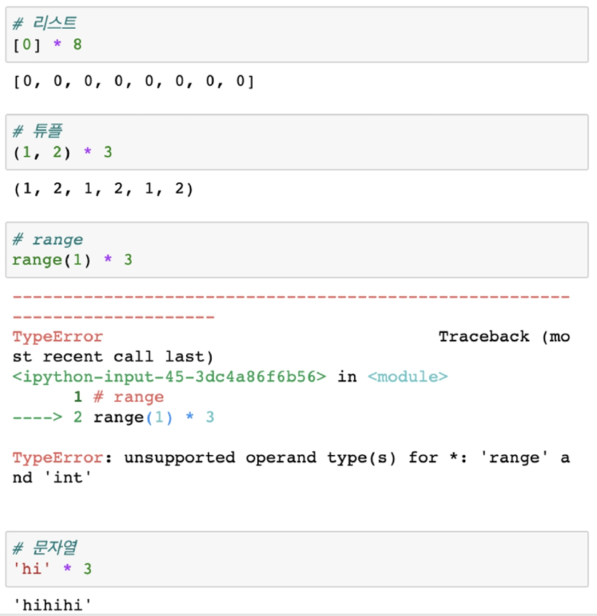


### 인덱싱(indexing)

- 시퀀스의 특정 인덱스 값에 접근
  - 해당 인덱스가 없는경우 IndexError

.assets/image-20210719141356859.png)


### 슬라이싱(Slicing)

- 시퀀스를 특정 단위로 슬라이싱

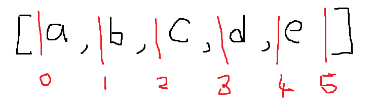

```bash
[a,b,c,d,e][2:3]
#[c]
[a,b,c,d,e][1:4]
#[b,c,d]
```

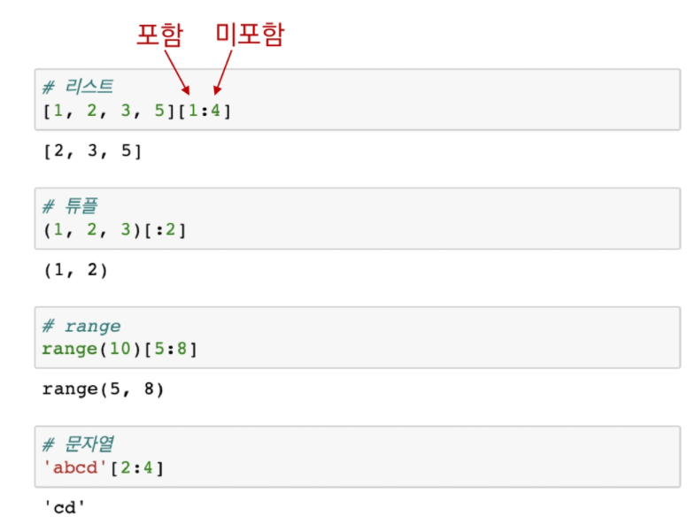

포함, 미포함보다는 **인덱스를 기준으로 자른**다고 생각하면 간단!

.assets/image-20210719141835851.png)


### 길이

- 시퀀스의 길이

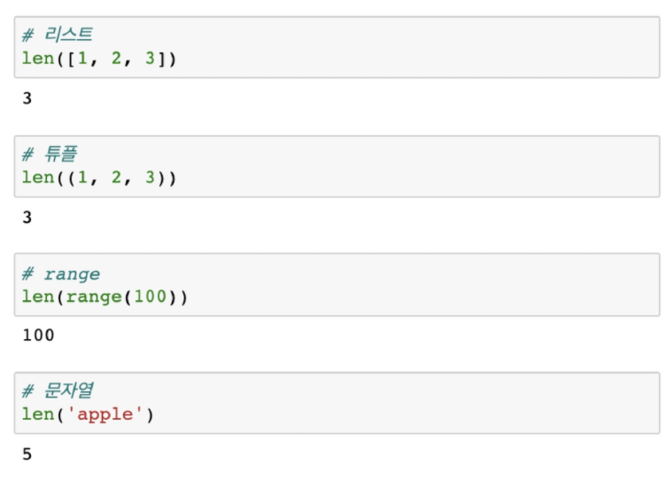


### 최소/최대

- 시퀀스의 최솟/ 최댓값
- 문자열은 ascii 코드에 따름

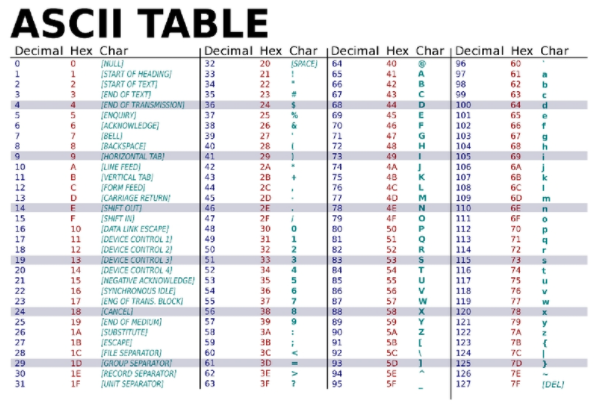

- ord함수 활용하여 확인 가능


### count

- 시퀀스에서의 특정 원소의 개수

  - 시퀀스에 등장하지 않는 경우 0 반환
```bash
[1,2,1,1,4].count(1)
# 2
```


### 실습 문제

.assets/image-20210719142312969.png)

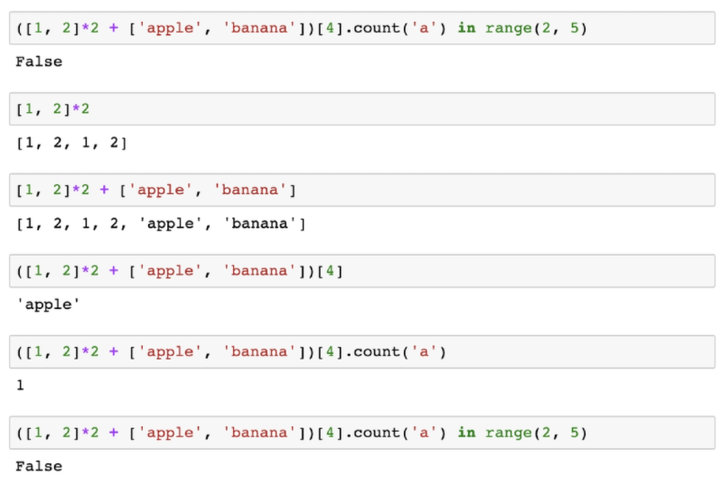


## 비시퀀스형 컨테이너(순서가 없음)

> 세트(set), 딕셔너리(dictionary)


### 세트(set)

- 순서가 없는 자료 구조
  - 중괄호({}) 혹은 set()을 통해 생성
    - 중괄호는 딕셔너리랑 같지만, 안에 있는 내용물이 다르다!
    - 비어있는 세트를 만들기 위해서는 **set()를 반드시 활용**해야함
      - **비어있는 중괄호는 딕셔너리**로 만들어진다!
  - 순서가 없어 별도의 값에 접근할 수 없음

.assets/image-20210719142739468.png)


- 수학에서의 **집합과 동일한 구조**를 가짐
  - 집합 연산이 가능
  - 중복된 값이 존재하지 않음

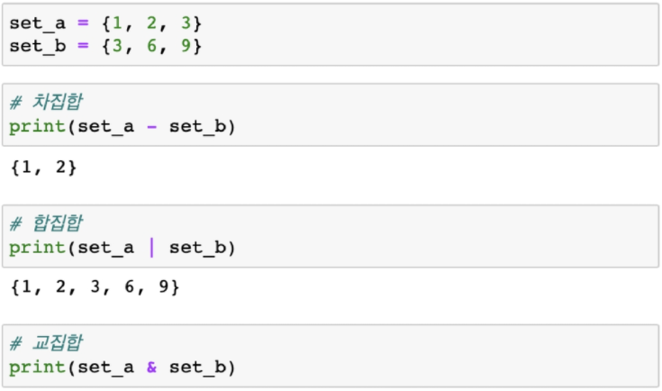


#### set 활용

- 다른 컨테이너에서 중복된 값을 쉽게 제거할 수 있음
  - 단 순서도 같이 무시 -> 순서가 중요한 경우 사용 X

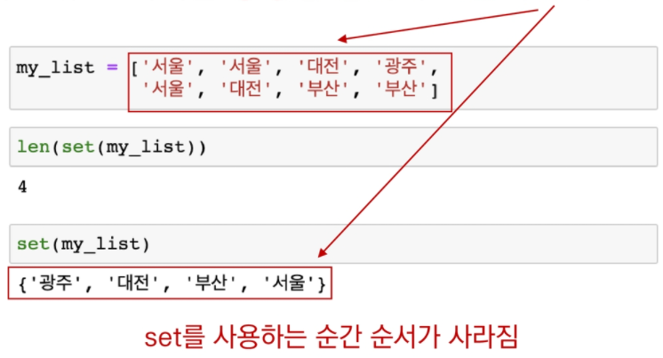


### 딕셔너리 (dictionary)

- **key**와 **value**가 쌍으로 이루어진 자료구조
  - 중괄호({}) 혹은 dict()을 통해 생성

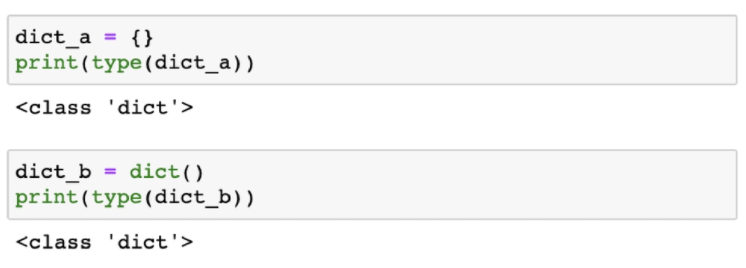

- **key를 통해 value에 접근**
  - value 값에 바로 접근 불가

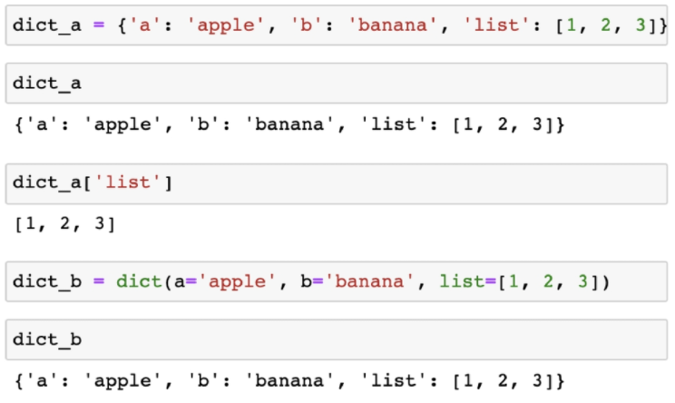

- key는 변경 불가능한 데이터(immutable)만 활용가능
  - string, integer, float, boolean, tuple, range
  - **string으로 작성하는 것을 원칙!**
  - 띄어쓰기도 하지 않는것이 원칙

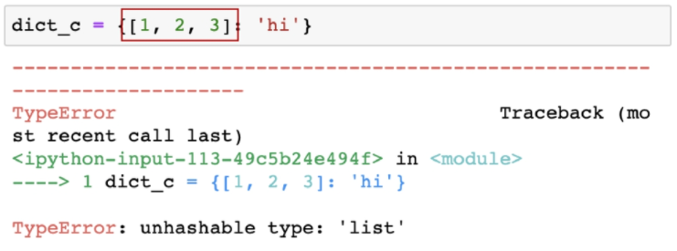

- value는 모든 값으로 설정 가능 (리스트, 딕셔너리 등)

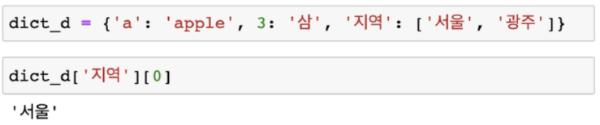

#### 딕셔너리 실습

.assets/image-20210719143759400.png)

드라마를 출력하는 코드..?

```bash
movie['genres']
#['드라마','스릴러']
movie['genres'][0]
#'드라마'
```


## 컨테이너 특징


### 컨테이너 형변환 (중요)

.assets/image-20210719143938092.png)


### 컨테이너 분류

- 변경 불가능한 데이터(immutable)
  - literal(리터럴) - 숫자, 문자형, 참/거짓 (->딕셔너리의 키)
    - 문자형의 경우 덮어씌우기가 아닌 데이터 한개만 수정하는 것이 불가능하다!
  - range
  - tuple
- 변경 불가능한 데이터(immutable)의 복사
  - b = a를 하면 같은 값이 공유
  - b의 값을 바꾸어도 a은 그대로!

- 변경이 가능한 데이터(mutable)
  - list
  - set
  - dictionary

- 변경이 가능한 데이터(mutable)의 복사
  - num2 = num1을 하는 경우 동일한 리스트(객체)의 주소를 참조
  - if num2[0] = 100으로 변경한다면 num1[0] 역시 100으로 변경이 된다!

.assets/image-20210719144610049.png)


.assets/image-20210719144758809.png)
