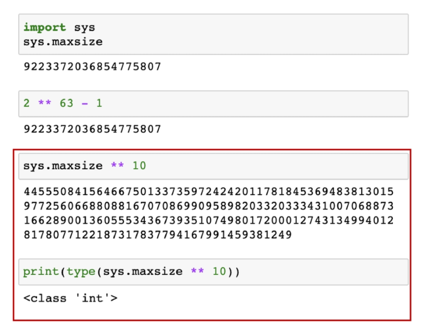
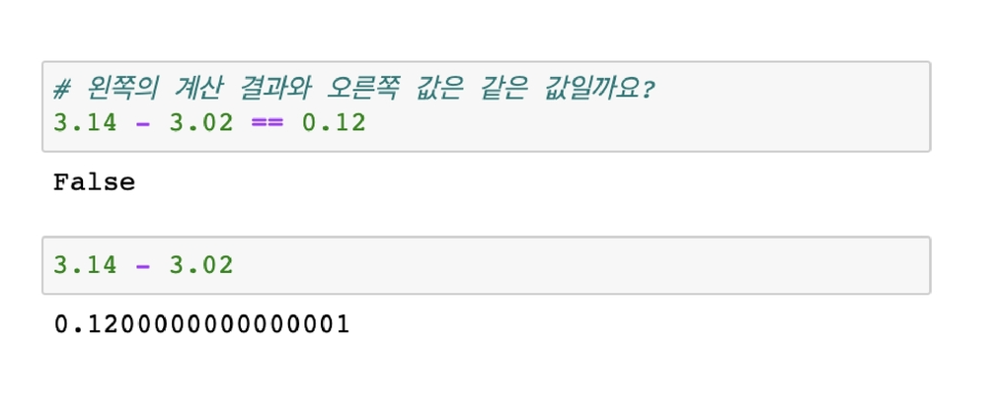
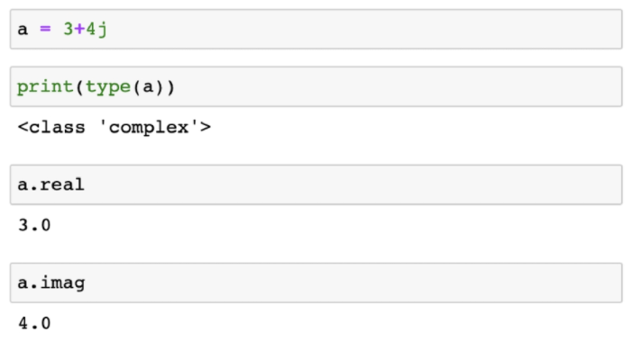
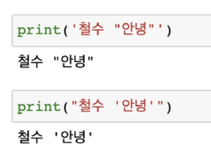

## 데이터 타입

### 숫자 (number)

- int (정수, integer)

- float (부동소수점, 실수, floating point number)
- complex (복소수, complex number)

모든 **정수의 타입은 int**

매우 큰 수를 나타낼 때 오버플로가 발생하지 않음

- 오버플로(overflow) : 데이터 타입별로 사용할 수 있는 메모리의 크기를 넘어서는 상황
- **Arbitary precision arithmetic(임의 정밀도 산술)**을 통해 고정된 형태의 메모리가 아닌 가용 메모리들을 활용하여 모든 수 표현에 활용 **(예시 ↓)**



​	`sys.maxsize`로 현재 나타낼 수 있는 최댓값을 나타냈지만, `sys.maxsize**10`처럼 10제곱을 할 경우 overflow가 나오지 않고 값이 출력된다.

#### 진수 표현

- 2진수 : 0b
- 8진수 : 0o
- 16진수 : 0x

``` bash
0b10
# 2
0o30
# 24
0x10
# 16
```


#### 부동소수점(float)

- 정수가 아닌 모든 실수

- 실수를 컴퓨터가 표현하는 방법 - 2진수(비트)로 숫자를 표현


- 이과정에서 **floating point rounding error**(부동소수점 반올림 오차)가 발생



​	해결방법 '3.14 - 3.02' 와 '0.12'의 **차이가 근사하면 같다고** 판별 해야한다

​	-> **매우 작은 수보다 작은지를 확인** or math 모듈 사용

``` bash
#임의의 작은수
abs(a-b) <= 1e-10
#true
```

``` bash
#시스템상의 machine epslion
import sys
print(abs(a-b) <= sys.float_info.epslion)
print(sys.float_info.epslion)
#true
#2.220446049250313e-16
```

``` bash
# python 3.5 이상
import math
math.isclose(a,b)
#true
```


#### 허수(J)

- 허수부를 j로 표현




### 문자열(string)

- 모든 문자는 str 타입
- PEP8에서는 소스코드 내에서 하나의 문장부호를 선택해서 유지하도록 권장 (예시 : '' or "")




### String Interpolation

- 변수의 값을 문자열의 **자리 표시자(placeholder)**로 대체하는 방법(과정)


> 최근에는 3번**(f-string)**을 자주쓰고, 2번은 함수를 만들때 자주 쓰인다


#### 참/거짓 (boolean)

- True/ False 값을 가진 타입은 bool
- 비교/논리 연산을 수행함에 있어서 활용
- 다음은 모두 False로 전환

`0, 0.0, (), {}, [], '', None`


#### None

- 값이 없음

- 타입 = NoneType

  