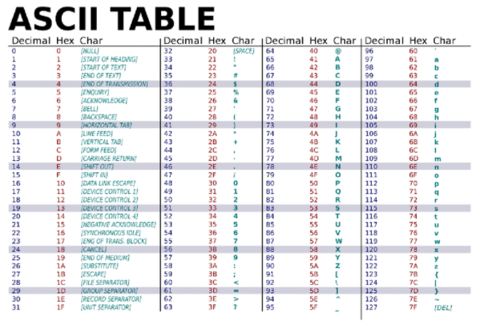

# 최소 & 최대

- 시퀀스의 최솟/ 최댓값

- 문자열은 ascii 코드에 따름

  

```python
print(min(numbers))

print(max(numbers))

```


## for문을 이용한 최대 최소

```python
numbers = [7, 10, 22, 4, 3, 17]

# 아래에 코드를 작성하시오.
numbers.sort()
for i in numbers:
    pass
print(i)


max_value = 0
for number in numbers:
    if number > max_value:
        max_value = number
print(max_value)    
```

22


```python
numbers = [7, 10, 22, 4, 3, 17]

# 아래에 코드를 작성하시오.
numbers.sort()
print(numbers[0])


min_value = numbers[0]
for number in numbers:
    if number < min_value:
        min_value = number
print(min_value)
```

3


- ord함수 활용하여 확인 가능


