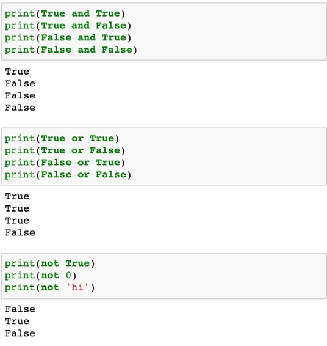

# 논리 연산자(and, or, not)

### and

- A and B : A와 B 모두 True시, True

### or 

- A or B : A와 B 모두 False시, False

### not

- False를 True로, True를 False로



### 논리 연산자 - 단축평가

- 결과가 확실한 경우 두번째 값은 확인하지 않음
- 결과가 확실한 경우 =  첫번째 값 반환
- 결과가 확실하지 않고 뒤의 값을 확인해야 할 경우 = 두번째 값 반환

```bash
a = 5 and 0
print(a)
#0
#and 연산에서 첫번째 값이 True인 경우 확인을 해봐야 함-> 두번째 값 반환
b = 5 or 0
print(b)
#5
#or 연산에서 첫번째 값이 True 경우 무조건 True -> 첫번째 값 반환
c = 0 and 5
print(c)
#0
#and 연산에서 첫번째 값이 False인 경우 무조건 False -> 첫번째 값 반환
d = 0 or 3
print(d)
#3
#or 연산에서 첫번째 값이 False 경우 뒤에 확인을 해봐야함 -> 두번째 값 반환
```

