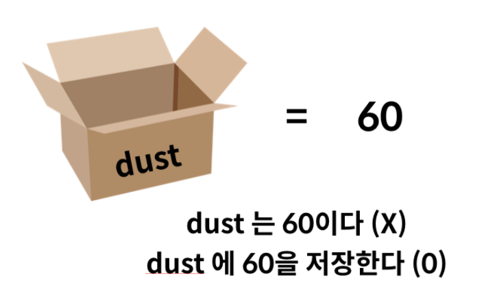

# Python 기초

공식 스타일 가이드 PEP-8 의 원칙 중요

### 주석

주석은 `#` 으로 표현

여러 줄의 주석은 `'''` 또는 `"""` 사용

### 코드 라인

'1 줄에 1 문장(statement)' 원칙

#### 문장(Statement)

- 파이썬이 실행 가능(executable)한 최소한의 코드 단위 (a syntatic unit of programming)

```
# 하나의 값(value)도 문장이 될 수 있습니다.
'ssafy'
```

```
'ssafy'
```

```
# 표현식(expression)도 문장이 될 수 있습니다.
5 * 21 - 4 
```

```
101
```

```
# 실행 가능(executable)해야 하기 때문에 아래의 코드는 문장이 될 수 없습니다.
```

```
name = '
```


기본적으로 `;`를 작성하지 않지만 한 줄로 표기할 때에는 `;`을 작성하여 표기 가능

여러줄을 작성할 때는 역슬래시 `\`를 사용가능

```python
print('hello\
 world')
# hello world
```

PEP-8 가이드에 따르면 여러줄 문자열은 아래와 같이 쓰는 게 관례(convention)

```python
print("""hello
world""")
```

 

## 변수



### 할당 연산자(Assignment Operator): `=`

- 변수는 `=`을 통해 할당(assignment) 됩니다.
- 해당 데이터 타입을 확인하기 위해서는 `type()`을 활용합니다.
- 해당 값의 메모리 주소를 확인하기 위해서는 `id()`를 활용합니다.

### 식별자(Identifiers)

파이썬에서 식별자는 변수, 함수, 모듈, 클래스 등을 식별하는데 사용되는 이름(name)입니다.

- 식별자의 이름은 영문알파벳(대문자와 소문자), 언더스코어(_), 숫자로 구성됩니다.
- 첫 글자에 숫자가 올 수 없습니다.
- 길이에 제한이 없습니다.
- 대소문자(case)를 구별합니다.
- 아래의 키워드는 사용할 수 없습니다. [파이썬 문서](https://docs.python.org/ko/3/reference/lexical_analysis.html#keywords)

```
False, None, True, and, as, assert, async, await, break, class, continue, def, del, elif, else, except, finally, for, from, global, if, import, in, is, lambda, nonlocal, not, or, pass, raise, return, try, while, with, yield
```


## 형변환(Type conversion, Typecasting)

파이썬에서 데이터타입은 서로 변환할 수 있습니다.

- 암시적 형변환
- 명시적 형변환

### 암시적 형변환(Implicit Type Conversion)

사용자가 의도하지 않았지만, 파이썬 내부적으로 자동으로 형변환 하는 경우입니다. 아래의 상황에서만 가능합니다.

- bool
- Numbers (int, float, complex)

```
# boolean과 integer는 더할 수 있을까요?
# True와 임의의 정수를 더해봅시다.
```

```
True + 100
```

```
101
```


```
# int, float, complex를 각각 변수에 대입해봅시다.
# 변수 int_number 에 정수를 할당해봅시다.
# 변수 float_numbe 에 실수를 할당해봅시다.
# 변수 complex_number 에 복소수를 할당해봅시다.
```

```
int_number = 100
float_number = 1.5
complex_number = 3+5j
```

```
# int와 float를 더해봅시다. 그리고 값을 출력해봅시다.
# 그 결과의 type은 무엇일까요?
```

```
int_number + float_number
```

```
101.5
```

```
# int와 complex를 더해봅시다. 그리고 값을 출력해봅시다.
# 그 결과의 type은 무엇일까요?
```

```
int_number + complex_number
```

```
(103+5j)
```


### 명시적 형변환(Explicit Type Conversion)

위의 상황을 제외하고는 모두 명시적으로 형변환을 해주어야합니다.

- string -> intger : 형식에 맞는 숫자만 가능
- integer -> string : 모두 가능

암시적 형변환이 되는 모든 경우도 명시적으로 형변환이 가능합니다.

- `int()` : string, float를 int로 변환
- `float()` : string, int를 float로 변환
- `str()` : int, float, list, tuple, dictionary를 문자열로 변환


## 연산자 우선순위

1. `()`을 통한 grouping
2. Slicing
3. Indexing
4. 제곱연산자 `**`
5. 단항연산자 `+`, `-` (음수/양수 부호)
6. 산술연산자 `*`, `/`, `%`
7. 산술연산자 `+`, `-`
8. 비교연산자, `in`, `is`
9. `not`
10. `and`
11. `or`